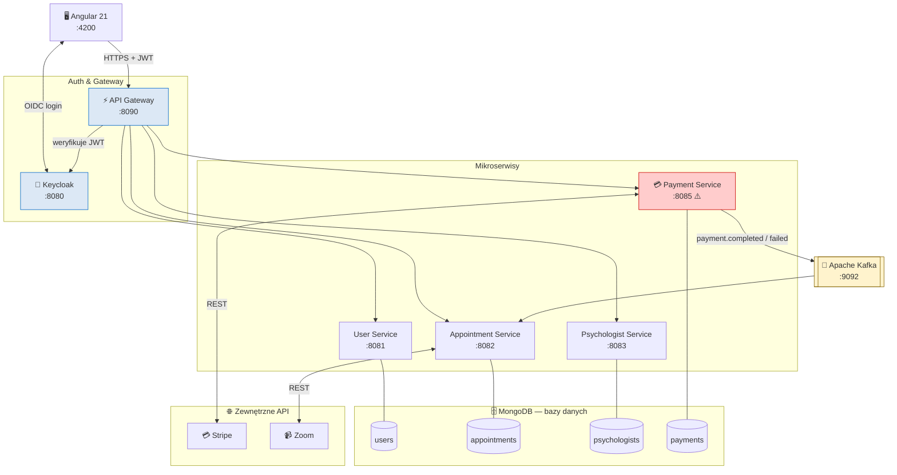
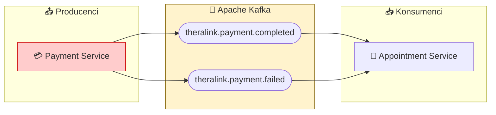
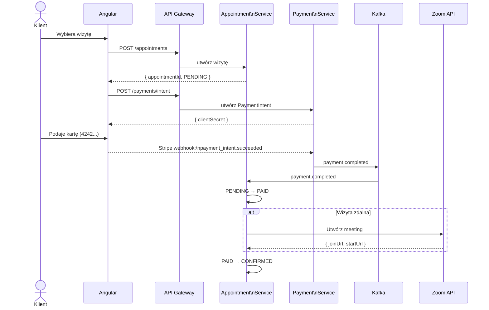
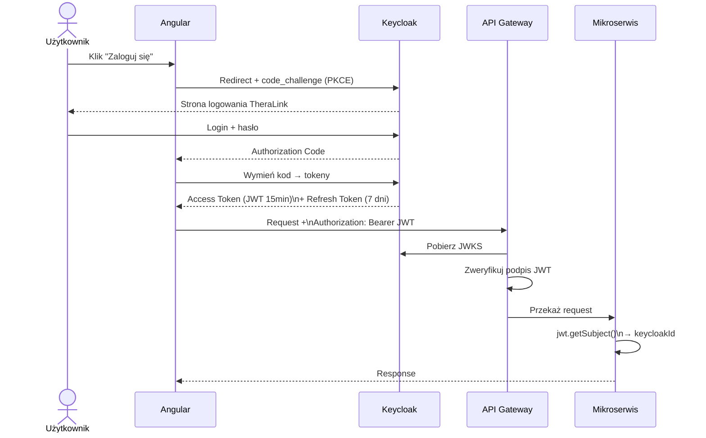
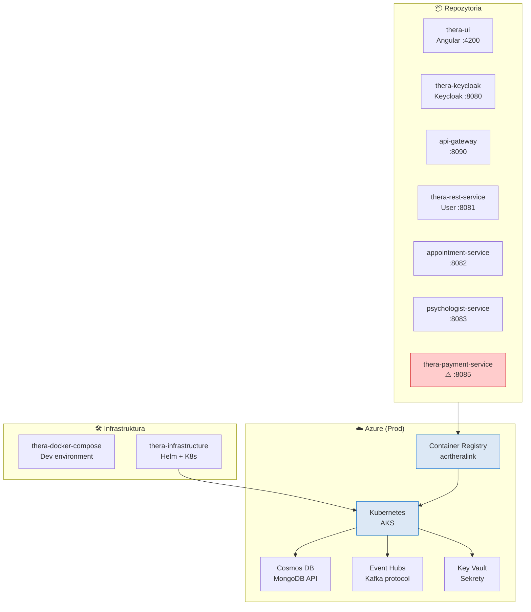

# TheraLink — Architektura systemu (diagramy)

> **Jak używać:**
> - **mermaid.live** → wklej kod bloku → Download PNG/SVG
> - **Miro** → Insert → Apps → Mermaid Diagrams → wklej kod
> - **Obsidian** → renderuje automatycznie

---

## 1. Widok całego systemu

---

## 2. Kafka — przepływ eventów

---

## 3. Przepływ: Rezerwacja + Płatność + Zoom

---

## 4. Przepływ: Autoryzacja (Keycloak PKCE)

---

## 5. Mapa repozytoriów i infrastruktury Azure

