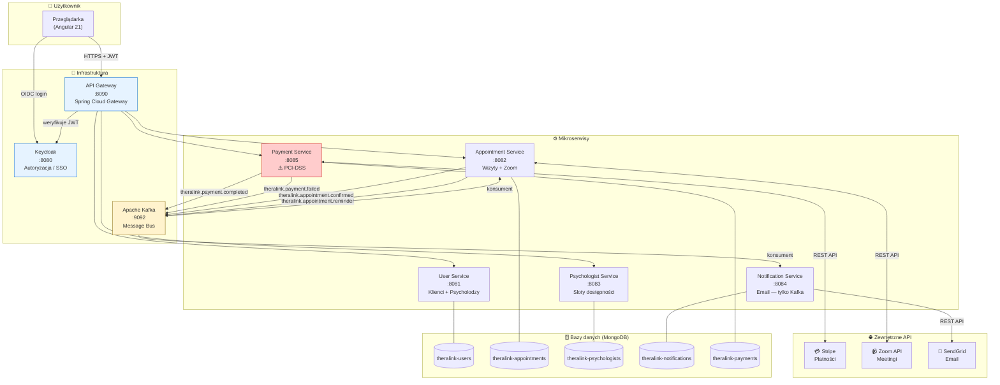
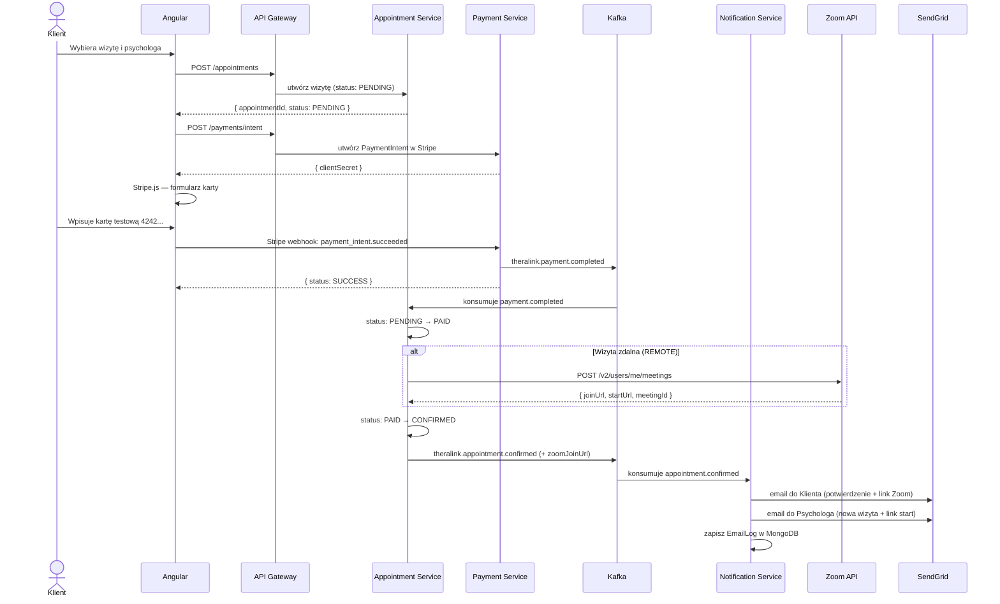
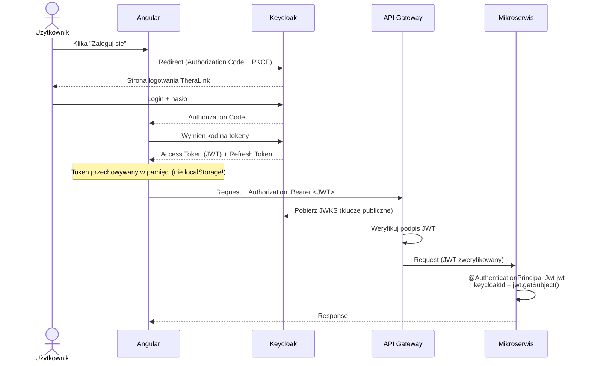
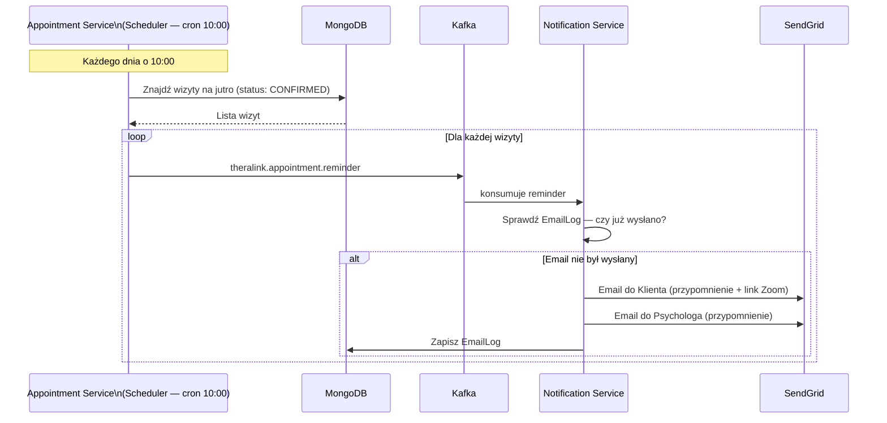
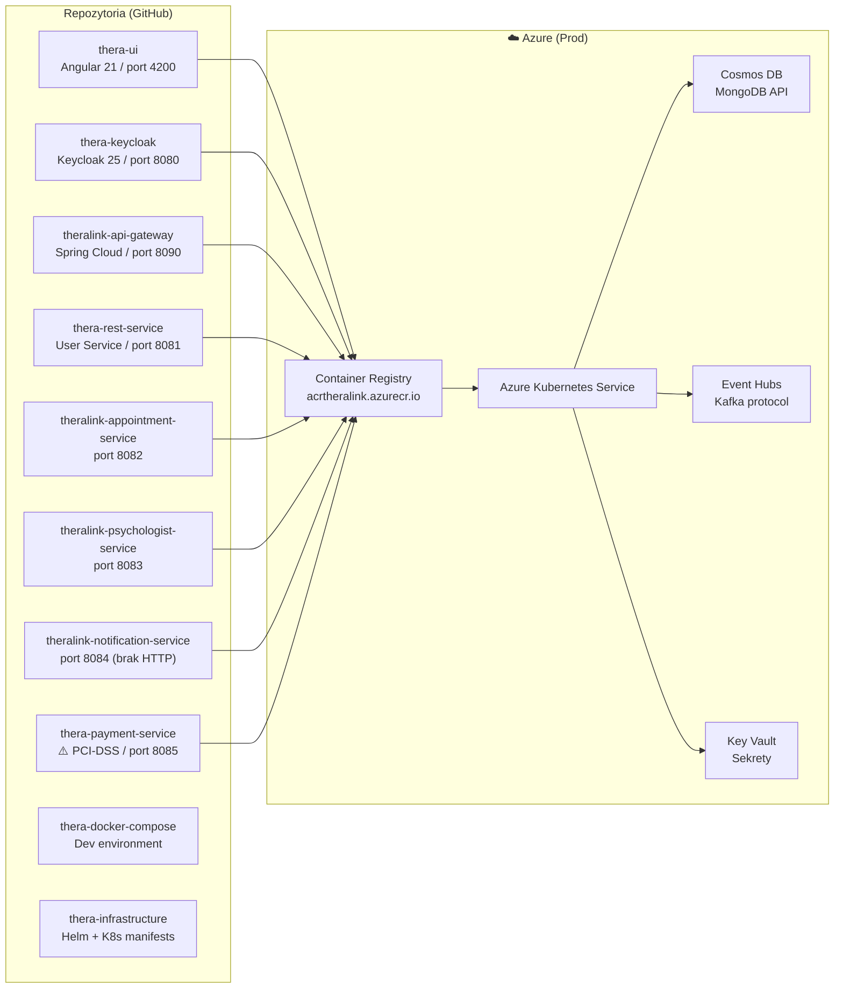

# TheraLink — Architektura systemu (diagramy)

> **Jak używać:**
> - **Miro** → zainstaluj plugin "Mermaid Diagrams for Miro" → wklej kod bloku
> - **mermaid.live** → otwórz stronę, wklej kod → screenshot do prezentacji
> - **Obsidian** → renderuje automatycznie

---

## 1. Widok całego systemu

---

## 2. Przepływ: Rezerwacja wizyty + Płatność + Zoom + Email

---

## 3. Przepływ: Autoryzacja (Keycloak)

---

## 4. Przepływ: Przypomnienie dzień przed wizytą

---

## 5. Mapa serwisów — porty i repozytoria

---

## Jak wygenerować obraz do prezentacji

### Opcja A — mermaid.live (najszybsze)
1. Otwórz **https://mermaid.live**
2. Wklej wybrany blok kodu (np. diagram 1 lub 2)
3. Kliknij **Download PNG** lub **Download SVG**

### Opcja B — Miro
1. W Miro: **Insert → Apps → Mermaid Diagrams**
2. Wklej kod → kliknij **Insert**
3. Edytuj kolory i układ bezpośrednio na tablicy

### Opcja C — Obsidian
Otwórz ten plik w Obsidian — wszystkie diagramy renderują się automatycznie.
