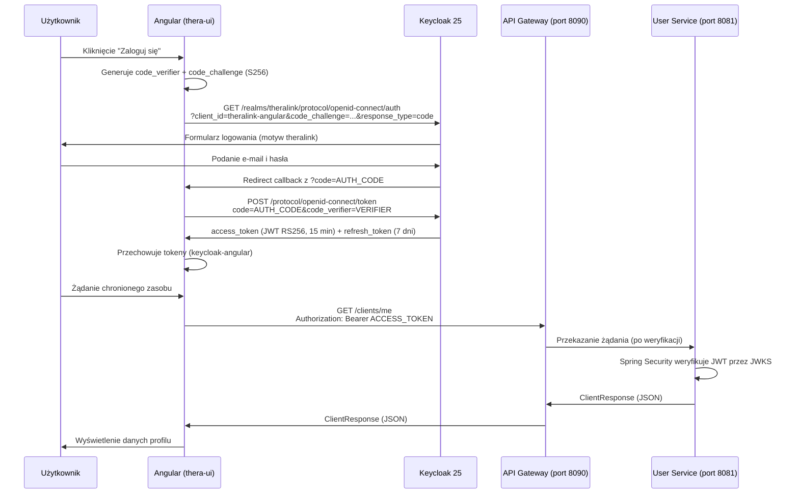

# Rozdział 5. System zarządzania tożsamością Keycloak

Rozdział opisuje migrację mechanizmu uwierzytelniania i autoryzacji z AWS Cognito na
self-hosted Keycloak 25. Omówiono podstawy protokołów OAuth 2.0 i OpenID Connect,
uzasadnienie wyboru technologii, konfigurację realm, przepływ logowania z PKCE S256,
strukturę tokenów JWT oraz integrację ze Spring Security Resource Server.

---

## 5.1 Podstawy OAuth 2.0, OpenID Connect i JSON Web Token

W systemach rozproszonych zarządzanie tożsamością użytkownika stanowi fundament
bezpieczeństwa całej architektury. Aby zapewnić spójny, standardowy mechanizm
uwierzytelniania i autoryzacji w platformie TheraLink, zastosowano trzy powiązane
ze sobą standardy: OAuth 2.0 [X], OpenID Connect (ang. *OpenID Connect*, OIDC) [X]
oraz JSON Web Token (ang. *JSON Web Token*, JWT) [X].

### OAuth 2.0 — delegacja autoryzacji

OAuth 2.0 jest frameworkiem autoryzacji zdefiniowanym w RFC 6749 [X]. Jego głównym
celem nie jest uwierzytelnienie użytkownika, lecz delegowanie uprawnień dostępu —
aplikacja kliencka uzyskuje ograniczony dostęp do zasobów w imieniu właściciela zasobu,
bez konieczności przekazywania jego danych logowania. W modelu OAuth 2.0 wyróżnia się
cztery role:

- **Authorization Server** — serwer wydający tokeny (Keycloak 25),
- **Resource Owner** — użytkownik platformy TheraLink,
- **Client** — aplikacja żądająca dostępu (Angular 21),
- **Resource Server** — serwer zasobów weryfikujący token (mikroserwisy Spring Boot 4.0.3).

### OpenID Connect — warstwa identyfikacji

OpenID Connect [X] jest protokołem tożsamości zbudowanym na bazie OAuth 2.0. OIDC
uzupełnia framework autoryzacji o warstwę identyfikacji użytkownika, wprowadzając pojęcie
**ID tokenu** — podpisanego JWT zawierającego twierdzenia (ang. *claims*) o zalogowanym
użytkowniku: unikalny identyfikator (`sub`), adres e-mail, imię i nazwisko. W projekcie
TheraLink pole `sub` z ID tokenu stanowi unikalny identyfikator użytkownika, przechowywany
we wszystkich dokumentach MongoDB jako `keycloakId` i przekazywany do serwisów przez
anotację `@AuthenticationPrincipal`.

### Struktura JSON Web Token

JSON Web Token [X] jest zwartym, samodzielnym formatem reprezentacji twierdzeń
przesyłanych między stronami. Token JWT składa się z trzech sekcji zakodowanych
w Base64url i oddzielonych kropkami:

```
NAGŁÓWEK.ŁADUNEK.PODPIS
```

**Nagłówek** (`header`) identyfikuje algorytm podpisu oraz identyfikator klucza publicznego:

```json
{
  "alg": "RS256",
  "typ": "JWT",
  "kid": "identyfikator-klucza-z-JWKS"
}
```

**Ładunek** (`payload`) zawiera twierdzenia. Przykładowy payload access tokenu wydanego
przez Keycloak dla użytkownika z rolą `CLIENT` w systemie TheraLink:

```json
{
  "sub": "a1b2c3d4-e5f6-7890-abcd-ef1234567890",
  "iss": "http://localhost:8080/realms/theralink",
  "aud": "theralink-angular",
  "exp": 1749600000,
  "iat": 1749599100,
  "realm_access": { "roles": ["CLIENT", "default-roles-theralink"] },
  "scope": "openid profile email roles",
  "email": "jan.kowalski@example.com"
}
```

**Podpis** (`signature`) powstaje z nagłówka i ładunku zaszyfrowanych kluczem prywatnym
Keycloak i weryfikowany jest przez serwery zasobów przy użyciu klucza publicznego.

### RS256 kontra HS256

Algorytm **RS256** (RSA + SHA-256) stosuje kryptografię asymetryczną: Keycloak podpisuje
token kluczem prywatnym, a każdy mikroserwis weryfikuje podpis kluczem publicznym —
bez konieczności posiadania wspólnego sekretu. Algorytm **HS256** (HMAC + SHA-256) wymaga
natomiast współdzielenia sekretu między wystawcą a każdym weryfikatorem, co w architekturze
mikrousługowej stwarza problem bezpiecznej dystrybucji tego sekretu. Z tego względu
w projekcie TheraLink zastosowano RS256.

### JWKS — automatyczna dystrybucja kluczy publicznych

JSON Web Key Set (ang. *JSON Web Key Set*, JWKS) [X] to standard publikowania kluczy
publicznych pod stałym, dobrze znany adresem URL. Keycloak udostępnia endpoint JWKS pod
adresem `{issuer}/protocol/openid-connect/certs`. Spring Security OAuth2 Resource Server
automatycznie pobiera klucze z tego endpointu przy starcie serwisu, a następnie weryfikuje
podpis każdego przychodzącego tokenu — bez centralnej bazy danych sesji.

**Przed / Po — weryfikacja podpisu tokenu:**

| Aspekt | Monolith (Cognito + Express) | Mikrousługi (Keycloak + Spring) |
|:---|:---|:---|
| Metoda weryfikacji | `jwt.decode()` — dekodowanie bez sprawdzenia podpisu | Spring JWKS — automatyczna weryfikacja RS256 |
| Podatność | Dowolny sfałszowany token akceptowany | Token bez poprawnego podpisu zwraca HTTP 401 |
| Źródło kluczy | Brak — klucz nie był nigdy sprawdzany | Endpoint JWKS Keycloak (auto-discovery) |
| Sesja po stronie serwera | Brak | Brak — serwer jest w pełni bezstanowy |

Kluczowa różnica wyraźnie widoczna jest w kodzie monolitu (Listing 5.1).
Funkcja `jwt.decode()` z biblioteki `jsonwebtoken` (linia 30) jedynie dekoduje token
Base64url i zwraca ładunek — nie weryfikuje podpisu kryptograficznego. Oznacza to,
że dowolna osoba mogła ręcznie skonstruować token z dowolną rolą i uzyskać dostęp
do chronionych zasobów API.

**Listing 5.1.** Fragment `backend/src/middleware/authMiddleware.ts` — krytyczna luka
bezpieczeństwa w mechanizmie weryfikacji tokenu JWT w monolicie
```typescript
29      try {
30        const decoded = jwt.decode(token) as DecodedToken;   // brak weryfikacji podpisu!
31        const userRole = decoded["custom:role"] || "";
32        req.user = {
33          id: decoded.sub,
34          role: userRole,
35        };
36
37        const hasAccess = allowedRoles.includes(userRole.toLowerCase());
38        if (!hasAccess) {
39          res.status(403).json({ message: "Access Denied" });
40          return;
41        }
```

Zastosowanie Spring Security OAuth2 Resource Server w połączeniu z JWKS Keycloak
eliminuje tę lukę bez żadnego dodatkowego kodu aplikacyjnego — weryfikacja następuje
automatycznie przed przekazaniem żądania do kontrolera.

> 📸 **[SCREEN DO DODANIA]**
> **Co pokazać:** Zdekodowany access token JWT w narzędziu jwt.io — widoczny nagłówek
> z `"alg": "RS256"`, payload z polem `realm_access.roles: ["CLIENT"]` i wartością `sub`
> (keycloakId), podpis oznaczony jako zweryfikowany.
> **Sugerowany podpis:** Rys. 5.1. Struktura access tokenu JWT wydanego przez Keycloak —
> widoczne twierdzenia `realm_access.roles` i `sub` (keycloakId)
> **Źródło:** narzędzie jwt.io z tokenem uzyskanym po zalogowaniu w aplikacji TheraLink

---

## 5.2 Uzasadnienie wyboru Keycloak

Migracja systemu uwierzytelniania z AWS Cognito na Keycloak była podyktowana szeregiem
ograniczeń zidentyfikowanych w monolicie podczas analizy opisanej w rozdziale 1.

### Ograniczenia AWS Cognito

W monolicie TheraLink rola użytkownika była przechowywana jako niestandardowy atrybut
Cognito `custom:role` — technologia specyficzna dla jednego dostawcy chmurowego,
niemożliwa do przeniesienia. Ponieważ Cognito nie udostępniał roli w standardowym
claimie JWT, a weryfikacja przez JWKS wymagała dodatkowej konfiguracji, zdecydowano
o użyciu `jwt.decode()` — rezygnując z weryfikacji kryptograficznej. Było to jedno z
11 ograniczeń bezpieczeństwa zidentyfikowanych w analizie monolitu (patrz rozdział 1,
podrozdział 1.5).

Ponadto AWS Cognito jako usługa zarządzana przez Amazon Web Services powodował
silne uzależnienie od konkretnego dostawcy chmurowego (ang. *vendor lock-in*).
Zmiana dostawcy chmury lub przejście na środowisko on-premises wymagałoby całkowitej
wymiany warstwy uwierzytelniania.

### Zalety Keycloak

Keycloak [X] jest serwerem tożsamości o otwartym kodzie źródłowym (ang. *open-source*),
utrzymywanym przez Red Hat. Kluczowe cechy, które zadecydowały o jego wyborze w projekcie
TheraLink:

- **Self-hosted** — Keycloak uruchamiany jest we własnej infrastrukturze (Docker/Kubernetes),
  eliminując uzależnienie od konkretnego dostawcy chmury,
- **Standardowe role realm** — role są pierwszorzędnym pojęciem w Keycloak i są
  automatycznie dołączane do JWT w claimie `realm_access.roles`, bez konieczności
  własnych mapperów ani obejść,
- **Natywna obsługa PKCE S256** — konfiguracja jednego atrybutu w kliencie (`pkce.code.challenge.method: S256`) zabezpiecza przepływ logowania,
- **Personalizacja UI** — możliwość dostarczenia własnych szablonów FreeMarker dla
  formularzy logowania i rejestracji,
- **Infrastructure as Code** — cała konfiguracja realm może być eksportowana do pliku
  JSON i importowana przy każdym uruchomieniu, co zapewnia powtarzalność środowisk.

**Tabela 5.1.** Porównanie AWS Cognito i Keycloak w kontekście wymagań platformy TheraLink

| Kryterium | AWS Cognito (monolith) | Keycloak 25 (mikrousługi) |
|:---|:---|:---|
| Hosting | AWS (vendor lock-in) | Self-hosted (Docker/Kubernetes) |
| Weryfikacja JWT | `jwt.decode()` — brak weryfikacji | Spring JWKS — automatyczna |
| Role użytkownika | `custom:role` (atrybut Cognito) | Realm roles w `realm_access.roles` |
| PKCE S256 | Brak (Amplify bez PKCE) | Natywna konfiguracja klienta |
| Custom theme | Ograniczone możliwości | Własne szablony FreeMarker (.ftl) |
| Infrastructure as Code | Brak eksportu konfiguracji | `realm-export.json` — pełny eksport |
| Koszt | Płatny (po przekroczeniu limitu) | Bezpłatny (open-source) |
| Przenośność | Ograniczona (AWS-specific API) | Pełna (standard OIDC/OAuth 2.0) |

---

## 5.3 Konfiguracja realm `theralink`

Konfiguracja serwera Keycloak utrzymywana jest w pliku `realm-export.json`
w repozytorium `thera-keycloak`. Plik ten pełni rolę Infrastructure as Code —
przy każdym uruchomieniu kontenera Keycloak (polecenie `start-dev --import-realm`)
konfiguracja jest automatycznie importowana ze stanu zapisanego w repozytorium.
Eliminuje to ręczne klikanie w panelu administracyjnym i gwarantuje identyczną
konfigurację w środowisku lokalnym i produkcyjnym.

### Ustawienia realm

Listing 5.2 przedstawia fragment `realm-export.json` definiujący podstawowe parametry
realm `theralink`.

**Listing 5.2.** Fragment `thera-keycloak/realm-export.json` (wiersze 1–30) —
podstawowe parametry realm, czasy życia tokenów i polityka haseł
```json
 1  {
 2    "realm": "theralink",
 3    "displayName": "TheraLink",
 4    "enabled": true,
 5
 6    "loginTheme": "theralink",
 7    "accountTheme": "theralink",
 8    "emailTheme": "base",
 9
10    "registrationAllowed": true,
11    "registrationEmailAsUsername": true,
12    "duplicateEmailsAllowed": false,
13    "resetPasswordAllowed": true,
14    "editUsernameAllowed": false,
15    "rememberMe": true,
16    "verifyEmail": false,
17
18    "accessTokenLifespan": 900,
19    "ssoSessionIdleTimeout": 1800,
20    "ssoSessionMaxLifespan": 604800,
21    "accessCodeLifespan": 60,
22
23    "internationalizationEnabled": true,
24    "supportedLocales": ["pl", "en"],
25    "defaultLocale": "pl",
26
27    "passwordPolicy": "length(8) and notUsername(undefined)"
28    ...
29  }
```

Czas życia access tokenu wynosi 900 sekund (15 minut) — wartość ta ogranicza ryzyko
związane z przechwyceniem tokenu. Maksymalny czas sesji SSO (ang. *Single Sign-On*)
wynosi 604 800 sekund (7 dni), co odpowiada czasowi życia refresh tokenu. Polityka
haseł wymaga minimalnie 8 znaków i wyklucza używanie nazwy użytkownika jako hasła.
Jako domyślny język interfejsu ustawiono język polski (`pl`), co jest spójne z docelową
grupą użytkowników platformy.

> 📸 **[SCREEN DO DODANIA]**
> **Co pokazać:** Panel administracyjny Keycloak → realm `theralink` → zakładka
> „Realm settings" → sekcja „Tokens" z widocznymi wartościami Access Token Lifespan
> (15 minutes) i SSO Session Max (7 days).
> **Sugerowany podpis:** Rys. 5.2. Konfiguracja czasów życia tokenów w panelu
> administracyjnym Keycloak dla realm `theralink`
> **Źródło:** panel administracyjny Keycloak 25 uruchomiony lokalnie

### Klienci realm

W realm `theralink` zdefiniowano dwóch klientów OAuth 2.0, odpowiadających dwóm
rodzajom aplikacji w architekturze systemu (Listing 5.3).

**Listing 5.3.** Fragment `thera-keycloak/realm-export.json` (wiersze 31–77) —
definicja klientów `theralink-angular` (publiczny) i `theralink-backend` (poufny)
```json
31  "clients": [
32    {
33      "clientId": "theralink-angular",
34      "name": "TheraLink Angular App",
35      "publicClient": true,
36      "standardFlowEnabled": true,
37      "directAccessGrantsEnabled": false,
38      "implicitFlowEnabled": false,
39      "serviceAccountsEnabled": false,
40      "redirectUris": [
41        "http://localhost:4200/*",
42        "https://app.theralink.pl/*"
43      ],
44      "webOrigins": [
45        "http://localhost:4200",
46        "https://app.theralink.pl"
47      ],
48      "attributes": {
49        "pkce.code.challenge.method": "S256"
50      },
51      "defaultClientScopes": ["openid", "profile", "email", "roles"],
52      "optionalClientScopes": ["offline_access"]
53    },
54    {
55      "clientId": "theralink-backend",
56      "name": "TheraLink Backend Services",
57      "publicClient": false,
58      "standardFlowEnabled": false,
59      "directAccessGrantsEnabled": false,
60      "serviceAccountsEnabled": true,
61      "defaultClientScopes": ["openid", "roles"]
62    }
63  ]
```

**Tabela 5.2.** Klienci OAuth 2.0 zdefiniowani w realm `theralink`

| Parametr | `theralink-angular` | `theralink-backend` |
|:---|:---|:---|
| Typ klienta | Publiczny (brak sekretu) | Poufny (client secret) |
| Standard Flow | Włączony | Wyłączony |
| PKCE S256 | Włączone | N/D |
| Service Accounts | Wyłączone | Włączone |
| Redirect URI (dev) | `http://localhost:4200/*` | — |
| Redirect URI (prod) | `https://app.theralink.pl/*` | — |

Klient `theralink-angular` jest klientem **publicznym** — aplikacje JavaScript uruchomione
w przeglądarce nie mogą bezpiecznie przechowywać sekretu klienta, dlatego nie jest
on wymagany. Bezpieczeństwo przepływu logowania zapewnia mechanizm PKCE opisany
w podrozdziale 5.4. Klient `theralink-backend` jest klientem **poufnym** z włączonymi
kontami serwisowymi (ang. *service accounts*), przeznaczonymi do komunikacji
serwis-do-serwisu.

> 📸 **[SCREEN DO DODANIA]**
> **Co pokazać:** Panel administracyjny Keycloak → realm `theralink` → zakładka „Clients"
> z listą klientów: `theralink-angular` i `theralink-backend`. Widoczne kolumny: Client ID,
> Enabled, Type (Public / Confidential).
> **Sugerowany podpis:** Rys. 5.3. Lista klientów OAuth 2.0 zdefiniowanych w realm
> `theralink` — klient publiczny dla frontendu i poufny dla serwisów backendowych
> **Źródło:** panel administracyjny Keycloak 25

> 📸 **[SCREEN DO DODANIA]**
> **Co pokazać:** Panel administracyjny Keycloak → klient `theralink-angular` → zakładka
> „Advanced" → widoczna wartość `pkce.code.challenge.method: S256`.
> **Sugerowany podpis:** Rys. 5.4. Konfiguracja metody PKCE S256 w kliencie
> `theralink-angular` — wymuszenie weryfikacji code challenge przy wymianie kodu
> **Źródło:** panel administracyjny Keycloak 25

### Role realm i mapowanie do JWT

W realm `theralink` zdefiniowano trzy role (Listing 5.4): `CLIENT` (pacjent), `PSYCHOLOGIST`
(psycholog) i `ADMIN` (administrator platformy). Rola `CLIENT` jest domyślnie przypisywana
każdemu nowemu użytkownikowi przy rejestracji (linia 96 realm-export.json).

**Listing 5.4.** Fragment `thera-keycloak/realm-export.json` (wiersze 79–96) —
role realm i domyślna rola nowo zarejestrowanych użytkowników
```json
79  "roles": {
80    "realm": [
81      { "name": "CLIENT",
82        "description": "Pacjent korzystający z platformy TheraLink" },
83      { "name": "PSYCHOLOGIST",
84        "description": "Zarejestrowany i zweryfikowany psycholog" },
85      { "name": "ADMIN",
86        "description": "Administrator platformy TheraLink" }
87    ]
88  },
89
90  "defaultRoles": ["CLIENT"]
```

Aby role były dostępne w JWT, zdefiniowano scope `roles` z mapperem protokołu OIDC
(Listing 5.5). Mapper `realm roles` dołącza role realm do tokenu pod kluczem
`realm_access.roles` — ta sama ścieżka jest odczytywana przez `JwtAuthenticationConverter`
w konfiguracji Spring Security (patrz podrozdział 5.6).

**Listing 5.5.** Fragment `thera-keycloak/realm-export.json` (wiersze 98–124) —
definicja scope `roles` z mapperem dołączającym role realm do tokenu JWT
```json
 98  "clientScopes": [
 99    {
100      "name": "roles",
101      "protocol": "openid-connect",
102      "protocolMappers": [
103        {
104          "name": "realm roles",
105          "protocolMapper": "oidc-usermodel-realm-role-mapper",
106          "config": {
107            "multivalued": "true",
108            "access.token.claim": "true",
109            "id.token.claim": "true",
110            "userinfo.token.claim": "true",
111            "claim.name": "realm_access.roles",
112            "jsonType.label": "String"
113          }
114        }
115      ]
116    }
117  ]
```

> 📸 **[SCREEN DO DODANIA]**
> **Co pokazać:** Panel administracyjny Keycloak → realm `theralink` → zakładka
> „Realm roles" z widocznymi rolami: CLIENT, PSYCHOLOGIST, ADMIN. Opcjonalnie widok
> pojedynczej roli CLIENT z informacją, że jest to rola domyślna.
> **Sugerowany podpis:** Rys. 5.5. Role realm zdefiniowane w Keycloak dla platformy
> TheraLink — trzy role odpowiadające trzem typom użytkowników systemu
> **Źródło:** panel administracyjny Keycloak 25

---

## 5.4 Przepływ Authorization Code z PKCE S256

Aplikacja Angular korzysta z przepływu **Authorization Code z PKCE** (ang. *Proof Key
for Code Exchange*) [X] — rekomendowanego przez IETF rodzaju przepływu OAuth 2.0
dla aplikacji publicznych (przeglądarek), w których nie można bezpiecznie przechowywać
sekretu klienta.

### Problem zabezpieczany przez PKCE

Bez PKCE przepływ Authorization Code jest podatny na atak przechwycenia kodu
(ang. *authorization code interception attack*). Napastnik przechwytujący parametr `code`
z adresu URL callback może go wymienić na token, podszywając się pod legalną aplikację.
PKCE eliminuje tę podatność przez powiązanie kodu autoryzacyjnego z aplikacją, która go
zainicjowała, za pomocą kryptograficznego wyzwania.

### Mechanizm PKCE S256

Przy każdym zainicjowaniu logowania aplikacja Angular:

1. Generuje losowy **code verifier** — ciąg 43–128 znaków z alfabetu bezpiecznego
   dla URI (RFC 7636 §4.1),
2. Wylicza **code challenge** jako `BASE64URL(SHA256(code_verifier))` (metoda S256),
3. Wysyła `code_challenge` wraz z żądaniem autoryzacji do Keycloak.

Po zalogowaniu użytkownika Keycloak wydaje kod autoryzacyjny powiązany z tym wyzwaniem.
Przy wymianie kodu na token Angular musi dostarczyć oryginalny `code_verifier` —
Keycloak weryfikuje, czy `SHA256(verifier)` zgadza się z zapamiętanym `code_challenge`.
Przechwycony kod bez znajomości `verifier` jest bezużyteczny.

### Krok po kroku — przepływ logowania

Poniżej przedstawiono diagram sekwencji całego przepływu uwierzytelniania w systemie
TheraLink:



Rys. 5.6. Diagram sekwencji przepływu Authorization Code z PKCE S256 w platformie
TheraLink — od kliknięcia przycisku logowania do zwrotu chronionych danych
źródło: opracowanie własne

### Inicjalizacja Keycloak w Angular

W aplikacji Angular inicjalizacja biblioteki `keycloak-angular` [X] odbywa się
w pliku `src/app/app.config.ts` (Listing 5.6). Opcja `onLoad: 'check-sso'` powoduje
próbę cichego przywrócenia sesji (ang. *silent SSO check*) przy każdym odświeżeniu
strony — bez przekierowania, jeśli użytkownik nie jest zalogowany.

**Listing 5.6.** Fragment `thera-ui/src/app/app.config.ts` (wiersze 27–37) —
inicjalizacja Keycloak z trybem `check-sso` i adresem realm `theralink`
```typescript
27      provideKeycloak({
28        config: {
29          url: environment.keycloak.url,
30          realm: environment.keycloak.realm,
31          clientId: environment.keycloak.clientId,
32        },
33        initOptions: {
34          onLoad: 'check-sso',
35          silentCheckSsoRedirectUri:
36            window.location.origin + '/assets/silent-check-sso.html',
37        },
38      }),
```

Ochronę tras realizuje funkcja `authGuard` (`core/auth/guards/auth.guard.ts`).
Guard sprawdza flagę `keycloak.authenticated` i, opcjonalnie, listę wymaganych ról
pobraną z konfiguracji trasy (`route.data['roles']`). Role weryfikowane są przez odczyt
`keycloak.realmAccess?.roles` — tej samej tablicy, która w JWT przechowywana jest
w claimie `realm_access.roles`.

**Przed / Po — integracja uwierzytelniania po stronie frontendu:**

| Aspekt | Monolith (AWS Amplify + Cognito) | Mikrousługi (keycloak-angular + Keycloak) |
|:---|:---|:---|
| Biblioteka | `@aws-amplify/auth` | `keycloak-angular` |
| Przepływ | Authorization Code (bez PKCE) | Authorization Code + PKCE S256 |
| Formularze logowania | Wbudowane w Next.js (Amplify UI) | Serwer-side Keycloak (custom theme) |
| Rola w JWT | `custom:role` (atrybut Cognito) | `realm_access.roles` (standard OIDC) |
| Odświeżanie tokenu | Automatyczne przez Amplify | `updateToken(5)` w interceptorze |

> 📸 **[SCREEN DO DODANIA]**
> **Co pokazać:** Formularz logowania z zastosowanym motywem `theralink` — widoczne logo
> TheraLink, pola e-mail i hasło, przycisk "Zaloguj się", brak elementów UI Keycloak
> domyślnego motywu Keycloak (np. logo Red Hat).
> **Sugerowany podpis:** Rys. 5.7. Formularz logowania Keycloak z zastosowanym motywem
> `theralink` — formularz jest serwowany przez Keycloak, a nie przez aplikację Angular
> **Źródło:** przeglądarka, `http://localhost:8080/realms/theralink/protocol/openid-connect/auth`

---

## 5.5 Struktura tokenów i zarządzanie cyklem życia

### Access token

Access token jest tokenem JWT podpisanym algorytmem RS256, ważnym przez 900 sekund
(15 minut). Krótki czas życia minimalizuje okno ekspozycji w przypadku przechwycenia
tokenu — skradziony token staje się bezużyteczny najpóźniej po kwadransie bez możliwości
odświeżenia go przez napastnika.

Token zawiera wszystkie informacje potrzebne do autoryzacji żądania po stronie serwera
zasobów: identyfikator użytkownika (`sub`), wystawcę (`iss`), czas wygaśnięcia (`exp`),
scope (`scope`) oraz role realm w claimie `realm_access.roles`. Dzięki temu mikroserwisy
Spring Boot mogą autoryzować żądanie lokalnie — bez zapytania do Keycloak przy każdym
żądaniu API.

### Refresh token

Refresh token jest wydawany razem z access tokenem i ma czas życia 604 800 sekund
(7 dni), odpowiadający wartości `ssoSessionMaxLifespan` w konfiguracji realm. Zakres
`offline_access` (opcjonalny scope klienta `theralink-angular`) pozwala na uzyskanie
refresh tokenu działającego nawet po zamknięciu przeglądarki, do czasu wygaśnięcia
sesji SSO.

### Strategia odświeżania w Angular

Odpowiedzialnością za zarządzanie cyklem życia tokenu po stronie frontendu zajmuje się
`jwtInterceptor` (`core/interceptors/jwt.interceptor.ts`, Listing 5.7). Przed każdym
żądaniem HTTP interceptor wywołuje `keycloak.updateToken(5)` — metoda ta odświeży
access token, jeśli jego pozostały czas ważności jest krótszy niż 5 sekund. Dzięki temu
żądania API nigdy nie trafiają do serwera z wygasłym tokenem, a użytkownik nie doświadcza
błędów autoryzacji podczas aktywnej pracy w aplikacji.

**Listing 5.7.** `thera-ui/src/app/core/interceptors/jwt.interceptor.ts` (wiersze 6–19) —
interceptor preemptywnie odświeżający access token przed każdym żądaniem HTTP
```typescript
 6  export const jwtInterceptor: HttpInterceptorFn =
 7       (req: HttpRequest<unknown>, next: HttpHandlerFn) => {
 8    const keycloak = inject(Keycloak);
 9
 9    return from(keycloak.updateToken(5).catch(() => false)).pipe(
10      switchMap(() => {
11        const token = keycloak.token;
12        if (token) {
13          const cloned = req.clone({
14            setHeaders: { Authorization: `Bearer ${token}` }
15          });
16          return next(cloned);
17        }
18        return next(req);
19      })
20    );
21  };
```

Jeśli odświeżenie tokenu nie powiedzie się (np. sesja wygasła), metoda `catch(() => false)`
zwraca `false`. W takim przypadku żądanie jest kontynuowane bez nagłówka autoryzacji,
a globalny `errorInterceptor` przechwytuje odpowiedź HTTP 401 i przekierowuje użytkownika
na stronę logowania.

**Przed / Po — zarządzanie tokenami:**

| Aspekt | Monolith | Mikrousługi |
|:---|:---|:---|
| Odświeżanie tokenów | Automatyczne (ukryte przez Amplify) | `updateToken(5)` — jawne, kontrolowane |
| Obsługa wygaśnięcia | Brak — użytkownik widział błędy 401 | Automatyczne odświeżenie lub redirect |
| Przechowywanie | `localStorage` (Amplify) | `keycloak-angular` (sesja przeglądarki) |

---

## 5.6 Spring Security OAuth2 Resource Server

### Koncepcja Resource Server

W terminologii OAuth 2.0 **Resource Server** to serwer przechowujący chronione zasoby
(dane API) i weryfikujący tokeny Bearer przed udostępnieniem tych zasobów. Mikroserwisy
Spring Boot w architekturze TheraLink pełnią właśnie tę rolę: nie zarządzają sesjami
użytkowników ani nie wydają tokenów — jedynie weryfikują, czy token dołączony do żądania
jest autentyczny i czy użytkownik ma odpowiednią rolę.

Spring Security OAuth2 Resource Server [X] automatyzuje ten proces dzięki integracji
z mechanizmem JWKS opisanym w podrozdziale 5.1. Wystarczy podać adres wystawcy tokenów
(`issuer-uri`) w konfiguracji aplikacji — framework samodzielnie pobierze klucze publiczne
i skonfiguruje filtr weryfikacji JWT.

### Konfiguracja w `application.yml`

Listing 5.8 przedstawia fragment konfiguracji serwisu `thera-rest-service`. Właściwość
`issuer-uri` (linia 20) wskazuje adres realm Keycloak. Spring Security automatycznie
odpytuje endpoint `{issuer}/.well-known/openid-configuration`, pobiera z odpowiedzi
adres JWKS i konfiguruje weryfikację.

**Listing 5.8.** `thera-rest-service/src/main/resources/application.yml` (wiersze 14–20) —
konfiguracja OAuth2 Resource Server z adresem wystawcy tokenów Keycloak
```yaml
14    security:
15      oauth2:
16        resourceserver:
17          jwt:
18            # Spring pobiera klucze publiczne z JWKS Keycloak i weryfikuje
19            # podpis każdego tokenu Bearer — zero ręcznego jwt.decode()
20            issuer-uri: ${KEYCLOAK_ISSUER_URI:http://localhost:8080/realms/theralink}
```

Zmienna środowiskowa `KEYCLOAK_ISSUER_URI` pozwala na podanie różnych adresów
w środowisku lokalnym (Docker) i produkcyjnym (Azure AKS) bez modyfikacji kodu.

### `SecurityConfig` — konfiguracja Spring Security

Konfiguracja zabezpieczeń HTTP serwisu `thera-rest-service` zawarta jest
w klasie `SecurityConfig` (Listing 5.9). Zastosowano wzorzec Lambda DSL wprowadzony
w Spring Security 6 [X], w którym każdy aspekt konfiguracji przekazywany jest jako
wyrażenie lambda (ang. *lambda expression*).

**Listing 5.9.** `thera-rest-service/src/main/java/.../config/SecurityConfig.java`
(wiersze 20–70) — konfiguracja łańcucha filtrów HTTP z Resource Server i ekstrakcją ról
```java
20  @Slf4j
21  @Configuration
22  @EnableWebSecurity
23  public class SecurityConfig {
24
25      @Bean
26      public SecurityFilterChain securityFilterChain(HttpSecurity http)
27              throws Exception {
28          http
29              .csrf(AbstractHttpConfigurer::disable)
30              .sessionManagement(session ->
31                  session.sessionCreationPolicy(SessionCreationPolicy.STATELESS)
32              )
33              .authorizeHttpRequests(auth -> auth
34                  .requestMatchers(HttpMethod.POST, "/clients").permitAll()
35                  .requestMatchers(HttpMethod.POST, "/psychologists").permitAll()
36                  .requestMatchers("/actuator/health").permitAll()
37                  .requestMatchers("/actuator/info").permitAll()
38                  .anyRequest().authenticated()
39              )
40              .oauth2ResourceServer(oauth2 -> oauth2
41                  .jwt(jwt -> jwt
42                      .jwtAuthenticationConverter(jwtAuthenticationConverter())
43                  )
44              );
45          return http.build();
46      }
47
48      @Bean
49      public JwtAuthenticationConverter jwtAuthenticationConverter() {
50          JwtAuthenticationConverter converter = new JwtAuthenticationConverter();
51
52          converter.setJwtGrantedAuthoritiesConverter(jwt -> {
53              Map<String, Object> realmAccess =
54                  jwt.getClaimAsMap("realm_access");
55
56              if (realmAccess == null || !realmAccess.containsKey("roles")) {
57                  log.debug("No realm_access.roles in JWT for subject: {}",
58                      jwt.getSubject());
59                  return List.of();
60              }
61
62              @SuppressWarnings("unchecked")
63              Collection<String> roles =
64                  (Collection<String>) realmAccess.get("roles");
65
66              return roles.stream()
67                  .map(role -> new SimpleGrantedAuthority(
68                      "ROLE_" + role.toUpperCase()))
69                  .collect(Collectors.toList());
70          });
71
72          return converter;
73      }
74  }
```

Kluczowe elementy konfiguracji:

- **Linia 31** — `SessionCreationPolicy.STATELESS` wyłącza tworzenie sesji HTTP po
  stronie serwera. Każde żądanie musi zawierać kompletny token Bearer; serwer nie
  przechowuje stanu między żądaniami.
- **Linie 33–38** — endpointy rejestracji (`POST /clients`, `POST /psychologists`) są
  dostępne publicznie, gdyż użytkownik nie posiada jeszcze tokenu podczas tworzenia
  konta. Endpointy Actuator dla sond K8s są również dostępne bez uwierzytelniania.
  Wszystkie pozostałe żądania wymagają ważnego tokenu JWT.
- **Linie 40–44** — blok `oauth2ResourceServer().jwt()` aktywuje automatyczną
  weryfikację JWT przez Spring Security przy każdym żądaniu HTTP.
- **Linie 52–70** — `JwtAuthenticationConverter` z niestandardowym konwerterem uprawnień
  odczytuje listę ról z claimu `realm_access.roles` i mapuje je na obiekty
  `SimpleGrantedAuthority` z prefiksem `ROLE_` (np. `CLIENT` → `ROLE_CLIENT`).
  Prefiks ten jest wymagany przez Spring Security do poprawnego działania
  adnotacji `@PreAuthorize("hasRole('CLIENT')")`.

### Użycie `@AuthenticationPrincipal` w kontrolerach

Po pomyślnej weryfikacji tokenu przez filtr Spring Security, dane JWT są dostępne
w metodach kontrolerów przez anotację `@AuthenticationPrincipal Jwt jwt` (Listing 5.10).
Metoda `jwt.getSubject()` zwraca wartość claimu `sub` — unikalny identyfikator
użytkownika w Keycloak (`keycloakId`). W architekturze TheraLink jest to jednocześnie
klucz identyfikujący dokument użytkownika w MongoDB.

**Listing 5.10.** Fragment `thera-rest-service/.../controller/ClientController.java`
(wiersze 40–43) — pobieranie profilu zalogowanego użytkownika na podstawie `keycloakId`
z tokenu JWT
```java
40      @GetMapping("/me")
41      public ResponseEntity<ClientResponse> getMyProfile(
42              @AuthenticationPrincipal Jwt jwt) {
43          return ResponseEntity.ok(
44              clientService.getClientByKeycloakId(jwt.getSubject()));
45      }
```

Stosowanie `@AuthenticationPrincipal` zamiast ręcznego parsowania nagłówka
`Authorization` zapewnia, że identyfikator użytkownika pochodzi zawsze z tokenu
zweryfikowanego kryptograficznie przez Spring Security.

**Przed / Po — weryfikacja i ekstrakcja tożsamości w warstwie serwera:**

| Aspekt | Monolith (authMiddleware.ts) | Mikrousługi (SecurityConfig.java) |
|:---|:---|:---|
| Weryfikacja | Brak (`jwt.decode()`) | Automatyczna (JWKS RS256) |
| Ekstrakcja identyfikatora | `decoded.sub` (po dekodowaniu bez weryfikacji) | `jwt.getSubject()` (po weryfikacji) |
| Ekstrakcja roli | `decoded["custom:role"]` (atrybut Cognito) | `realm_access.roles` (standard OIDC) |
| Format roli | Ciąg znaków: `"admin"` | `GrantedAuthority`: `"ROLE_ADMIN"` |
| Endpointy niechronione | 11 z 18 (62%) — brak middleware | 3 z N — jawna lista `permitAll()` |
| Konfiguracja | Ręczne stosowanie middleware per trasa | Deklaratywna — jeden `SecurityFilterChain` |

---

## 5.7 Personalizacja Keycloak — motyw `theralink`

Formularze logowania i rejestracji w Keycloak domyślnie wyświetlane są z motywem
zawierającym elementy wizualne Red Hat. W projekcie TheraLink zastosowano własny motyw
`theralink`, który integruje formularze serwowane przez Keycloak z identyfikacją
wizualną platformy.

### Struktura motywu

Pliki motywu przechowywane są w repozytorium `thera-keycloak` w katalogu
`themes/theralink/`. Struktura katalogów odpowiada konwencji Keycloak:

```
themes/
└── theralink/
    ├── login/
    │   ├── theme.properties       # deklaracja rozszerzanego motywu bazowego
    │   ├── template.ftl           # główny szablon HTML (layout)
    │   ├── login.ftl              # formularz logowania
    │   ├── register.ftl           # formularz rejestracji
    │   ├── error.ftl              # strona błędów
    │   └── resources/
    │       ├── css/theralink.css  # style aplikacji
    │       └── img/logo.svg       # logo TheraLink
    └── account/
        └── theme.properties       # motyw panelu konta użytkownika
```

Szablony `.ftl` są plikami FreeMarker (ang. *FreeMarker Template Language*) —
silnika szablonów zintegrowanego z Keycloak. Pliki te mogą zawierać dowolny HTML,
CSS oraz odwołania do zmiennych kontekstowych Keycloak (np. adres URL akcji formularza,
komunikaty błędów, lista obsługiwanych dostawców logowania).

Powiązanie motywu z realm `theralink` odbywa się przez właściwości `loginTheme`
i `accountTheme` w pliku `realm-export.json` (linie 6–7 w Listing 5.2):

```json
"loginTheme": "theralink",
"accountTheme": "theralink"
```

### Konfiguracja środowiska deweloperskiego

W trybie deweloperskim Keycloak domyślnie buforuje szablony FTL i zasoby statyczne,
co wymuszałoby restart kontenera po każdej zmianie w plikach motywu. W `docker-compose.yml`
(repozytorium `thera-keycloak`) wyłączono buforowanie przez zmienne środowiskowe:

```yaml
KC_SPI_THEME_STATIC_MAX_AGE: "-1"
KC_SPI_THEME_CACHE_THEMES: "false"
KC_SPI_THEME_CACHE_TEMPLATES: "false"
```

### Import konfiguracji przy starcie

Kontener Keycloak uruchamiany jest z parametrem `start-dev --import-realm`
(`docker-compose.yml`, linie 45–47). Jeśli realm `theralink` jeszcze nie istnieje
w bazie danych, Keycloak importuje go z pliku zamontowanego pod ścieżką
`/opt/keycloak/data/import/realm-export.json`. Mechanizm ten zapewnia, że nowe
środowisko deweloperskie jest w pełni skonfigurowane po pierwszym uruchomieniu
polecenia `docker compose up`.

**Przed / Po — konfiguracja dostawcy tożsamości:**

| Aspekt | Monolith (Cognito) | Mikrousługi (Keycloak) |
|:---|:---|:---|
| Konfiguracja | Panel AWS Console (ręczna, niepowtarzalna) | `realm-export.json` (IaC, powtarzalna) |
| Motyw logowania | Amplify Authenticator (komponent React) | FreeMarker .ftl (serwowany przez Keycloak) |
| Odtworzenie środowiska | Ponowna ręczna konfiguracja Cognito | `docker compose up --import-realm` |

---

## 5.8 Podsumowanie: analiza porównawcza Cognito kontra Keycloak

W ramach rozdziału opisano migrację systemu zarządzania tożsamością z AWS Cognito na
self-hosted Keycloak 25. Poniższa tabela zbiera wszystkie analizowane wymiary tej zmiany.

**Tabela 5.3.** Zbiorcza tabela porównawcza systemu uwierzytelniania —
AWS Cognito w monolicie kontra Keycloak 25 w architekturze mikrousługowej

| Wymiar | Cognito + Express (przed) | Keycloak 25 + Spring (po) |
|:---|:---|:---|
| Weryfikacja podpisu JWT | Brak — `jwt.decode()` | Automatyczna — JWKS RS256 |
| Algorytm podpisu | Nieznany (pominięty) | RS256 (kryptografia asymetryczna) |
| Role użytkownika | `custom:role` (atrybut, poza standardem) | `realm_access.roles` (standard OIDC) |
| Ochrona przepływu logowania | Brak PKCE | Authorization Code + PKCE S256 |
| Vendor lock-in | AWS (niemożliwe przeniesienie) | Self-hosted (przenośne, open-source) |
| Custom theme | Komponent React wbudowany w app | FreeMarker — niezależny od frontendu |
| Konfiguracja jako kod | Brak | `realm-export.json` — pełny IaC |
| Integracja Spring Security | Ręczna (brak biblioteki) | `spring-boot-starter-oauth2-resource-server` |

Migracja na Keycloak eliminuje krytyczną lukę bezpieczeństwa stanowiącą jedno
z 11 ograniczeń monolitu — `jwt.decode()` bez weryfikacji kryptograficznej.
Zastosowanie Spring Security OAuth2 Resource Server w połączeniu z JWKS Keycloak
zapewnia automatyczną weryfikację podpisu RS256 przy każdym żądaniu HTTP, bez żadnego
kodu aplikacyjnego realizującego tę logikę. Rola użytkownika przeniosła się z niestandardowego
atrybutu Cognito (`custom:role`) na standard OIDC (`realm_access.roles`), co upraszcza
integrację między serwisami i eliminuje uzależnienie od konkretnego dostawcy chmury.

Mechanizm PKCE S256 zabezpiecza przepływ logowania przed atakami przechwycenia kodu
autoryzacyjnego w aplikacjach publicznych. Plik `realm-export.json` pełni rolę
Infrastructure as Code — całą konfigurację realm można odtworzyć w nowym środowisku
jednym poleceniem `docker compose up`, co jest niemożliwe w przypadku konfiguracji
ręcznej przez panel AWS Console.
