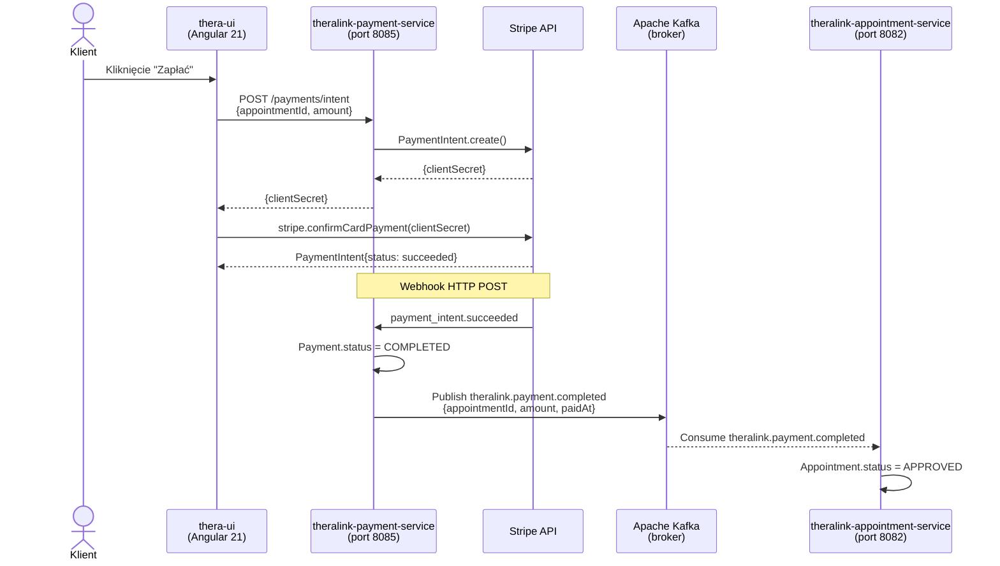

# Rozdział 6. Komunikacja asynchroniczna z wykorzystaniem Apache Kafka

Rozdział opisuje warstwę komunikacji asynchronicznej w architekturze mikrousługowej systemu
TheraLink. Omówiono podstawy architektury sterowanej zdarzeniami, uzasadnienie wyboru
Apache Kafka jako brokera komunikatów, konfigurację środowiska deweloperskiego
i produkcyjnego, konwencję nazewnictwa topiców oraz implementację producenta i konsumenta
zdarzeń w Spring Boot. Jako główny przypadek użycia opisano przepływ zdarzenia
`theralink.payment.completed` inicjującego aktualizację statusu wizyty.

---

## 6.1 Architektura sterowana zdarzeniami — podstawy teoretyczne

### Problem komunikacji synchronicznej w mikrousługach

W architekturze monolitycznej komunikacja między modułami odbywa się przez bezpośrednie
wywołania funkcji w ramach jednego procesu — jest to podejście proste i deterministyczne.
W architekturze mikrousługowej każdy serwis działa jako oddzielny proces sieciowy.
Gdy serwis A musi powiadomić serwis B o pewnym zdarzeniu, najprostszym rozwiązaniem
jest synchroniczne wywołanie HTTP (ang. *Hypertext Transfer Protocol*, HTTP):
A czeka na odpowiedź B przed kontynuowaniem pracy. Takie podejście wprowadza kilka
problemów:

- **Czasowe sprzężenie** — serwis A jest zablokowany na czas przetwarzania przez B; awaria B
  skutkuje błędem w A,
- **Kaskadowe awarie** — jeśli łańcuch synchronicznych wywołań to A→B→C→D, niedostępność D
  paraliżuje cały łańcuch,
- **Ścisłe powiązanie** — A musi znać adres B; każda zmiana API B wymaga aktualizacji A.

### Architektura sterowana zdarzeniami

Architektura sterowana zdarzeniami (ang. *Event-Driven Architecture*, EDA) [X] rozwiązuje
te problemy przez odwrócenie modelu komunikacji: producent (ang. *producer*) nie wysyła
wiadomości bezpośrednio do konsumenta (ang. *consumer*), lecz publikuje zdarzenie
do pośrednika (ang. *message broker*). Konsument subskrybuje interesujące go topiki
i przetwarza zdarzenia we własnym tempie, niezależnie od producenta. Oba serwisy
nie muszą być jednocześnie dostępne — broker buforuje zdarzenia do czasu przetworzenia.

W systemie TheraLink zastosowano wzorzec publikuj-subskrybuj (ang. *publish-subscribe*,
pub-sub): po zakończeniu płatności serwis płatności publikuje zdarzenie
`theralink.payment.completed`, a serwis wizyt subskrybuje ten topik i aktualizuje
status wizyty. Żaden z tych serwisów nie ma bezpośredniej wiedzy o istnieniu drugiego.

### Komponenty Apache Kafka

Apache Kafka [X] jest dystrybuowaną platformą strumieniowania zdarzeń (ang. *event
streaming platform*) zaprojektowaną z myślą o wysokiej przepustowości i trwałości
komunikatów. Kluczowe pojęcia:

- **Broker** — proces Kafka przechowujący wiadomości i obsługujący producentów
  oraz konsumentów. W środowisku deweloperskim systemu TheraLink uruchomiono
  pojedynczy broker w kontenerze Docker.
- **Topik** (ang. *topic*) — nazwany kanał, do którego producent wysyła wiadomości
  i z którego konsument je odczytuje. Odpowiednik tematu w modelu pub-sub.
- **Partycja** (ang. *partition*) — topik jest podzielony na partycje. Każda wiadomość
  w ramach partycji posiada monotonicznie rosnący numer zwany offsetem (ang. *offset*).
  Kafka gwarantuje kolejność wiadomości tylko wewnątrz jednej partycji.
- **Klucz wiadomości** (ang. *message key*) — opcjonalna wartość decydująca, do której
  partycji trafi wiadomość. Wiadomości z tym samym kluczem zawsze trafiają do tej samej
  partycji, co gwarantuje ich przetwarzanie w kolejności. W TheraLink jako klucza używa
  się identyfikatora wizyty (`appointmentId`), co zapewnia porządek zdarzeń dla każdej
  wizyty z osobna.
- **Grupa konsumentów** (ang. *consumer group*) — logiczny zbiór konsumentów współdzielących
  obciążenie. Każda partycja jest w danej chwili przypisana do dokładnie jednego konsumenta
  w grupie. Pozwala to na skalowanie poziome bez duplikacji przetwarzania.
- **Offset zatwierdzony** (ang. *committed offset*) — pozycja ostatnio przetworzonej
  wiadomości, zapisywana przez Kafkę. Dzięki temu konsument może wznowić pracę
  od właściwego miejsca po restarcie.

### Uzasadnienie wyboru Kafka

Przy wyborze brokera komunikatów dla platformy TheraLink rozważono trzy podejścia
zaprezentowane w tabeli 6.1.

**Tabela 6.1.** Porównanie podejść do komunikacji między serwisami

| Kryterium | REST synchroniczne | RabbitMQ | Apache Kafka |
|---|---|---|---|
| Model | Żądanie-odpowiedź | Kolejka/pub-sub | Pub-sub (log zdarzeń) |
| Trwałość wiadomości | Brak | Opcjonalna (TTL) | Konfigurowana retencja (domyślnie 7 dni) |
| Replay zdarzeń | Niemożliwy | Niemożliwy | Możliwy (offset reset) |
| Sprzężenie | Ścisłe (adres serwisu B) | Luźne | Luźne |
| Odporność na awarie | Awaria B = błąd A | Wiadomość czeka w kolejce | Wiadomość czeka w logu |
| Skalowalność konsumentów | Brak | Ograniczona | Wysoka (partycje) |
| Złożoność konfiguracji | Niska | Niska | Średnia |

Wybór Kafki podyktowany był dwoma głównymi przesłankami. Po pierwsze, serwis
wizyt nie posiada dostępu do bazy danych serwisu płatności — jest to fundamentalne
wymaganie wzorca *database per service* opisanego w rozdziale 7. Jedyna droga
powiadomienia serwisu wizyt o zakończeniu płatności wiedzie przez zdarzenie asynchroniczne.
Po drugie, Kafka obsługuje protokół natywny przez Azure Event Hubs [X] bez jakichkolwiek
zmian w kodzie aplikacji — wystarczy podmienić zmienną środowiskową
`KAFKA_BOOTSTRAP_SERVERS`, co jest istotne w kontekście wdrożenia na platformie
Azure AKS opisanego w rozdziale 11.

**Przed / Po — model komunikacji między serwisami**

| Aspekt | Monolityczna (przed) | Mikrousługi + Kafka (po) |
|---|---|---|
| Powiadomienie o płatności | Bezpośrednie wywołanie funkcji w obrębie procesu | Zdarzenie `theralink.payment.completed` przez Kafkę |
| Sprzężenie serwisów | Brak (jeden proces) | Luźne — producent nie zna konsumenta |
| Awaria jednego modułu | Wyjątek przechwycony w bloku try-catch | Wiadomości buforowane w Kafce do momentu odzyskania serwisu |
| Audyt i replay | Brak historii zdarzeń | Log Kafka — możliwość ponownego przetworzenia zdarzeń |

---

## 6.2 Konfiguracja środowiska Kafka

### Docker Compose — środowisko deweloperskie

Środowisko deweloperskie oparto na obrazach Confluent Platform 7.6.0 — dystrybucji
Apache Kafka dostarczonej przez firmę Confluent [X]. Do uruchomienia Kafki wymagane
jest wcześniej uruchomienie procesu Zookeeper (ang. *ZooKeeper*) [X], który w Kafce
do wersji 3.x pełni rolę serwisu koordynującego: przechowuje metadane klastra,
informacje o topikach i partycjach oraz rejestr liderów replikacji.

**Listing 6.1.** Konfiguracja Kafka, Zookeeper i Kafka-UI w Docker Compose
(plik `thera-infrastructure/docker-compose/docker-compose.yml`, linie 94–145)

```yaml
  zookeeper:
    image: confluentinc/cp-zookeeper:7.6.0
    container_name: thera-zookeeper
    networks: [theralink-network]
    ports:
      - "2181:2181"
    environment:
      ZOOKEEPER_CLIENT_PORT: 2181
      ZOOKEEPER_TICK_TIME: 2000
    volumes:
      - zookeeper_data:/var/lib/zookeeper/data

  kafka:
    image: confluentinc/cp-kafka:7.6.0
    container_name: thera-kafka
    networks: [theralink-network]
    ports:
      - "9092:9092"   # dostęp z hosta (IDE/terminal)
    depends_on:
      - zookeeper
    environment:
      KAFKA_BROKER_ID: 1
      KAFKA_ZOOKEEPER_CONNECT: zookeeper:2181

      # Dwa listenery — kluczowa konfiguracja
      KAFKA_LISTENER_SECURITY_PROTOCOL_MAP: INTERNAL:PLAINTEXT,EXTERNAL:PLAINTEXT
      KAFKA_LISTENERS: INTERNAL://0.0.0.0:29092,EXTERNAL://0.0.0.0:9092
      KAFKA_ADVERTISED_LISTENERS: INTERNAL://kafka:29092,EXTERNAL://localhost:9092
      KAFKA_INTER_BROKER_LISTENER_NAME: INTERNAL

      KAFKA_OFFSETS_TOPIC_REPLICATION_FACTOR: 1
      KAFKA_AUTO_CREATE_TOPICS_ENABLE: "true"
    volumes:
      - kafka_data:/var/lib/kafka/data
    healthcheck:
      test: ["CMD", "kafka-broker-api-versions", "--bootstrap-server", "localhost:9092"]
      interval: 15s
      timeout: 10s
      retries: 5

  # Panel webowy do przeglądania topików i wiadomości Kafka
  kafka-ui:
    image: provectuslabs/kafka-ui:latest
    container_name: thera-kafka-ui
    networks: [theralink-network]
    ports:
      - "9090:8080"
    depends_on:
      - kafka
    environment:
      KAFKA_CLUSTERS_0_NAME: theralink-dev
      KAFKA_CLUSTERS_0_BOOTSTRAPSERVERS: kafka:29092
```

Kluczowym elementem konfiguracji brokera jest zmienna `KAFKA_ADVERTISED_LISTENERS`
definiująca dwa oddzielne listenery:

- **INTERNAL://kafka:29092** — używany przez kontenery Docker komunikujące się
  wewnątrz sieci `theralink-network`; adres `kafka` rozwiązywany jest przez DNS
  wewnątrz sieci Docker,
- **EXTERNAL://localhost:9092** — używany przez procesy uruchomione bezpośrednio
  na hoście (np. serwisy Spring Boot uruchamiane z IDE IntelliJ IDEA).

Rozdzielenie listenerów rozwiązuje typowy problem konfiguracyjny: serwis Spring Boot
uruchomiony lokalnie (poza Dockerem) nie może osiągnąć adresu `kafka:29092`,
ponieważ ta nazwa DNS istnieje tylko wewnątrz sieci kontenerów. Zmienna środowiskowa
`KAFKA_BOOTSTRAP_SERVERS` przyjmuje zatem wartość `kafka:29092` dla serwisów
uruchomionych w Dockerze, natomiast `localhost:9092` dla serwisów uruchomionych
bezpośrednio z IDE.

Dodatkowo uruchomiono panel webowy Kafka-UI (obraz `provectuslabs/kafka-ui`) dostępny
na porcie 9090. Narzędzie to umożliwia przeglądanie topików, partycji, grup konsumentów
oraz treści poszczególnych wiadomości bez konieczności użycia narzędzi wiersza poleceń.

> 📸 **[SCREEN DO DODANIA]**
> **Co pokazać:** Panel Kafka-UI (`http://localhost:9090`) z listą topiców systemu TheraLink — w widoku „Topics"; widoczne topiki `theralink.payment.completed`, `theralink.payment.failed`, `theralink.appointment.created`, `user-events.clients`
> **Sugerowany podpis:** Rys. 6.1. Panel Kafka-UI z listą topiców środowiska deweloperskiego TheraLink
> **Źródło:** opracowanie własne

### Azure Event Hubs — środowisko produkcyjne

Na środowisku produkcyjnym w Azure AKS zastosowano Azure Event Hubs [X] jako zarządzaną
usługę kompatybilną z protokołem Apache Kafka. Kompatybilność ta oznacza, że aplikacje
Spring Boot nie wymagają żadnych modyfikacji kodu — zmiana środowiska z lokalnego Docker
na Azure Event Hubs ogranicza się do podmiany zmiennej środowiskowej:

```
KAFKA_BOOTSTRAP_SERVERS=<namespace>.servicebus.windows.net:9093
```

Azure Event Hubs automatycznie zarządza retencją wiadomości, replikacją partycji
i skalowaniem klastra, eliminując potrzebę utrzymywania infrastruktury Zookeeper
przez zespół deweloperski.

---

## 6.3 Konwencja nazewnictwa topiców

W systemie TheraLink przyjęto jednolitą konwencję nazewnictwa topiców Kafka zgodną
z hierarchicznym formatem:

```
theralink.{domena}.{zdarzenie}
```

gdzie `domena` odpowiada domenie biznesowej (np. `appointment`, `payment`, `user`),
a `zdarzenie` opisuje fakt, który zaszedł — zawsze w formie dokonanej
(np. `created`, `completed`, `failed`). Użycie formy dokonanej jest celowe:
zdarzenie reprezentuje fakt, który już nastąpił i jest nieodwołalny, w odróżnieniu
od komendy (ang. *command*), która dopiero żąda wykonania akcji.

Tabela 6.2 zestawia wszystkie topiki zdefiniowane w systemie na etapie opisywanej migracji.

**Tabela 6.2.** Topiki Kafka w systemie TheraLink

| Topik | Producent | Konsument(y) | Kluczowe pola zdarzenia |
|---|---|---|---|
| `theralink.appointment.created` | appointment-service | payment-service | `appointmentId`, `clientKeycloakId` |
| `theralink.payment.completed` | payment-service | appointment-service | `paymentId`, `appointmentId`, `amount`, `currency`, `paidAt` |
| `theralink.payment.failed` | payment-service | appointment-service | `paymentId`, `appointmentId`, `clientKeycloakId` |
| `user-events.clients` | user-service | (planowane serwisy) | `clientId`, `keycloakId`, `email`, `name` |
| `user-events.psychologists` | user-service | (planowane serwisy) | `psychologistId`, `keycloakId`, `email`, `name` |

Topiki `user-events.clients` i `user-events.psychologists` nie są zgodne z przyjętą
konwencją `theralink.{domena}.{zdarzenie}` — zostały zaimplementowane na wcześniejszym
etapie projektu i stanowią dług techniczny (ang. *technical debt*) przeznaczony
do standaryzacji w kolejnej iteracji.

Istotnym aspektem konfiguracji producenta jest właściwość `spring.json.add.type.headers`
ustawiona na `false` (patrz podrozdział 6.4). Domyślnie Spring Kafka dodaje do nagłówka
Kafka wiadomości w pełni kwalifikowaną nazwę klasy Java (np.
`com.theralink.paymentservice.kafka.PaymentCompletedEvent`). Wyłączenie tej opcji
powoduje, że wiadomości są zwykłymi obiektami JSON bez informacji o typie Java, dzięki
czemu konsumenci napisani w innych językach (Python, Node.js) mogą odczytywać zdarzenia
bez znajomości modelu obiektowego Java.

---

## 6.4 Konfiguracja producenta — KafkaTemplate

### Konfiguracja w application.yml

Spring Boot oferuje mechanizm automatycznej konfiguracji (ang. *auto-configuration*)
większości infrastruktury, w tym Kafki. Podstawowa konfiguracja producenta w pliku
`application.yml` serwisu `theralink-user-service` ogranicza się do wskazania adresu
brokera i serializatorów:

**Listing 6.2.** Konfiguracja producenta Kafka w pliku `application.yml` serwisu użytkowników
(plik `thera-rest-service/src/main/resources/application.yml`, linie 22–30)

```yaml
  kafka:
    bootstrap-servers: ${KAFKA_BOOTSTRAP_SERVERS:localhost:9092}
    producer:
      key-serializer: org.apache.kafka.common.serialization.StringSerializer
      value-serializer: org.springframework.kafka.support.serializer.JsonSerializer
      properties:
        # Nie dodawaj nagłówków z nazwą klasy Java do wiadomości Kafka
        # (inne serwisy mogą używać innych języków/frameworków)
        spring.json.add.type.headers: false
```

Serwis płatności wymaga zarówno producenta (do publikowania zdarzeń `payment.completed`),
jak i konsumenta (do odczytywania zdarzeń `appointment.created`). Jego konfiguracja
`application.yml` zawiera zatem sekcje dla obu ról:

**Listing 6.3.** Konfiguracja producenta i konsumenta Kafka w pliku `application.yml`
serwisu płatności (plik `thera-payment-service/src/main/resources/application.yml`, linie 33–48)

```yaml
  # ── Kafka ────────────────────────────────────────────────────────────────────
  kafka:
    bootstrap-servers: ${KAFKA_BOOTSTRAP_SERVERS:localhost:9092}
    producer:
      key-serializer: org.apache.kafka.common.serialization.StringSerializer
      # JsonSerializer automatycznie konwertuje obiekt Java na JSON
      value-serializer: org.springframework.kafka.support.serializer.JsonSerializer
    consumer:
      group-id: theralink-payment-group
      # earliest = od początku topicu (przydatne gdy serwis był chwilowo offline)
      auto-offset-reset: earliest
      key-deserializer: org.apache.kafka.common.serialization.StringDeserializer
      value-deserializer: org.springframework.kafka.support.serializer.JsonDeserializer
      properties:
        # Pozwalamy deserializować klasy z dowolnego pakietu
        spring.json.trusted.packages: "*"
```

Właściwość `auto-offset-reset: earliest` oznacza, że konsument — w przypadku braku
zapisanego offsetu (np. pierwsze uruchomienie serwisu) — odczyta wszystkie wiadomości
od początku topiku. Jest to szczególnie ważne w środowisku deweloperskim, gdzie serwis
może być uruchamiany po brokerze i mógłby ominąć zdarzenia opublikowane wcześniej.

### Klasa konfiguracyjna KafkaProducerConfig

Mechanizm automatycznej konfiguracji Spring Boot tworzy domyślnie bean
`KafkaTemplate<Object, Object>`. Klasa `PaymentEventProducer` w serwisie płatności
wymaga jednak dokładnie `KafkaTemplate<String, Object>` — Spring nie może dopasować
tych typów generycznych, co skutkuje błędem uruchomienia aplikacji. Z tego względu
konieczne jest jawne zdefiniowanie beana z dokładnym typem generycznym w klasie konfiguracyjnej:

**Listing 6.4.** Klasa konfiguracyjna producenta Kafka
(plik `thera-payment-service/src/main/java/com/theralink/paymentservice/config/KafkaProducerConfig.java`, linie 30–68)

```java
@Configuration
public class KafkaProducerConfig {

    /**
     * Adres brokera Kafka wczytywany z application.yml (lub zmiennej środowiskowej).
     * Domyślna wartość: localhost:9092 (lokalne środowisko developerskie).
     */
    @Value("${spring.kafka.bootstrap-servers}")
    private String bootstrapServers;

    /**
     * Fabryka producentów Kafka.
     *
     * ProducerConfig.BOOTSTRAP_SERVERS_CONFIG  — gdzie jest broker Kafka
     * ProducerConfig.KEY_SERIALIZER_CLASS_CONFIG   — jak serializować klucz (String → bytes)
     * ProducerConfig.VALUE_SERIALIZER_CLASS_CONFIG — jak serializować wartość (Object → JSON bytes)
     */
    @Bean
    public ProducerFactory<String, Object> producerFactory() {
        Map<String, Object> config = new HashMap<>();
        config.put(ProducerConfig.BOOTSTRAP_SERVERS_CONFIG, bootstrapServers);
        config.put(ProducerConfig.KEY_SERIALIZER_CLASS_CONFIG, StringSerializer.class);
        config.put(ProducerConfig.VALUE_SERIALIZER_CLASS_CONFIG, JsonSerializer.class);
        return new DefaultKafkaProducerFactory<>(config);
    }

    /**
     * KafkaTemplate — główne API do wysyłania wiadomości.
     *
     * Używany przez PaymentEventProducer:
     *   kafkaTemplate.send(topic, key, value)
     *     topic — nazwa kolejki (np. "theralink.payment.completed")
     *     key   — appointmentId (zapewnia kolejność w partycji)
     *     value — Map<String, Object> serializowana do JSON
     */
    @Bean
    public KafkaTemplate<String, Object> kafkaTemplate() {
        return new KafkaTemplate<>(producerFactory());
    }
}
```

Klasa `KafkaProducerConfig` definiuje dwa beany tworzone w łańcuchu zależności.
Metoda `producerFactory()` buduje obiekt `DefaultKafkaProducerFactory` z mapą
właściwości konfiguracyjnych: adresem brokera, serializatorem klucza (`StringSerializer`)
i serializatorem wartości (`JsonSerializer`). `JsonSerializer` z biblioteki Spring Kafka
korzysta z Jackson ObjectMapper do automatycznej konwersji obiektów Java na JSON.
Metoda `kafkaTemplate()` opakowuje fabrykę w wygodne API `KafkaTemplate<String, Object>`,
które udostępnia metodę `send(topic, key, value)` do wysyłania wiadomości.

---

## 6.5 Publikowanie zdarzeń

### PaymentEventProducer — zdarzenia płatności

Klasa `PaymentEventProducer` w serwisie płatności jest odpowiedzialna za publikowanie
dwóch typów zdarzeń: `PAYMENT_COMPLETED` i `PAYMENT_FAILED`. Zdarzenia konstruowane
są jako niemodyfikowalne mapy (ang. *immutable map*) `Map.of(...)` z Javy 9+.
Jako klucz partycji użyto `appointmentId`, co gwarantuje, że wszystkie zdarzenia
dotyczące tej samej wizyty trafiają do tej samej partycji i są przetwarzane w kolejności.

**Listing 6.5.** Metoda publikująca zdarzenie `PAYMENT_COMPLETED`
(plik `thera-payment-service/src/main/java/com/theralink/paymentservice/kafka/PaymentEventProducer.java`, linie 36–67)

```java
@Component
@RequiredArgsConstructor
@Slf4j
public class PaymentEventProducer {

    private final KafkaTemplate<String, Object> kafkaTemplate;

    private static final String TOPIC_COMPLETED = "theralink.payment.completed";
    private static final String TOPIC_FAILED    = "theralink.payment.failed";

    /**
     * Wysyłane po odebraniu webhooka payment_intent.succeeded.
     *
     * Konsumenci:
     *   - notification-service: wyślij email z potwierdzeniem płatności
     *   - appointment-service: oznacz wizytę jako opłaconą
     */
    public void publishPaymentCompleted(Payment payment) {
        Map<String, Object> event = Map.of(
                "eventType",        "PAYMENT_COMPLETED",
                "paymentId",        payment.getId(),
                "appointmentId",    payment.getAppointmentId(),
                "clientKeycloakId", payment.getClientKeycloakId(),
                "amount",           payment.getAmount(),
                "currency",         payment.getCurrency(),
                "paidAt",           payment.getPaidAt().toString(),
                "timestamp",        Instant.now().toString()
        );
        kafkaTemplate.send(TOPIC_COMPLETED, payment.getAppointmentId(), event);
        log.info("Opublikowano event PAYMENT_COMPLETED na topicu {} dla wizyty: {}",
                TOPIC_COMPLETED, payment.getAppointmentId());
    }
```

Metoda `publishPaymentCompleted` wywoływana jest przez serwis płatności po odebraniu
webhooka Stripe `payment_intent.succeeded`, co oznacza potwierdzone obciążenie karty
klienta. Wywołanie `kafkaTemplate.send(...)` jest asynchroniczne — metoda zwraca
`CompletableFuture` bez oczekiwania na potwierdzenie odbioru przez brokera.
Ewentualne błędy dostarczenia rejestrowane są przez logger SLF4J.

> **Uwaga:** komentarz Javadoc w kodzie źródłowym (linia 406) wymienia `notification-service`
> jako potencjalnego konsumenta topiku `theralink.payment.completed`. Usługa powiadomień
> e-mail pozostaje poza zakresem niniejszej pracy (por. Wstęp). W zakresie zrealizowanej
> implementacji jedynym konsumentem tego topiku jest `theralink-appointment-service`,
> który aktualizuje status wizyty na `PAID`.

### UserEventProducer — zdarzenia użytkowników

Serwis użytkowników (`theralink-user-service`) publikuje zdarzenia przy rejestracji
nowego klienta lub psychologa. Klasa `UserEventProducer` stosuje nieco inny wzorzec
niż `PaymentEventProducer`: zamiast `Map.of(...)` używa mutowalnej `HashMap`
oraz rejestruje wynik wysyłki w callbacku `.whenComplete(...)`:

**Listing 6.6.** Metoda publikująca zdarzenie `CLIENT_CREATED`
(plik `thera-rest-service/src/main/java/com/example/therarestservice/kafka/UserEventProducer.java`, linie 13–41)

```java
@Slf4j
@Component
@RequiredArgsConstructor
public class UserEventProducer {

    private static final String CLIENT_TOPIC = "user-events.clients";
    private static final String PSYCHOLOGIST_TOPIC = "user-events.psychologists";

    private final KafkaTemplate<String, Object> kafkaTemplate;

    public void publishClientCreated(ClientResponse client) {
        Map<String, Object> event = new HashMap<>();
        event.put("eventType", "CLIENT_CREATED");
        event.put("clientId", client.getId());
        event.put("keycloakId", client.getKeycloakId());
        event.put("email", client.getEmail());
        event.put("name", client.getName());

        kafkaTemplate.send(CLIENT_TOPIC, client.getId(), event)
                .whenComplete((result, ex) -> {
                    if (ex != null) {
                        log.error("Failed to publish CLIENT_CREATED for clientId: {}. Error: {}",
                                client.getId(), ex.getMessage());
                    } else {
                        log.info("Published CLIENT_CREATED for clientId: {} to partition: {}",
                                client.getId(), result.getRecordMetadata().partition());
                    }
                });
    }
```

Callback `.whenComplete(...)` rejestruje w przypadku sukcesu numer partycji, do której
trafiła wiadomość — jest to przydatne w diagnostyce problemów z kolejnością zdarzeń.
W przypadku błędu (np. niedostępności brokera) błąd jest logowany, ale nie propagowany
jako wyjątek — jest to świadoma decyzja projektowa zgodna z filozofią *fire-and-forget*
właściwą dla operacji asynchronicznych, gdzie błędy mogą być retried przez mechanizmy
retry Kafki.

---

## 6.6 Konsumowanie zdarzeń — adnotacja @KafkaListener

### Implementacja konsumenta

Adnotacja `@KafkaListener` z biblioteki Spring Kafka [X] wskazuje Spring Boot, że
oznaczona metoda ma być wywoływana za każdym razem, gdy na wskazanym topiku pojawi się
nowa wiadomość. Spring automatycznie zarządza pętlą pobierania (ang. *poll loop*),
deserializacją wiadomości, zarządzaniem offsetami i ponownymi połączeniami
w przypadku niedostępności brokera.

**Listing 6.7.** Konsument zdarzeń `appointment.created` w serwisie płatności
(plik `thera-payment-service/src/main/java/com/theralink/paymentservice/kafka/AppointmentEventConsumer.java`, linie 32–52)

```java
@Component
@RequiredArgsConstructor
@Slf4j
public class AppointmentEventConsumer {

    @KafkaListener(
            topics = "theralink.appointment.created",
            groupId = "theralink-payment-group"
    )
    public void onAppointmentCreated(Map<String, Object> event) {
        String appointmentId    = (String) event.get("appointmentId");
        String clientKeycloakId = (String) event.get("clientKeycloakId");

        log.info("Nowa wizyta wymagająca płatności: appointmentId={}, client={}",
                appointmentId, clientKeycloakId);

        // W bieżącej implementacji czekamy aż klient sam zainicjuje płatność
        // przez POST /payments/intent — brak akcji tutaj.
    }
}
```

Parametr `groupId = "theralink-payment-group"` identyfikuje grupę konsumentów.
Wszystkie instancje serwisu płatności uruchomione w ramach jednej grupy będą
współdzielić partycje topiku — każda wiadomość zostanie przetworzona przez dokładnie
jedną instancję. Zapewnia to idempotentność przetwarzania przy skalowaniu poziomym.

Deserializacja wiadomości odbywa się do `Map<String, Object>` — Spring Kafka
konwertuje JSON na mapę przy użyciu `JsonDeserializer`. Jest to podejście prostsze
od mapowania na dedykowaną klasę DTO, ale traci statyczne typowanie; planowana
biblioteka `theralink-contracts` rozwiązuje ten problem (patrz podrozdział 6.7).

### Przypadek użycia: przepływ zdarzenia payment.completed

Głównym przypadkiem użycia komunikacji asynchronicznej w systemie TheraLink jest
aktualizacja statusu wizyty po potwierdzeniu płatności. Poniższy diagram przedstawia
pełny przepływ zdarzenia od kliknięcia „Zapłać" przez użytkownika do zaktualizowania
statusu wizyty.



> 📸 **[SCREEN DO DODANIA]**
> **Co pokazać:** Panel Kafka-UI → zakładka „Topics" → topik `theralink.payment.completed` → zakładka „Messages"; widoczna co najmniej jedna wiadomość z polami `eventType: PAYMENT_COMPLETED`, `appointmentId`, `amount`
> **Sugerowany podpis:** Rys. 6.2. Wiadomość zdarzenia `PAYMENT_COMPLETED` w panelu Kafka-UI
> **Źródło:** opracowanie własne

**Przed / Po — przepływ powiadomienia o płatności**

| Aspekt | Monolit (przed) | Mikrousługi + Kafka (po) |
|---|---|---|
| Mechanizm | Bezpośrednie wywołanie modułu płatności i wizyty w jednej transakcji | Zdarzenie async `payment.completed`; serwisy niezależne |
| Awaria serwisu wizyt | Cały przepływ płatności zatrzymany | Zdarzenie czeka w Kafce; przetworzenie po powrocie serwisu |
| Możliwość debugowania | Logi jednej aplikacji | Kafka-UI: widoczna treść każdej wiadomości, offset, timestamp |

---

## 6.7 Schemat zdarzeń — biblioteka theralink-contracts

Aktualnie zdarzenia w systemie TheraLink reprezentowane są jako `Map<String, Object>` —
podejście elastyczne, niewymagające wspólnych zależności między serwisami, ale pozbawione
statycznego typowania. Błędy w nazwach pól (np. literówka `"paymentID"` zamiast
`"paymentId"`) ujawniają się dopiero w środowisku uruchomieniowym.

W toku planowania architektury zdecydowano o stworzeniu wspólnej biblioteki Maven
`theralink-contracts` zawierającej rekordy Java (ang. *Java records*) [X] modelujące
schematy wszystkich zdarzeń Kafka. Przykładowy rekord:

```java
// Planowany plik: theralink-contracts/src/main/java/com/theralink/contracts/PaymentCompletedEvent.java
public record PaymentCompletedEvent(
    String eventType,
    String paymentId,
    String appointmentId,
    String clientKeycloakId,
    Long amount,
    String currency,
    String paidAt,
    String timestamp
) {}
```

Producent publikowałby typowany obiekt zamiast mapy:

```java
// Przed (aktualny stan):
kafkaTemplate.send(TOPIC_COMPLETED, payment.getAppointmentId(), Map.of("eventType", "PAYMENT_COMPLETED", ...));

// Po (z theralink-contracts):
kafkaTemplate.send(TOPIC_COMPLETED, payment.getAppointmentId(),
    new PaymentCompletedEvent("PAYMENT_COMPLETED", payment.getId(), ...));
```

Biblioteka `theralink-contracts` stanowi naturalną ewolucję obecnej implementacji,
jednak jej stworzenie i opublikowanie do lokalnego repozytorium Maven (lub Azure Artifacts)
zaplanowano poza zakresem opisywanej migracji.

---

## 6.8 Podsumowanie — komunikacja asynchroniczna

Wdrożenie Apache Kafka jako warstwy komunikacji asynchronicznej umożliwiło realizację
architektury mikrousługowej opartej na zasadzie izolacji danych (*database per service*).
Serwisy TheraLink nie współdzielą baz danych, a jedynym mechanizmem wymiany informacji
między domenami jest magistrala zdarzeń Kafka.

**Tabela 6.3.** Zbiorcze porównanie modelu komunikacji przed i po migracji

| Kryterium | Monolityczna architektura (przed) | Mikrousługi z Kafka (po) |
|---|---|---|
| Mechanizm | Bezpośrednie wywołania funkcji w procesie | Asynchroniczne zdarzenia przez brokera Kafka |
| Sprzężenie serwisów | Brak (jeden proces) | Luźne — producent nie zna konsumenta |
| Odporność na awarie | Awaria modułu = wyjątek w procesie | Zdarzenia buforowane — serwis odtwarza po restarcie |
| Kolejność zdarzeń | Deterministyczna (synchroniczna) | Gwarantowana w partycji (klucz = `appointmentId`) |
| Audyt i replay | Brak historii | Log Kafka — możliwy replay z dowolnego offsetu |
| Narzędzia | Logi aplikacji | Kafka-UI, Azure Event Hubs Monitor |
| Złożoność konfiguracji | Niska | Wyższa (broker, listenery, serializacja) |
| Środowisko prod | PostgreSQL (zarządzany przez PaaS) | Azure Event Hubs (Kafka protocol, bez zmian kodu) |

Zastosowanie Kafki zwiększa złożoność operacyjną systemu: wymaga utrzymania brokera,
konfiguracji listenerów sieciowych i monitorowania offsetów. Korzyścią jest jednak
pełna separacja serwisów — dodanie nowego konsumenta istniejącego topiku (np. serwisu
analitycznego lub audytowego) nie wymaga jakichkolwiek zmian w producencie. Przejście
na Azure Event Hubs w środowisku produkcyjnym eliminuje koszty operacyjne utrzymania
klastra Kafka i automatycznie zapewnia wysoki poziom dostępności usługi.
