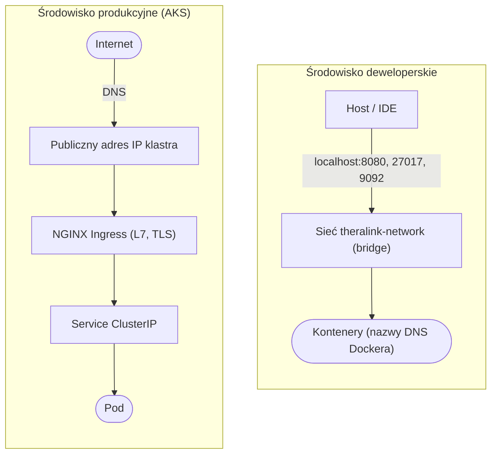

# Rozdział 10. Separacja środowisk uruchomieniowych

Rozdział porównuje dwa środowiska uruchomieniowe systemu TheraLink: deweloperskie (lokalne,
oparte na Docker Compose) oraz produkcyjne (chmura Azure, klaster AKS). Wychodząc od zasady
zgodności środowisk (ang. *dev/prod parity*) z metodyki *12-factor app*, omówiono kolejno
różnice w uruchamianiu, bazie danych, brokerze komunikatów, serwerze tożsamości, zarządzaniu
sekretami, konfiguracji aplikacji, sieci, domenie i certyfikacie, przepływie pracy dewelopera
oraz skalowaniu. W odróżnieniu od pozostałych rozdziałów cały ten rozdział ma charakter
porównawczy — w każdym podrozdziale zestawiono stan deweloperski z produkcyjnym w postaci
krótkiej tabeli, a rozdział zamyka zbiorcze porównanie z wnioskami. Szczegóły konteneryzacji
i orkiestracji opisano w rozdziale 8, a wdrożenia chmurowego — w rozdziale 9; niniejszy rozdział
skupia się na *różnicach konfiguracyjnych* między środowiskami przy zachowaniu wspólnego kodu.

---

## 10.1 Zasada zgodności środowisk — *12-factor app*

Metodyka *12-factor app* [X] formułuje zasadę zgodności środowisk: środowisko deweloperskie
i produkcyjne powinny być maksymalnie podobne, aby ograniczyć klasę błędów „u mnie działa"
(ang. *works on my machine*). Jednocześnie pewne różnice są nieuniknione i racjonalne — wynikają
z kosztu, opóźnień sieciowych oraz dostępu do rzeczywistych usług zewnętrznych. Strategia
przyjęta w TheraLink polega na zachowaniu spójnego stosu technologicznego w obu środowiskach
(te same wersje frameworków Spring Boot 4 i Angular 21, ten sam sterownik Spring Data MongoDB
i model danych dokumentowych, te same biblioteki Spring Kafka) przy świadomej różnicy w warstwie
*usługa samodzielnie hostowana kontra usługa zarządzana*. Wersja protokołu bazy danych różni się
między środowiskami (MongoDB 7.0 lokalnie wobec protokołu 4.2 w Cosmos DB), co — dzięki
zachowanej kompatybilności sterownika — nie wymaga zmian w kodzie aplikacji. Wersje Javy
różnią się również między serwisami: thera-rest-service korzysta z Javy 25, a thera-payment-service
z Javy 21 (omówiono w rozdziale 3); różnica ta jest zachowana w obu środowiskach uruchomieniowych.
Kluczowe jest, że kod aplikacji pozostaje ten sam — różnice sprowadzają się do konfiguracji
wstrzykiwanej z zewnątrz (zmienne środowiskowe, manifesty Kubernetes, pliki wartości Helm).

**Tabela 10.1.** Co wspólne, a co różne między środowiskami TheraLink

| Element | Wspólne (dev = prod) | Różnica (dev → prod) |
|---|---|---|
| Język i runtime | Java 25/21, Node 22 | brak |
| Frameworki | Spring Boot 4, Angular 21 | brak |
| Baza danych | Protokół MongoDB, sterownik Spring Data | `mongo:7.0` (kontener) → Cosmos DB (zarządzana) |
| Broker | Protokół Kafka, biblioteki Spring Kafka | Confluent + Zookeeper → Event Hubs |
| Serwer tożsamości | Keycloak 25, realm `theralink` | `start-dev` → `start --optimized` |
| Sekrety | Odczyt jako zmienne środowiskowe | `.env` → Azure Key Vault |
| Sieć i TLS | — | Mapowane porty → Ingress + TLS |

---

## 10.2 Uruchamianie — `docker-compose up` kontra `helm install`

W środowisku deweloperskim cały stos uruchamia jedno polecenie `docker-compose up` na jednej
maszynie (definicja w `docker-compose.yml`, rozdział 8). W produkcji odpowiednikiem jest
`helm install` (lub `helm upgrade`) wdrażający chart na klastrze AKS z pliku wartości
`values.prod.yaml`. Helm pełni wobec Kubernetes rolę analogiczną do Docker Compose wobec
Dockera, dodatkowo wprowadzając szablonowanie i aktualizacje kroczące. Manifesty i polecenia
szczegółowo omówiono w rozdziałach 8 i 9.

**Tabela 10.2.** Porównanie uruchamiania w środowisku deweloperskim i produkcyjnym

| Aspekt | Dev | Prod |
|---|---|---|
| Polecenie | `docker-compose up -d` | `helm install theralink ./helm/theralink -f values.prod.yaml` |
| Zakres | Jedna maszyna | Klaster AKS |
| Definicja | `docker-compose.yml` | Chart Helm + `values.prod.yaml` |
| Aktualizacja | `docker-compose up --build` | `helm upgrade` (aktualizacja krocząca, ang. *rolling update*) |
| Wycofanie | Brak (ręczne) | `helm rollback` |

> 📸 **[SCREEN DO DODANIA]**
> **Co pokazać:** Output `docker-compose ps` na komputerze lokalnym — 5–6 serwisów dev (mongodb, keycloak, keycloak-db, kafka, zookeeper, kafka-ui) w stanie Running
> **Sugerowany podpis:** Rys. 10.1. Środowisko deweloperskie TheraLink uruchomione lokalnie przez Docker Compose
> **źródło:** opracowanie własne

> 📸 **[SCREEN DO DODANIA]**
> **Co pokazać:** Output `kubectl get pods -n theralink -o wide` — 5 podów `thera-*` z prod Azure
> **Sugerowany podpis:** Rys. 10.2. Środowisko produkcyjne TheraLink w klastrze AKS — odpowiednik Rys. 10.1
> **źródło:** opracowanie własne

---

## 10.3 Baza danych — kontener MongoDB kontra Azure Cosmos DB

W środowisku deweloperskim używana jest pojedyncza instancja `mongo:7.0` w kontenerze
(bez replikacji i TLS), w produkcji — zarządzana usługa Azure Cosmos DB [X] z protokołem
MongoDB 4.2 (replikacja, wymagany TLS, przepustowość RU/s — ang. *Request Units per second*).
Ponieważ sterownik Spring Data MongoDB jest identyczny, zmiana ogranicza się do adresu połączenia
w zmiennej `MONGODB_URI` (por. rozdział 9, w tym obejście rozwiązywania adresu przez
`JDK_JAVA_OPTIONS` — Listing 9.5).

**Tabela 10.3.** Porównanie warstwy bazy danych w środowisku deweloperskim i produkcyjnym

| Aspekt | Dev (`mongo:7.0`) | Prod (Cosmos DB) |
|---|---|---|
| Wersja/protokół | MongoDB 7.0 | Protokół MongoDB 4.2 |
| Replikacja, TLS | Brak | Wbudowana replikacja, wymagany TLS |
| Adres | `mongodb://mongodb:27017/theralink-users` | `mongodb://...:10255/theralink-users?ssl=true&...` |
| Skalowanie | Brak | Przepustowość RU/s (400 RU/s na bazę danych) |
| Kod aplikacji | Bez zmian | Bez zmian |

---

## 10.4 Broker komunikatów — Kafka kontra Azure Event Hubs

Lokalnie działa pełny stos Confluent Kafka z Zookeeperem (~500 MB RAM), w produkcji — zarządzana
usługa Event Hubs eksponująca protokół Kafka [X], bez Zookeepera i bez własnej infrastruktury.
Świadomie zrezygnowano z warstwy abstrakcji nad protokołem: aplikacja korzysta z oficjalnych
bibliotek Kafka, a Event Hubs jest ich bezpośrednim zamiennikiem. Różnica dotyczy adresu
i sposobu uwierzytelnienia (rozdział 9).

**Tabela 10.4.** Porównanie warstwy brokera komunikatów w środowisku deweloperskim i produkcyjnym

| Aspekt | Dev (Confluent Kafka) | Prod (Event Hubs) |
|---|---|---|
| Infrastruktura | Kafka + Zookeeper (kontenery) | Usługa zarządzana (brak Zookeepera) |
| Adres | `kafka:29092` / `localhost:9092` | `evh-...servicebus.windows.net:9093` |
| Uwierzytelnienie | PLAINTEXT (brak) | SASL_SSL + PLAIN (konfiguracja JAAS) |
| Kod aplikacji | Bez zmian | Bez zmian |

---

## 10.5 Serwer tożsamości — Keycloak deweloperski kontra produkcyjny

W obu środowiskach działa ten sam obraz Keycloak 25 (rozdział 5), różni się jedynie tryb
uruchomienia i model bazy danych. W środowisku deweloperskim Keycloak startuje w trybie
`start-dev` z bazą PostgreSQL w kontenerze i importem realm z pliku, a konto administratora
tworzone jest ze zmiennych środowiskowych. W produkcji obraz uruchamiany jest w trybie
`start --optimized` (po prekompilacji `kc.sh build --db postgres`, rozdział 8), z bazą PostgreSQL
jako StatefulSet z trwałym wolumenem Azure Disk [X]. W produkcji ujawniło się ograniczenie
wersji 25.0.4: konto administratora trzeba utworzyć ręcznym poleceniem SQL z hashem PBKDF2
(rozdział 9).

**Tabela 10.5.** Porównanie konfiguracji serwera tożsamości Keycloak w środowisku deweloperskim i produkcyjnym

| Aspekt | Dev | Prod |
|---|---|---|
| Tryb startu | `start-dev` | `start --optimized` |
| Baza | PostgreSQL w kontenerze | PostgreSQL (StatefulSet + PVC) |
| Import realm | `--import-realm` z pliku | REST API administracji |
| Konto admina | Ze zmiennych środowiskowych | Ręczny SQL INSERT (PBKDF2) |

---

## 10.6 Sekrety — plik `.env` kontra Azure Key Vault

W środowisku deweloperskim sekrety przechowywane są w pliku `.env` wykluczonym z systemu kontroli
wersji (wpis w `.gitignore`), z którego Docker Compose wczytuje zmienne środowiskowe (szablon
`.env.example`, Listing 8.13). W produkcji osiem sekretów znajduje się w Azure Key Vault, skąd
sterownik CSI pobiera je i synchronizuje do obiektu Secret Kubernetes (rozdziały 8 i 9). W obu
przypadkach aplikacja odczytuje sekrety jako zmienne środowiskowe — kod jest identyczny, zmienia
się jedynie źródło wartości.

**Tabela 10.6.** Porównanie zarządzania sekretami w środowisku deweloperskim i produkcyjnym

| Aspekt | Dev (`.env`) | Prod (Azure Key Vault) |
|---|---|---|
| Przechowywanie | Plik tekstowy (wykluczony z systemu kontroli wersji) | Key Vault, szyfrowanie at-rest |
| Dostarczenie do aplikacji | Zmienne Docker Compose | Sterownik CSI → Secret → `secretKeyRef` |
| Kontrola dostępu | Dostęp do dysku | RBAC + tożsamość zarządzana |
| Liczba sekretów | 3 (Keycloak + Stripe) | 8 (bazy, Kafka, Keycloak, Stripe) |

> 📸 **[SCREEN DO DODANIA]**
> **Co pokazać:** Po lewej terminal z `cat .env | sed 's/=.*/=***MASKED***/'` (lokalny `.env` z zamaskowanymi wartościami), po prawej Azure Portal `kv-theralink-prod-se-01` → Secrets. Jeden screen side-by-side lub dwa osobne
> **Sugerowany podpis:** Rys. 10.3. Porównanie zarządzania sekretami: `.env` lokalnie kontra Azure Key Vault w środowisku produkcyjnym
> **źródło:** opracowanie własne

---

## 10.7 Konfiguracja aplikacji — Spring i Angular

### Spring Boot — zmienne środowiskowe z wartościami domyślnymi

Konfiguracja serwisów Spring Boot opiera się na wzorcu `${ZMIENNA:wartość_domyślna}` w pliku
`application.yml` (Listing 10.1). W środowisku deweloperskim, gdy zmienna nie jest ustawiona,
używana jest wartość domyślna wskazująca na `localhost`. W produkcji Kubernetes wstrzykuje
zmienne (`MONGODB_URI`, `KEYCLOAK_ISSUER_URI`, `KAFKA_BOOTSTRAP_SERVERS`) z Key Vault, a dodatkowo
aktywuje profil produkcyjny zmienną `SPRING_PROFILES_ACTIVE=prod` (ustawianą w manifeście
Deployment). Co istotne, w TheraLink nie utrzymuje się osobnego pliku `application-prod.yml` —
wszystkie nadpisania produkcyjne dostarczane są przez zmienne środowiskowe, co upraszcza
utrzymanie pojedynczego źródła konfiguracji.

**Listing 10.1.** Konfiguracja Spring z wartościami domyślnymi dla środowiska deweloperskiego
(plik `thera-rest-service/src/main/resources/application.yml`, linie 4–23)

```yaml
spring:
  application:
    name: theralink-user-service

  data:
    mongodb:
      # ${ZMIENNA:domyslna_wartosc} — czyta zmienną środowiskową,
      # jeśli nie istnieje, używa wartości po dwukropku (dla lokalnego dev)
      uri: ${MONGODB_URI:mongodb://localhost:27017/theralink-users}

  security:
    oauth2:
      resourceserver:
        jwt:
          # Spring automatycznie pobiera klucze publiczne z Keycloak JWKS endpoint
          # i weryfikuje podpis każdego tokenu Bearer — bez ręcznej dekodyfikacji tokenu.
          issuer-uri: ${KEYCLOAK_ISSUER_URI:http://localhost:8080/realms/theralink}

  kafka:
    bootstrap-servers: ${KAFKA_BOOTSTRAP_SERVERS:localhost:9092}
```

### Angular — podmiana plików środowiskowych przy budowaniu

Aplikacja Angular wybiera konfigurację już na etapie budowania. Plik `environment.ts`
(Listing 10.2) zawiera adresy deweloperskie (`localhost`), a `environment.prod.ts` (Listing 10.3)
— adresy produkcyjne (subdomeny `theralink.pl`). Mechanizm `fileReplacements` w `angular.json`
(Listing 10.4) podmienia plik deweloperski na produkcyjny podczas budowania w konfiguracji
produkcyjnej (`ng build --configuration production`). Pułapką jest pominięcie tej konfiguracji:
bez `fileReplacements` build produkcyjny użyłby adresów deweloperskich.

**Listing 10.2.** Konfiguracja środowiska deweloperskiego Angular
(plik `thera-ui/src/environments/environment.ts`, linie 1–12)

```typescript
export const environment = {
  production: false,
  apiGatewayUrl: 'http://localhost:8090',
  keycloak: {
    url: 'http://localhost:8080',
    realm: 'theralink',
    clientId: 'theralink-angular',
  },
  stripe: {
    publicKey: 'pk_test_51TMrDm…',   // klucz publiczny (publishable) Stripe — skrócony
  },
};
```

**Listing 10.3.** Konfiguracja środowiska produkcyjnego Angular
(plik `thera-ui/src/environments/environment.prod.ts`, linie 1–12)

```typescript
export const environment = {
  production: true,
  apiGatewayUrl: 'https://api.theralink.pl',
  keycloak: {
    url: 'https://auth.theralink.pl',
    realm: 'theralink',
    clientId: 'theralink-angular',
  },
  stripe: {
    publicKey: 'pk_test_51TMrDm…',   // klucz publiczny (publishable) Stripe — skrócony
  },
};
```

W Listingu 10.3 widoczny jest klucz publiczny Stripe w trybie testowym (`pk_test_…`). Środowisko
produkcyjne TheraLink ma w niniejszej pracy charakter demonstracyjny — uruchamiane jest na potrzeby
prezentacji rozwiązania i nie obsługuje rzeczywistych transakcji finansowych z udziałem
zewnętrznych użytkowników. Świadomie utrzymano klucz testowy także w konfiguracji
produkcyjnej, co pozwala bezpiecznie testować pełny przepływ płatności z użyciem testowych
numerów kart (np. `4242 4242 4242 4242`) bez ryzyka obciążenia rzeczywistych środków.
W docelowym wdrożeniu komercyjnym klucz zostałby zastąpiony kluczem `pk_live_…`, a klucze prywatne
po stronie payment-service — odpowiednio `sk_live_…` — i przechowywane wyłącznie w Azure Key Vault
(rozdział 11).

**Listing 10.4.** Podmiana pliku środowiskowego przy budowaniu produkcyjnym
(plik `thera-ui/angular.json`, linie 52–57)

```json
              "fileReplacements": [
                {
                  "replace": "src/environments/environment.ts",
                  "with": "src/environments/environment.prod.ts"
                }
              ]
```

> 📸 **[SCREEN DO DODANIA]**
> **Co pokazać:** IDE z dwiema zakładkami obok siebie: `thera-ui/src/environments/environment.ts` (production: false, localhost URLs) i `environment.prod.ts` (production: true, theralink.pl URLs)
> **Sugerowany podpis:** Rys. 10.4. Porównanie plików konfiguracyjnych Angular: `environment.ts` (deweloperski) i `environment.prod.ts` (produkcyjny)
> **źródło:** opracowanie własne

> 📸 **[SCREEN DO DODANIA]**
> **Co pokazać:** IDE → `application.yml` (default profile) z sekcją `spring.data.mongodb.uri: ${MONGODB_URI:mongodb://localhost:27017/theralink-users}` lub Run Configuration z `SPRING_PROFILES_ACTIVE=prod`
> **Sugerowany podpis:** Rys. 10.5. Konfiguracja Spring profile w `application.yml` z fallback dev URI
> **źródło:** opracowanie własne

**Tabela 10.7.** Porównanie konfiguracji aplikacji w środowisku deweloperskim i produkcyjnym

| Aspekt | Dev | Prod |
|---|---|---|
| Spring — źródło wartości | Domyślne (`localhost`) | Zmienne z Key Vault + `SPRING_PROFILES_ACTIVE=prod` |
| Angular — adresy | `environment.ts` (`localhost`) | `environment.prod.ts` (`theralink.pl`) |
| Angular — wybór pliku | Domyślny | `fileReplacements` przy `ng build --configuration production` |

---

## 10.8 Sieć — sieć Docker Compose kontra Service i Ingress

W środowisku deweloperskim wszystkie kontenery należą do jednej sieci `theralink-network`
i komunikują się po nazwach (np. `http://keycloak:8080`), a wybrane porty są mapowane na host
(`8080:8080`, `27017:27017`). W produkcji komunikacja wewnętrzna odbywa się przez nazwy DNS
usług ClusterIP (np. `http://thera-keycloak.theralink.svc.cluster.local:8080`), a ruch z zewnątrz
wchodzi przez kontroler NGINX Ingress, jeden publiczny adres IP i trzy subdomeny z TLS
(rozdział 8). Różnicę ścieżki ruchu ilustruje Rys. 10.6.



**Rys. 10.6.** Ścieżka ruchu sieciowego: środowisko deweloperskie i produkcyjne

źródło: opracowanie własne

**Tabela 10.8.** Porównanie warstwy sieciowej w środowisku deweloperskim i produkcyjnym

| Aspekt | Dev | Prod |
|---|---|---|
| Komunikacja wewnętrzna | Nazwy kontenerów (`keycloak:8080`) | DNS ClusterIP (`...svc.cluster.local`) |
| Ruch zewnętrzny | Mapowane porty na host | NGINX Ingress + 1 publiczny adres IP |
| Adresowanie zewnętrzne | `localhost:port` | 3 subdomeny `theralink.pl` |

---

## 10.9 Domena i certyfikat — `localhost` kontra Let's Encrypt

Lokalnie aplikacja dostępna jest pod adresami `localhost:4200` (Angular) i `localhost:8080`
(Keycloak), bez szyfrowania. W produkcji działa pod domenami `theralink.pl`, `auth.theralink.pl`
i `api.theralink.pl` z certyfikatem Let's Encrypt [X] (ważnym trzy miesiące, odnawianym
automatycznie, rozdział 9). Wynika z tego praktyczna pułapka: lista dozwolonych adresów
przekierowań (ang. *redirect URIs*) w realm Keycloak musi zawierać oba warianty —
`http://localhost:4200/*` dla środowiska deweloperskiego i `https://theralink.pl/*`
dla produkcyjnego.

**Tabela 10.9.** Porównanie domeny i certyfikatu w środowisku deweloperskim i produkcyjnym

| Aspekt | Dev | Prod |
|---|---|---|
| Adresy | `localhost:4200`, `localhost:8080` | `theralink.pl`, `auth.theralink.pl`, `api.theralink.pl` |
| TLS | Brak (HTTP) | Let's Encrypt (auto-odnawianie) |
| Adresy przekierowań Keycloak | `http://localhost:4200/*` | `https://theralink.pl/*` |

---

## 10.10 Przepływ pracy dewelopera

Oba środowiska współistnieją w codziennej pracy: zmiany testowane są najpierw lokalnie
(szybka iteracja), a następnie wdrażane do produkcji. Typowy cykl od zmiany kodu do wdrożenia
obejmuje cztery kroki (Listing 10.5).

**Listing 10.5.** Typowy cykl od lokalnej zmiany kodu do wdrożenia w klastrze AKS

```bash
git commit -am "fix: bug w slot pickerze"
git push origin main
./scripts/build-and-push.sh                              # build + push obrazu do ACR
helm upgrade theralink ./helm/theralink --set frontend.tag=abc1234   # aktualizacja krocząca w AKS
```

Lokalny test pętli zwrotnej trwa sekundy, a pełne wdrożenie do produkcji (budowa obrazu,
wypchnięcie do ACR, aktualizacja krocząca) — ~3–4 minuty. Rozdzielenie środowisk pozwala łączyć
szybkość iteracji deweloperskiej z wiernością konfiguracji produkcyjnej.

> 📸 **[SCREEN DO DODANIA]**
> **Co pokazać:** Terminal z pełnym workflow (4 komendy): `git commit` → `git push` → `./scripts/build-and-push.sh` (z linią `✓ Pushed: ...frontend:abc1234`) → `helm upgrade theralink ... --set frontend.tag=abc1234` (z `Release "theralink" has been upgraded`)
> **Sugerowany podpis:** Rys. 10.7. Przepływ pracy dewelopera — od zmiany kodu lokalnie do wdrożenia w klastrze AKS
> **źródło:** opracowanie własne

---

## 10.11 Skalowanie — stała liczba replik kontra autoskalowanie

W środowisku deweloperskim każdy serwis działa w jednej replice — uruchamianie większej liczby
replik na pojedynczej maszynie nie przynosi korzyści. W produkcji obecnie również uruchomiona
jest jedna replika (oszczędność zasobów na węźle `Standard_B2s_v2` o ograniczonym dostępnym CPU,
rozdział 9), jednak chart Helm wspiera zwiększenie liczby replik bez zmian w kodzie (np.
`--set keycloak.replicas=3`). Kierunkiem na przyszłość jest mechanizm HPA (ang. *Horizontal Pod
Autoscaler*) [X], który automatycznie dostosowuje liczbę replik do obciążenia na podstawie
progów zużycia CPU lub pamięci.

**Tabela 10.10.** Porównanie skalowania w środowisku deweloperskim i produkcyjnym

| Aspekt | Dev | Prod |
|---|---|---|
| Liczba replik | 1 (na maszynę) | 1 (oszczędność zasobów) |
| Zmiana skali | Niemożliwa sensownie | `--set <serwis>.replicas=N` (deklaratywnie) |
| Autoskalowanie | Brak | Możliwe przez HPA (kierunek na przyszłość) |

---

## 10.12 Podsumowanie — separacja środowisk

Zestawienie obu środowisk (Tabela 10.11) potwierdza realizację zasady zgodności środowisk:
aplikacja działa na identycznym stosie technologicznym, a wszystkie różnice zamknięte są
w warstwie konfiguracji — zmiennych środowiskowych, manifestach Kubernetes i pliku wartości
Helm. Materialnym artefaktem zachowującym te różnice jest chart Helm wraz z `values.prod.yaml`.

**Tabela 10.11.** Zbiorcze porównanie środowiska deweloperskiego i produkcyjnego

| Element | Dev (lokalnie) | Prod (Azure) |
|---|---|---|
| Uruchamianie | `docker-compose up` | `helm install` / `helm upgrade` |
| Orkiestracja | Docker Compose | Azure Kubernetes Service (AKS) |
| Baza danych | `mongo:7.0` (kontener) | Azure Cosmos DB (protokół Mongo 4.2) |
| Broker komunikatów | Confluent Kafka + Zookeeper | Azure Event Hubs (protokół Kafka) |
| Serwer tożsamości | Keycloak `start-dev` | Keycloak `start --optimized` |
| Baza Keycloak | PostgreSQL (kontener) | PostgreSQL (StatefulSet + PVC) |
| Sekrety | Plik `.env` | Azure Key Vault + CSI Driver |
| Konfiguracja Spring | Wartości domyślne `localhost` | Zmienne z Key Vault + `SPRING_PROFILES_ACTIVE=prod` |
| Konfiguracja Angular | `environment.ts` | `environment.prod.ts` (`fileReplacements`) |
| Sieć wewnętrzna | Sieć `theralink-network` | Service ClusterIP + DNS klastra |
| Wejście zewnętrzne | Mapowane porty na host | NGINX Ingress + 1 publiczny adres IP |
| Domena | `localhost` | 3 subdomeny `theralink.pl` |
| TLS | Brak | Let's Encrypt (auto-odnawianie) |
| Skalowanie | 1 replika | 1 replika; gotowość na HPA |
| Aktualizacja | `docker-compose up --build` | Aktualizacja krocząca (`helm upgrade`) |
| Monitorowanie | Logi kontenerów | Azure Monitor / `kubectl` / k9s |
| Koszt | 0 USD | ~44–62 USD/mies. |
| Kod aplikacji | Identyczny | Identyczny |

Z porównania płyną cztery wnioski końcowe. Po pierwsze — ten sam kod aplikacji działa w obu
środowiskach, co potwierdza skuteczność realizacji zasady *dev/prod parity*. Po drugie — różnice
ograniczają się wyłącznie do warstwy konfiguracji, nie dotykając logiki biznesowej. Po trzecie —
chart Helm z plikiem `values.prod.yaml` stanowi wersjonowany, jawny artefakt zachowujący te
różnice w repozytorium. Po czwarte — koszt środowiska produkcyjnego (~44–62 USD/mies. wobec 0 USD
lokalnie) jest uzasadniony jego skalą, izolacją i niezawodnością; w kontekście pracy dyplomowej
środowisko to można uruchamiać na potrzeby demonstracji i wyłączać poza nią. Tym samym domyka się
blok rozdziałów poświęconych infrastrukturze (8–10): od spakowania serwisów w obrazy kontenerowe,
przez ich orkiestrację i wdrożenie w chmurze Azure, po świadome rozdzielenie środowisk
uruchomieniowych.
