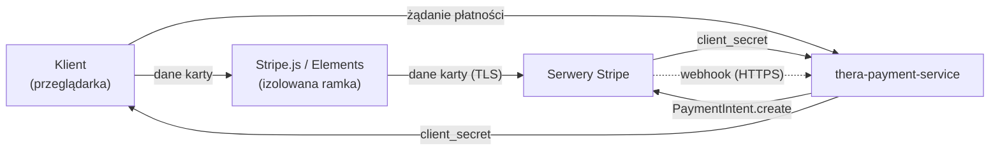
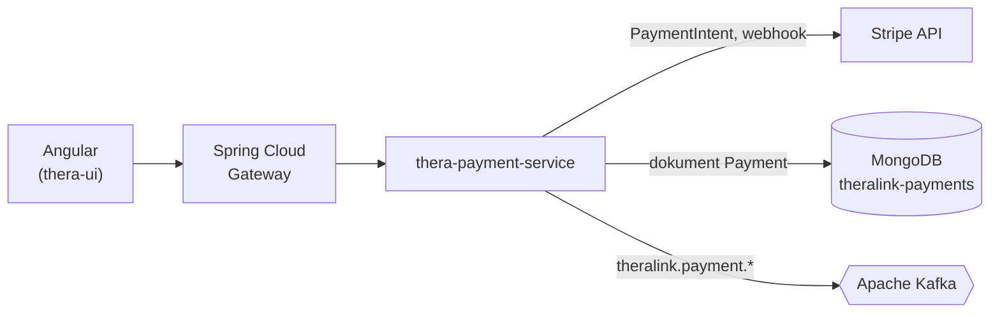
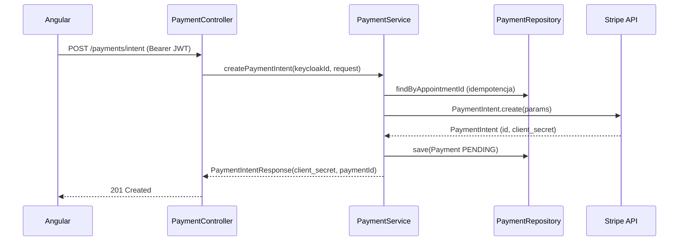
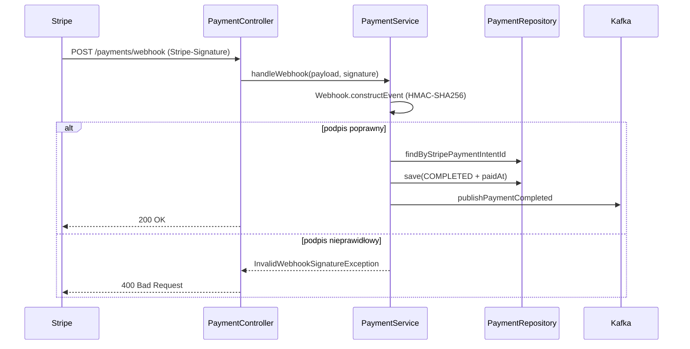

# Rozdział 11. Płatności internetowe (Stripe)

Rozdział opisuje realizację obsługi płatności kartą w systemie TheraLink — funkcjonalności,
której monolit nie posiadał, a która realizuje trzeci cel pracy zdefiniowany we wstępie.
Wychodząc od teorii bezpiecznego przyjmowania płatności w aplikacji webowej (tokenizacja,
standard PCI-DSS), omówiono kolejno: wydzielenie płatności do osobnego mikroserwisu
`thera-payment-service`, konfigurację pakietu programistycznego (ang. *SDK*, *Software
Development Kit*) Stripe i sekretów, model danych w MongoDB, przepływ tworzenia obiektu
PaymentIntent, bezpieczną obsługę zdarzeń zwrotnych (ang. *webhook*) z weryfikacją podpisu,
publikację zdarzeń do Apache Kafka, udostępnienie historii płatności klientowi oraz strategię
testową. Rozdział zamyka podsumowanie realizacji celu i kierunki rozwoju. W odróżnieniu od
rozdziałów 3–10 nie ma on charakteru migracyjnego — opisuje funkcjonalność dodaną od podstaw
w architekturze docelowej.

---

## 11.1 Teoria — obsługa płatności kartą w aplikacji webowej

Przyjmowanie płatności kartą wiąże się z rygorystycznymi wymaganiami standardu PCI-DSS
(ang. *Payment Card Industry Data Security Standard*) [X] — zbioru reguł bezpieczeństwa
narzucanych przez organizacje kartowe na podmioty przetwarzające dane kart płatniczych.
Samodzielne przyjmowanie pełnych numerów kart przez własny backend oznaczałoby objęcie całego
systemu najwyższym, najkosztowniejszym poziomem certyfikacji (PCI-DSS Level 1), co jest
nieosiągalne i nieuzasadnione w kontekście pracy dyplomowej. Rozwiązaniem stosowanym
powszechnie jest **tokenizacja**: dane karty nigdy nie trafiają do backendu aplikacji, lecz są
przekazywane bezpośrednio do wyspecjalizowanego operatora płatności, który zwraca jedynie
bezpieczny żeton (ang. *token*) reprezentujący transakcję.

Operator Stripe udostępnia trzy podstawowe modele integracji: przekierowanie do gotowej strony
płatności (ang. *hosted checkout*), osadzony formularz oparty na bibliotece Stripe.js wraz
z komponentami Elements oraz bezpośrednie wywołania API (wymagające pełnej certyfikacji
PCI-DSS). Dla TheraLink wybrano model pośredni — **Stripe.js z interfejsem PaymentIntent** [X].
Formularz karty renderowany jest po stronie przeglądarki w izolowanej ramce (ang. *iframe*)
dostarczanej przez Stripe, backend tworzy jedynie obiekt PaymentIntent reprezentujący zamiar
płatności, a właściwe dane karty przepływają wyłącznie między przeglądarką a serwerami Stripe.
Model ten ogranicza zakres PCI-DSS do najprostszego kwestionariusza samooceny (ang.
*Self-Assessment Questionnaire A*), ponieważ backend nigdy nie styka się z numerem karty.

Kluczowe pojęcia interfejsu Stripe wykorzystane w dalszej części rozdziału to: **PaymentIntent**
(obiekt reprezentujący pojedynczy zamiar płatności wraz z jej cyklem życia), **client_secret**
(jednorazowy sekret przekazywany do Stripe.js w celu potwierdzenia płatności po stronie
klienta), **webhook** (asynchroniczne powiadomienie HTTP wysyłane przez Stripe po zmianie stanu
płatności) oraz **idempotencja** (gwarancja, że wielokrotne przetworzenie tego samego zdarzenia
nie powieli skutków). Ogólny przepływ tokenizacji przedstawia Rys. 11.1.



**Rys. 11.1.** Model tokenizacji płatności — dane karty omijają backend aplikacji

źródło: opracowanie własne

---

## 11.2 Architektura — `thera-payment-service` jako wydzielony mikroserwis

Płatności wydzielono do osobnego repozytorium i osobnego mikroserwisu `thera-payment-service`.
Decyzja ta wynika wprost z wymagań PCI-DSS [X]: izolacja kodu i sekretów obsługujących płatności
ogranicza zakres systemu objęty wymaganiami bezpieczeństwa (ang. *scope reduction*), umożliwia
ograniczenie dostępu do repozytorium wyłącznie do uprawnionych osób oraz pozwala na niezależny
cykl wdrożeniowy. Serwis posiada również własną, odrębną bazę danych Cosmos DB
`theralink-payments` — zgodnie z zasadą jednej bazy na mikroserwis (rozdział 7), która w tym
przypadku jest dodatkowo wymogiem regulacyjnym, a nie tylko dobrą praktyką architektoniczną.

Serwis zbudowano na Spring Boot 4.0.3 i Javie 21, podczas gdy `thera-rest-service` korzysta
z Javy 25 (uzasadnienie różnicy omówiono w rozdziale 3). Wybór długoterminowo wspieranej
(ang. *Long-Term Support*, LTS) Javy 21 dla serwisu płatności jest świadomy — zapewnia
maksymalną stabilność i kompatybilność biblioteki Stripe w komponencie o podwyższonych
wymaganiach bezpieczeństwa. Zestaw zależności serwisu (Listing 11.1) obejmuje pakiet
`spring-boot-starter-web`, sterownik `spring-boot-starter-data-mongodb`, moduły bezpieczeństwa
`spring-boot-starter-security` oraz `spring-boot-starter-oauth2-resource-server` (weryfikacja
tokenów Keycloak — rozdział 5), walidację `spring-boot-starter-validation`, bibliotekę
`stripe-java` w wersji 25.3.0 oraz `spring-kafka`.

**Listing 11.1.** Kluczowe zależności serwisu płatności
(plik `thera-payment-service/pom.xml`, linie 44–82)

```xml
        <!-- ── MongoDB — osobna baza dla płatności ──────────── -->
        <dependency>
            <groupId>org.springframework.boot</groupId>
            <artifactId>spring-boot-starter-data-mongodb</artifactId>
        </dependency>

        <!-- ── Security + JWT (Keycloak) ────────────────────── -->
        <dependency>
            <groupId>org.springframework.boot</groupId>
            <artifactId>spring-boot-starter-security</artifactId>
        </dependency>
        <dependency>
            <groupId>org.springframework.boot</groupId>
            <artifactId>spring-boot-starter-oauth2-resource-server</artifactId>
        </dependency>

        <!-- ── Walidacja DTO ────────────────────────────────── -->
        <dependency>
            <groupId>org.springframework.boot</groupId>
            <artifactId>spring-boot-starter-validation</artifactId>
        </dependency>

        <!-- ── Stripe Java SDK ──────────────────────────────── -->
        <dependency>
            <groupId>com.stripe</groupId>
            <artifactId>stripe-java</artifactId>
            <version>25.3.0</version>
        </dependency>

        <!-- ── Kafka ────────────────────────────────────────── -->
        <dependency>
            <groupId>org.springframework.kafka</groupId>
            <artifactId>spring-kafka</artifactId>
        </dependency>
```

Miejsce serwisu w architekturze systemu przedstawia Rys. 11.2. Żądania z aplikacji Angular
przechodzą przez bramę Spring Cloud Gateway (rozdział 2) do serwisu płatności, który komunikuje
się z trzema zewnętrznymi zależnościami: interfejsem Stripe (HTTP), własną bazą MongoDB oraz
brokerem Kafka.



**Rys. 11.2.** Umiejscowienie `thera-payment-service` w architekturze TheraLink

źródło: opracowanie własne

---

## 11.3 Konfiguracja pakietu Stripe SDK i sekretów

Integracja ze Stripe wymaga trzech rodzajów kluczy: klucza publikowalnego `pk_test_…`
(ang. *publishable key*, używanego po stronie przeglądarki przez Stripe.js), klucza tajnego
`sk_test_…` (ang. *secret key*, używanego przez backend do wywołań API) oraz sekretu
zdarzeń zwrotnych `whsec_…` (ang. *webhook secret*, służącego do weryfikacji podpisu).
Powszechnym błędem integracyjnym jest pomylenie klucza publikowalnego z tajnym — pierwszy jest
z założenia jawny i osadzany w kodzie frontendu, drugi nie może nigdy opuścić backendu.

Pakiet Stripe SDK inicjalizowany jest przez przypisanie klucza tajnego do statycznego pola
`Stripe.apiKey`. W TheraLink realizuje to metoda oznaczona adnotacją `@PostConstruct`
w klasie `StripeConfig` (Listing 11.2), wywoływana automatycznie po utworzeniu komponentu
i wstrzyknięciu zależności. Wersja interfejsu Stripe jest w pakiecie 25.x ustalana na stałe
przez wersję biblioteki, dlatego — w odróżnieniu od starszych wersji SDK — nie ustawia się jej
ręcznie.

**Listing 11.2.** Inicjalizacja pakietu Stripe SDK w metodzie `@PostConstruct`
(plik `thera-payment-service/src/main/java/.../config/StripeConfig.java`, linie 35–47)

```java
    @Value("${stripe.secret-key}")
    private String secretKey;

    @PostConstruct
    public void initStripe() {
        Stripe.apiKey = secretKey;
        // Wersja API Stripe jest ustalana przez wersję SDK (25.3.0 → 2024-06-20).
        // Stripe.apiVersion zostało usunięte w SDK 25.x — wersja jest teraz stała per SDK.
        // Żeby zmienić wersję API, zaktualizuj wersję stripe-java w pom.xml.

        log.info("Stripe SDK zainicjalizowany (środowisko: {})",
                secretKey.startsWith("sk_test_") ? "TEST" : "PRODUKCJA");
    }
```

Zgodnie z konwencją całego projektu żaden klucz nie jest zapisywany na stałe w kodzie ani
w repozytorium. Plik `application.yml` (Listing 11.3) odwołuje się wyłącznie do zmiennych
środowiskowych — brak ustawionej zmiennej powoduje świadomie celowy błąd uruchomienia aplikacji,
co jest bezpieczniejsze niż cicha awaria w środowisku produkcyjnym. W środowisku deweloperskim
zmienne dostarczane są z pliku `.env`, a w produkcji z Azure Key Vault za pośrednictwem
sterownika CSI (rozdziały 9 i 10), skąd trafiają do aplikacji jako zmienne środowiskowe
odczytywane adnotacją `@Value`.

**Listing 11.3.** Odwołania do sekretów Stripe przez zmienne środowiskowe
(plik `thera-payment-service/src/main/resources/application.yml`, linie 50–59)

```yaml
# ── Stripe ────────────────────────────────────────────────────────────────────
# Te wartości MUSZĄ być ustawione przez zmienne środowiskowe.
# Brak zmiennej = błąd startu aplikacji (celowo — lepsza niż cicha awaria w produkcji).
#
# Jak ustawić lokalnie:
#   export STRIPE_SECRET_KEY="sk_test_..."
#   export STRIPE_WEBHOOK_SECRET="whsec_..."
stripe:
  secret-key: ${STRIPE_SECRET_KEY}
  webhook-secret: ${STRIPE_WEBHOOK_SECRET}
```

System TheraLink w niniejszej pracy ma charakter demonstracyjny i wykorzystuje klucze w trybie
testowym (`pk_test_…`, `sk_test_…`), co — jak omówiono w rozdziale 10 (§10.7) — pozwala
bezpiecznie testować pełny przepływ płatności z użyciem testowych numerów kart bez ryzyka
obciążenia rzeczywistych środków. W docelowym wdrożeniu komercyjnym klucze zostałyby zastąpione
odpowiednikami `pk_live_…` i `sk_live_…`, przechowywanymi wyłącznie w Azure Key Vault.

> ⚠️ **Wykryto podczas pracy nad rozdziałem:**
> Plik `thera-payment-service/src/main/resources/application-local.yml` (wykluczony z systemu
> kontroli wersji) zawiera wpisany na stałe testowy klucz `sk_test_…` dla wygody uruchomienia
> lokalnego. Jest to klucz w trybie testowym o niskim ryzyku, jednak narusza zasadę „żaden
> sekret w kodzie". Sugerowana poprawka: usunąć wartość z pliku i pozostawić wyłącznie odczyt
> ze zmiennej środowiskowej (`export STRIPE_SECRET_KEY=...`); przy jakiejkolwiek ekspozycji
> repozytorium klucz testowy zregenerować w panelu Stripe.
> Status: zgłoszone do uzupełnienia po powrocie autora.

> 📸 **[SCREEN DO DODANIA]**
> **Co pokazać:** Panel Stripe Dashboard w trybie testowym (Test Mode) — sekcja Developers → API keys z widocznymi (zamaskowanymi) kluczami `pk_test_…` i `sk_test_…`
> **Sugerowany podpis:** Rys. 11.3. Klucze API w panelu Stripe w trybie testowym
> **źródło:** opracowanie własne

---

## 11.4 Model danych — kolekcja `payments` w MongoDB

Płatność reprezentowana jest dokumentem `Payment` (Listing 11.4) mapowanym na kolekcję
`payments`. Encja pełni rolę agregatu w rozumieniu projektowania sterowanego dziedziną
(ang. *Domain-Driven Design*, rozdział 7) i przechowuje: identyfikator dokumentu `id`,
identyfikator wizyty `appointmentId`, identyfikator klienta `clientKeycloakId` (wartość `sub`
z tokenu JWT, rozdział 5), identyfikator obiektu PaymentIntent po stronie Stripe
`stripePaymentIntentId`, kwotę `amount`, walutę `currency`, status `status`, znaczniki czasu
`createdAt` oraz `paidAt`, a także opcjonalny opis `description`.

Na uwagę zasługują dwie decyzje modelowe. Po pierwsze, kwota przechowywana jest jako liczba
całkowita typu `Long` **w groszach** (najmniejszej jednostce waluty) — 150,00 PLN zapisywane
jest jako wartość 15000. Jest to konwencja Stripe, która eliminuje błędy zaokrągleń typowe dla
liczb zmiennoprzecinkowych. Po drugie, na polach `appointmentId` oraz `stripePaymentIntentId`
założono indeksy unikalne (`@Indexed(unique = true)`). Indeks na `appointmentId` egzekwuje
regułę „jedna wizyta — jedna płatność" i stanowi mechanizm idempotencji na poziomie bazy danych,
natomiast indeks na `stripePaymentIntentId` zapewnia jednoznaczne powiązanie zwrotne z obiektem
w systemie Stripe, wykorzystywane przy obsłudze zdarzeń zwrotnych.

**Listing 11.4.** Dokument `Payment` — model danych płatności
(plik `thera-payment-service/src/main/java/.../model/Payment.java`, linie 27–66)

```java
@Document(collection = "payments")
@Data           // Lombok: generuje gettery, settery, equals, hashCode, toString
@Builder        // Lombok: wzorzec Builder — Payment.builder().appointmentId("x").build()
@NoArgsConstructor
@AllArgsConstructor
public class Payment {

    @Id // MongoDB _id (generowany automatycznie jako ObjectId, ale trzymamy jako String)
    private String id;

    // ID wizyty z appointment-service.
    // Referencja przez String (nie JOIN jak w SQL) — mikroserwisy nie dzielą bazy!
    @Indexed(unique = true)
    private String appointmentId;

    // Subject z tokenu JWT Keycloak — unikalny identyfikator użytkownika
    @Indexed
    private String clientKeycloakId;

    // ID obiektu PaymentIntent w Stripe (format: "pi_3QdXXXXXXXXXXXX")
    // Potrzebny do identyfikacji w webhooku i ewentualnych refundacji
    @Indexed(unique = true)
    private String stripePaymentIntentId;

    // Kwota w GROSZACH (najmniejsza jednostka waluty).
    // 150,00 PLN = 15000. To najczęstszy błąd przy integracji Stripe!
    private Long amount;

    // Kod waluty ISO 4217, małe litery: "pln", "eur", "usd"
    private String currency;

    private PaymentStatus status;

    // Kiedy backend stworzył PaymentIntent (nie kiedy klient zapłacił!)
    private Instant createdAt;

    // Kiedy Stripe przysłał webhook potwierdzający płatność (null do momentu sukcesu)
    private Instant paidAt;

    private String description;
}
```

Cykl życia płatności opisuje wyliczenie `PaymentStatus`, obejmujące cztery uproszczone stany
będące odwzorowaniem licznych statusów wewnętrznych Stripe. Przejścia między stanami zestawiono
w Tabeli 11.1.

**Tabela 11.1.** Stany płatności (`PaymentStatus`) i przejścia między nimi

| Stan | Znaczenie | Przejście z | Wyzwalane przez |
|---|---|---|---|
| `PENDING` | PaymentIntent utworzony, klient jeszcze nie zapłacił | stan początkowy | utworzenie PaymentIntent |
| `COMPLETED` | Stripe potwierdził płatność | `PENDING` | webhook `payment_intent.succeeded` |
| `FAILED` | płatność odrzucona (brak środków, błąd karty) | `PENDING` | webhook `payment_intent.payment_failed` |
| `REFUNDED` | wykonano zwrot środków | `COMPLETED` | webhook `charge.refunded` (kierunek rozwoju) |

---

## 11.5 Przepływ tworzenia obiektu PaymentIntent

Płatność inicjowana jest żądaniem `POST /payments/intent`, dostępnym wyłącznie dla zalogowanego
klienta. Autoryzacja realizowana jest dwuwarstwowo: identyfikator klienta pobierany jest
z tokenu JWT przez `@AuthenticationPrincipal Jwt jwt` (`jwt.getSubject()`), a dostęp ograniczono
adnotacją `@PreAuthorize("hasRole('CLIENT')")` (rozdział 5). Logikę tworzenia płatności
przedstawia Listing 11.5.

Metoda `createPaymentIntent` realizuje cztery kroki. Najpierw weryfikuje idempotencję na poziomie
aplikacji — odpytuje repozytorium o istniejącą płatność dla danej wizyty i w razie jej
odnalezienia zgłasza wyjątek `PaymentAlreadyExistsException`. Następnie buduje obiekt
`PaymentIntentCreateParams` z kwotą (w groszach), walutą `pln`, automatycznym doborem metod
płatności (ang. *automatic payment methods* — Stripe proponuje dla waluty PLN m.in. BLIK i kartę)
oraz metadanymi (`appointmentId`, `clientKeycloakId`) służącymi późniejszej identyfikacji.
W trzecim kroku wywołuje synchronicznie statyczną metodę `PaymentIntent.create(params)`, która
wykonuje żądanie HTTP do `api.stripe.com`. Na końcu zapisuje dokument `Payment` ze statusem
`PENDING` i zwraca obiekt `PaymentIntentResponse` zawierający `client_secret` oraz identyfikator
płatności. Wartość `client_secret` zwracana jest wyłącznie w tym miejscu i nie jest nigdzie
przechowywana. Całość ujęto w blok `try-catch` przechwytujący `StripeException` i opakowujący
go we własny wyjątek `PaymentCreationException`.

**Listing 11.5.** Tworzenie obiektu PaymentIntent
(plik `thera-payment-service/src/main/java/.../service/PaymentService.java`, linie 67–127)

```java
    public PaymentIntentResponse createPaymentIntent(
            String clientKeycloakId,
            CreatePaymentIntentRequest request
    ) {
        // Idempotencja: jedna wizyta = jedna płatność
        paymentRepository.findByAppointmentId(request.getAppointmentId())
                .ifPresent(existing -> {
                    throw new PaymentAlreadyExistsException(
                            "Płatność dla wizyty " + request.getAppointmentId() + " już istnieje. " +
                            "ID płatności: " + existing.getId());
                });

        try {
            // Budowanie parametrów dla Stripe API
            PaymentIntentCreateParams params = PaymentIntentCreateParams.builder()
                    .setAmount(request.getAmount())   // UWAGA: w groszach! 15000 = 150,00 PLN
                    .setCurrency("pln")
                    // AutomaticPaymentMethods dobiera metody płatności dostępne dla danej waluty i kraju.
                    // Dla PLN Stripe automatycznie zaproponuje BLIK, kartę itp.
                    .setAutomaticPaymentMethods(
                            PaymentIntentCreateParams.AutomaticPaymentMethods.builder()
                                    .setEnabled(true)
                                    .build()
                    )
                    // Metadata to dowolne klucze-wartości przechowywane w Stripe.
                    // Pomoże nam zidentyfikować płatność w webhooku i w panelu Stripe.
                    .putMetadata("appointmentId", request.getAppointmentId())
                    .putMetadata("clientKeycloakId", clientKeycloakId)
                    .setDescription(request.getDescription() != null
                            ? request.getDescription()
                            : "Wizyta TheraLink")
                    .build();

            // Wywołanie do Stripe API — PaymentIntent.create() to metoda STATYCZNA
            PaymentIntent intent = PaymentIntent.create(params);
            log.info("Stworzono PaymentIntent: {} dla wizyty: {}",
                    intent.getId(), request.getAppointmentId());

            // Zapis w MongoDB ze statusem PENDING
            Payment payment = Payment.builder()
                    .appointmentId(request.getAppointmentId())
                    .clientKeycloakId(clientKeycloakId)
                    .stripePaymentIntentId(intent.getId())
                    .amount(request.getAmount())
                    .currency("pln")
                    .status(PaymentStatus.PENDING)
                    .createdAt(Instant.now())
                    .description(request.getDescription())
                    .build();

            Payment saved = paymentRepository.save(payment);

            // client_secret zwracamy TYLKO tutaj — potem go nie przechowujemy ani nie zwracamy!
            return new PaymentIntentResponse(intent.getClientSecret(), saved.getId());

        } catch (StripeException e) {
            log.error("Błąd Stripe przy tworzeniu PaymentIntent dla wizyty {}: {}",
                    request.getAppointmentId(), e.getMessage());
            throw new PaymentCreationException("Błąd podczas inicjalizacji płatności: " + e.getMessage());
        }
    }
```

Dane wejściowe walidowane są przez Bean Validation: pole `appointmentId` opatrzono adnotacją
`@NotBlank`, a `amount` adnotacjami `@NotNull` oraz `@Min(100)` (minimum 1,00 PLN). Walidacja
aktywowana jest adnotacją `@Valid` w kontrolerze; jej niepowodzenie skutkuje odpowiedzią
HTTP 400. Sekwencję tworzenia płatności ilustruje Rys. 11.4.



**Rys. 11.4.** Sekwencja tworzenia obiektu PaymentIntent

źródło: opracowanie własne

> ⚠️ **Wykryto podczas pracy nad rozdziałem:**
> Wywołanie `PaymentIntent.create(params)` nie przekazuje klucza idempotencji Stripe
> (nagłówek `Idempotency-Key`). Idempotencję zapewnia obecnie wyłącznie warstwa aplikacji
> (sprawdzenie `findByAppointmentId` + indeks unikalny na `appointmentId`), co skutecznie
> chroni przed powieleniem dokumentu `Payment`. W skrajnym przypadku (powodzenie żądania do
> Stripe przy braku odpowiedzi z powodu przekroczenia czasu) mogłoby jednak dojść do utworzenia
> dwóch obiektów PaymentIntent po stronie Stripe. Sugerowana poprawka: dodać
> `.setIdempotencyKey(request.getAppointmentId())` w opcjach żądania (`RequestOptions`).
> Ryzyko niskie — indeks unikalny kompensuje skutki po stronie systemu. Status: zgłoszone do
> uzupełnienia po powrocie autora.

> 📸 **[SCREEN DO DODANIA]**
> **Co pokazać:** Lista obiektów PaymentIntent w panelu Stripe (Payments) z widocznym statusem (succeeded / requires_payment_method) oraz metadanymi appointmentId
> **Sugerowany podpis:** Rys. 11.5. Obiekty PaymentIntent w panelu Stripe wraz z metadanymi wizyty
> **źródło:** opracowanie własne

---

## 11.6 Zdarzenia zwrotne Stripe — bezpieczeństwo i weryfikacja podpisu

Po zmianie stanu płatności Stripe wysyła asynchroniczne żądanie HTTP POST na endpoint
`/payments/webhook`. Mechanizm ten jest krytyczny z punktu widzenia bezpieczeństwa: bez
weryfikacji autentyczności żądania dowolny podmiot mógłby przesłać sfałszowane zdarzenie
i oznaczyć płatność jako opłaconą bez rzeczywistego przelewu środków. Zabezpieczeniem jest
weryfikacja podpisu w schemacie HMAC-SHA256 (ang. *Hash-based Message Authentication Code*,
RFC 2104 [X]): Stripe podpisuje każde zdarzenie sekretem `whsec_…` i umieszcza podpis
w nagłówku `Stripe-Signature` [X].

Endpoint kontrolera (Listing 11.6) przyjmuje surowe ciało żądania jako `@RequestBody String`
oraz nagłówek `Stripe-Signature`. Przyjęcie ciała jako nieprzetworzonego łańcucha znaków, a nie
jako zdeserializowanego obiektu, jest wymogiem koniecznym: Stripe weryfikuje podpis na surowych
bajtach ciała, a jakakolwiek deserializacja i ponowna serializacja JSON zmieniłaby bajty
(kolejność kluczy, białe znaki), unieważniając podpis. Endpoint jest jednocześnie jedynym
publicznym (`permitAll`) w konfiguracji bezpieczeństwa — Stripe nie dysponuje tokenem Keycloak,
więc bezpieczeństwo opiera się wyłącznie na weryfikacji podpisu. Kontroler zwraca HTTP 200 przy
poprawnym podpisie oraz HTTP 400 przy podpisie nieprawidłowym.

**Listing 11.6.** Endpoint zdarzeń zwrotnych — surowe ciało żądania i nagłówek podpisu
(plik `thera-payment-service/src/main/java/.../controller/PaymentController.java`, linie 97–110)

```java
    @PostMapping("/webhook")
    public ResponseEntity<Map<String, String>> handleWebhook(
            @RequestBody String payload,
            @RequestHeader("Stripe-Signature") String stripeSignature
    ) {
        try {
            paymentService.handleWebhook(payload, stripeSignature);
            return ResponseEntity.ok(Map.of("status", "received"));
        } catch (PaymentService.InvalidWebhookSignatureException e) {
            log.error("Odrzucono webhook z nieprawidłowym podpisem");
            return ResponseEntity.status(HttpStatus.BAD_REQUEST)
                    .body(Map.of("error", "Invalid signature"));
        }
    }
```

Właściwa weryfikacja i routing zdarzeń odbywa się w metodzie `handleWebhook` serwisu
(Listing 11.7). Wywołanie `Webhook.constructEvent(payload, stripeSignatureHeader, webhookSecret)`
weryfikuje podpis kryptograficznie i — przy niepowodzeniu — zgłasza
`SignatureVerificationException`, przechwytywany i opakowywany we własny wyjątek
`InvalidWebhookSignatureException`. Po pomyślnej weryfikacji następuje rozgałęzienie po typie
zdarzenia: `payment_intent.succeeded` aktualizuje status na `COMPLETED` i publikuje zdarzenie
`theralink.payment.completed`, `payment_intent.payment_failed` ustawia status `FAILED`
i publikuje `theralink.payment.failed`, a pozostałe typy są pomijane (jedynie zapisywane
w dzienniku).

**Listing 11.7.** Weryfikacja podpisu i routing zdarzeń Stripe
(plik `thera-payment-service/src/main/java/.../service/PaymentService.java`, linie 154–171)

```java
    public void handleWebhook(String payload, String stripeSignatureHeader) {
        Event event;
        try {
            event = Webhook.constructEvent(payload, stripeSignatureHeader, webhookSecret);
        } catch (SignatureVerificationException e) {
            log.error("Nieprawidłowy podpis webhooka Stripe: {}", e.getMessage());
            throw new InvalidWebhookSignatureException("Nieprawidłowy podpis webhooka");
        }

        log.info("Otrzymano webhook Stripe: typ={}, id={}", event.getType(), event.getId());

        // Routing zdarzeń Stripe — dodaj kolejne case'y gdy będziesz obsługiwał refundy itp.
        switch (event.getType()) {
            case "payment_intent.succeeded"      -> handlePaymentSucceeded(event);
            case "payment_intent.payment_failed" -> handlePaymentFailed(event);
            default -> log.debug("Nieobsługiwany typ webhooka: {} — pomijamy", event.getType());
        }
    }
```

Obsługa zdarzenia powodzenia płatności (metoda `handlePaymentSucceeded`) odnajduje płatność po
`stripePaymentIntentId`, a w przypadku jej braku zapisuje ostrzeżenie w dzienniku, nie zgłaszając
wyjątku. Jest to świadoma realizacja idempotencji obsługi zdarzeń: Stripe ponawia niepotwierdzone
żądania nawet przez kilka dni, a brak dokumentu może wynikać z wyścigu (ang. *race condition*),
gdy zdarzenie dotrze przed zapisem. Lista obsługiwanych typów zdarzeń i reakcji systemu znajduje
się w Tabeli 11.2, a pełną sekwencję obsługi przedstawia Rys. 11.6.

**Tabela 11.2.** Obsługiwane typy zdarzeń Stripe i reakcja systemu

| Typ zdarzenia Stripe | Zmiana statusu | Publikowane zdarzenie Kafka |
|---|---|---|
| `payment_intent.succeeded` | `PENDING` → `COMPLETED` (+ `paidAt`) | `theralink.payment.completed` |
| `payment_intent.payment_failed` | `PENDING` → `FAILED` | `theralink.payment.failed` |
| pozostałe (np. `charge.refunded`) | brak (zapis w dzienniku) | brak |



**Rys. 11.6.** Sekwencja obsługi zdarzenia zwrotnego z weryfikacją podpisu HMAC-SHA256

źródło: opracowanie własne

> 📸 **[SCREEN DO DODANIA]**
> **Co pokazać:** Terminal z narzędziem `stripe listen --forward-to localhost:8085/payments/webhook` — log przekazanych zdarzeń `payment_intent.succeeded` z odpowiedzią `[200]`
> **Sugerowany podpis:** Rys. 11.7. Przekierowanie zdarzeń zwrotnych narzędziem Stripe CLI w środowisku lokalnym
> **źródło:** opracowanie własne

---

## 11.7 Publikacja zdarzeń Kafka — integracja z resztą systemu

Po pomyślnym przetworzeniu zdarzenia płatności serwis publikuje odpowiednie zdarzenie domenowe
do Apache Kafka, realizując luźne powiązanie (ang. *loose coupling*) z pozostałymi serwisami
(rozdział 6). Komponent `PaymentEventProducer` (Listing 11.8) publikuje na temat
`theralink.payment.completed` zdarzenie o ustalonej strukturze: `eventType`, `paymentId`,
`appointmentId`, `clientKeycloakId`, `amount`, `currency`, `paidAt` oraz `timestamp`. Kluczem
wiadomości jest `appointmentId`, co — zgodnie z gwarancją kolejności Kafki w obrębie partycji —
zapewnia uporządkowanie zdarzeń dotyczących tej samej wizyty.

**Listing 11.8.** Publikacja zdarzenia o zakończonej płatności
(plik `thera-payment-service/src/main/java/.../kafka/PaymentEventProducer.java`, linie 53–67)

```java
    public void publishPaymentCompleted(Payment payment) {
        Map<String, Object> event = Map.of(
                "eventType",        "PAYMENT_COMPLETED",
                "paymentId",        payment.getId(),
                "appointmentId",    payment.getAppointmentId(),
                "clientKeycloakId", payment.getClientKeycloakId(),
                "amount",           payment.getAmount(),
                "currency",         payment.getCurrency(),
                "paidAt",           payment.getPaidAt().toString(),
                "timestamp",        Instant.now().toString()
        );
        kafkaTemplate.send(TOPIC_COMPLETED, payment.getAppointmentId(), event);
        log.info("Opublikowano event PAYMENT_COMPLETED na topicu {} dla wizyty: {}",
                TOPIC_COMPLETED, payment.getAppointmentId());
    }
```

Planowanym konsumentem tego zdarzenia jest serwis wizyt (`appointment-service`, rozdział 2),
który po odebraniu potwierdzenia płatności aktualizowałby status wizyty. Serwis płatności
zawiera również pasywny konsument `AppointmentEventConsumer` nasłuchujący na temacie
`theralink.appointment.created`; w bieżącej implementacji wyłącznie zapisuje on zdarzenie
w dzienniku, oczekując na samodzielne zainicjowanie płatności przez klienta. Konfigurację
producenta (`KafkaTemplate<String, Object>` z serializacją JSON) omówiono w rozdziale 6.

> 📸 **[SCREEN DO DODANIA]**
> **Co pokazać:** Narzędzie Kafka UI z widokiem topicu `theralink.payment.completed` i pojedynczą wiadomością (JSON z polami eventType, paymentId, appointmentId, amount)
> **Sugerowany podpis:** Rys. 11.8. Zdarzenie `theralink.payment.completed` w narzędziu Kafka UI
> **źródło:** opracowanie własne

> 📸 **[SCREEN DO DODANIA]**
> **Co pokazać:** MongoDB Compass z kolekcją `payments` i otwartym dokumentem (status COMPLETED, amount 15000, paidAt ustawione)
> **Sugerowany podpis:** Rys. 11.9. Dokument płatności w bazie `theralink-payments` (MongoDB Compass)
> **źródło:** opracowanie własne

---

## 11.8 Historia płatności klienta — endpoint `GET /payments/me`

Trzeci endpoint kontrolera udostępnia zalogowanemu klientowi historię jego płatności
(Listing 11.9). Identyfikator klienta pobierany jest z tokenu JWT (`jwt.getSubject()`), a nie
z parametru żądania — dzięki temu klient nie ma możliwości odczytania cudzych płatności przez
podanie obcego identyfikatora. Dostęp ograniczono adnotacją `@PreAuthorize("hasRole('CLIENT')")`.

**Listing 11.9.** Endpoint historii płatności klienta
(plik `thera-payment-service/src/main/java/.../controller/PaymentController.java`, linie 133–139)

```java
    @GetMapping("/me")
    @PreAuthorize("hasRole('CLIENT')")
    public ResponseEntity<List<PaymentResponse>> getMyPayments(
            @AuthenticationPrincipal Jwt jwt
    ) {
        return ResponseEntity.ok(paymentService.getPaymentsForClient(jwt.getSubject()));
    }
```

Endpoint zwraca listę obiektów `PaymentResponse` — bezpiecznego DTO (ang. *Data Transfer
Object*), które celowo nie zawiera pól wrażliwych: `stripePaymentIntentId` (wewnętrzny
identyfikator Stripe). Mapowanie encji na DTO realizuje statyczna metoda fabryczna
`PaymentResponse.from(Payment)` (Listing 11.10). Dla tak prostego, jednokierunkowego mapowania
świadomie zrezygnowano z generatora MapStruct (stosowanego w `thera-rest-service`, rozdział 7)
na rzecz zwięzłej metody statycznej trzymanej blisko definicji DTO — zgodnie z zasadą, że encja
`@Document` nigdy nie jest zwracana bezpośrednio w odpowiedzi API.

**Listing 11.10.** Bezpieczne DTO odpowiedzi i metoda mapująca `from`
(plik `thera-payment-service/src/main/java/.../dto/response/PaymentResponse.java`, linie 23–47)

```java
public class PaymentResponse {
    private String id;
    private String appointmentId;
    private String clientKeycloakId;
    private Long amount;
    private String currency;
    private PaymentStatus status;
    private Instant createdAt;
    private Instant paidAt;
    private String description;

    public static PaymentResponse from(Payment payment) {
        return PaymentResponse.builder()
                .id(payment.getId())
                .appointmentId(payment.getAppointmentId())
                .clientKeycloakId(payment.getClientKeycloakId())
                .amount(payment.getAmount())
                .currency(payment.getCurrency())
                .status(payment.getStatus())
                .createdAt(payment.getCreatedAt())
                .paidAt(payment.getPaidAt())
                .description(payment.getDescription())
                .build();
    }
}
```

---

## 11.9 Testy jednostkowe i integracyjne

Serwis płatności pokryto siedmioma plikami testowymi obejmującymi warstwy: jednostkową
(logika serwisu, producent zdarzeń), warstwę HTTP oraz integracyjną (repozytorium MongoDB).
Szczegółową analizę pokrycia przeprowadzono w rozdziale 12 (§12.3); w niniejszym podrozdziale
omówiono jedynie najistotniejszy z punktu widzenia bezpieczeństwa test obsługi zdarzeń zwrotnych.

Test `PaymentServiceWebhookTest` weryfikuje reakcję serwisu na poszczególne typy zdarzeń.
Ponieważ wygenerowanie prawidłowego podpisu HMAC w teście jednostkowym wymagałoby odtworzenia
sekretu i algorytmu Stripe, statyczną metodę `Webhook.constructEvent` zastąpiono atrapą przy
użyciu mechanizmu `MockedStatic` biblioteki Mockito (Listing 11.11). Pozwala to odizolować
i przetestować logikę reakcji serwisu (zmiana statusu na `COMPLETED`, ustawienie `paidAt`,
publikacja zdarzenia Kafka), powierzając samą weryfikację kryptograficzną bibliotece Stripe.
Poprawność ścieżki odrzucenia testowana jest osobno — przez wymuszenie wyjątku
`SignatureVerificationException` i sprawdzenie, że serwis nie wykonuje żadnej operacji na bazie
ani na brokerze. Pełne, kryptograficzne sprawdzenie podpisu HMAC wymaga testu typu end-to-end
z narzędziem Stripe CLI i opisano je jako kierunek rozwoju (rozdział 12, §12.8).

**Listing 11.11.** Test obsługi zdarzenia `payment_intent.succeeded` z atrapą weryfikacji podpisu
(plik `thera-payment-service/src/test/java/.../service/PaymentServiceWebhookTest.java`, linie 112–130)

```java
        try (MockedStatic<Webhook> webhookStatic = mockStatic(Webhook.class)) {
            webhookStatic.when(() -> Webhook.constructEvent(payload, signature, "whsec_test_dummy"))
                    .thenReturn(mockEvent);

            // ── Act ──
            paymentService.handleWebhook(payload, signature);

            // ── Assert ──
            // Sprawdzamy że zapisany Payment ma status COMPLETED i ustawiony paidAt
            ArgumentCaptor<Payment> paymentCaptor = ArgumentCaptor.forClass(Payment.class);
            verify(paymentRepository).save(paymentCaptor.capture());
            Payment saved = paymentCaptor.getValue();
            assertThat(saved.getStatus()).isEqualTo(PaymentStatus.COMPLETED);
            assertThat(saved.getPaidAt()).isNotNull();

            // Event Kafka został opublikowany
            verify(eventProducer).publishPaymentCompleted(any(Payment.class));
            verify(eventProducer, never()).publishPaymentFailed(any());
        }
```

---

## 11.10 Podsumowanie — realizacja celu i kierunki rozwoju

Zbiorcze zestawienie elementów serwisu płatności przedstawia Tabela 11.3. Zaimplementowana
funkcjonalność realizuje trzeci cel pracy: rzeczywiste płatności internetowe z bezpieczną
tokenizacją (Stripe.js), pełnym przepływem PaymentIntent, obsługą zdarzeń zwrotnych
z kryptograficzną weryfikacją podpisu HMAC-SHA256, idempotencją na poziomie aplikacji
i bazy danych, integracją z resztą systemu przez Kafkę oraz izolacją wymaganą przez PCI-DSS
(wydzielone repozytorium, osobna baza, klucze w Azure Key Vault).

**Tabela 11.3.** Zbiorcze zestawienie serwisu `thera-payment-service`

| Kategoria | Elementy |
|---|---|
| Endpointy REST | `POST /payments/intent`, `POST /payments/webhook`, `GET /payments/appointment/{id}`, `GET /payments/me` |
| Zdarzenia Kafka (publikowane) | `theralink.payment.completed`, `theralink.payment.failed` |
| Zdarzenia Kafka (konsumowane) | `theralink.appointment.created` (pasywnie) |
| Model danych | dokument `Payment` (kolekcja `payments`), wyliczenie `PaymentStatus` |
| Sekrety | `STRIPE_SECRET_KEY`, `STRIPE_WEBHOOK_SECRET` (Azure Key Vault) |
| Bezpieczeństwo | OAuth2 Resource Server (JWT Keycloak), `@PreAuthorize`, weryfikacja podpisu HMAC |

Poza zakresem pracy pozostawiono następujące kierunki rozwoju. Po pierwsze — obsługę zwrotów
(ang. *refund*): endpoint `POST /payments/{id}/refund` oraz reakcję na zdarzenie
`charge.refunded` aktualizującą status na `REFUNDED` (przewidziany już w wyliczeniu
`PaymentStatus`). Po drugie — przekazywanie klucza idempotencji Stripe (`Idempotency-Key`),
zgłoszone w §11.5. Po trzecie — konfigurację rozliczania podatku VAT (Stripe Tax) oraz
dodatkowych metod płatności (Apple Pay, Google Pay), które Stripe obsługuje po stronie panelu
bez zmian w kodzie. Po czwarte — pełne testy typu end-to-end weryfikujące rzeczywisty podpis
HMAC z udziałem narzędzia Stripe CLI (§12.8).

Implementacja potwierdza, że dodanie wrażliwej funkcjonalności płatniczej w architekturze
mikroserwisowej można zrealizować w sposób bezpieczny i zgodny z wymaganiami regulacyjnymi
dzięki wydzieleniu odpowiedzialności do izolowanego serwisu, tokenizacji oraz konsekwentnemu
zarządzaniu sekretami opisanemu w rozdziałach 9 i 10.
