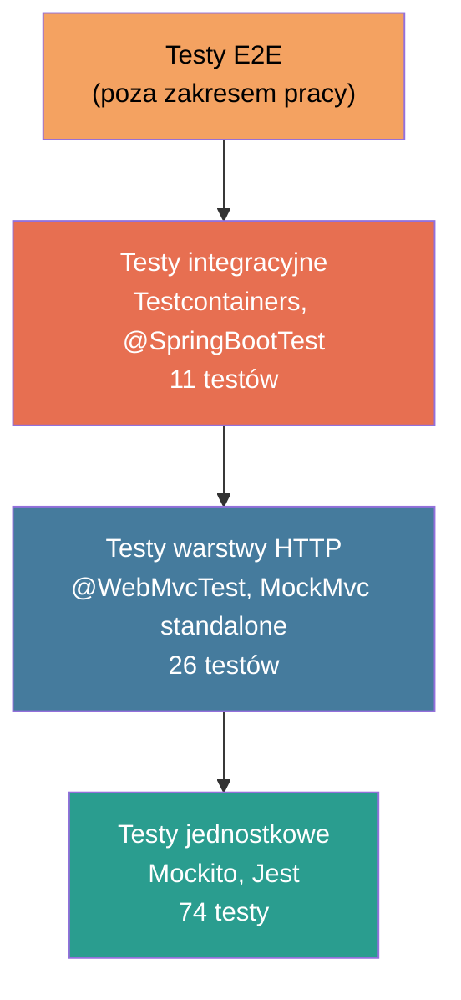

# Rozdział 12. Testy funkcjonalne i wydajnościowe

Rozdział dokumentuje strategię testowania przyjętą w projekcie TheraLink w fazie migracji do
architektury mikroserwisowej. Żaden z istniejących komponentów monolitu nie był objęty testami
automatycznymi przed migracją — całość opisana w niniejszym rozdziale stanowi nową warstwę
pokrycia stworzoną równolegle z implementacją nowych serwisów. W rozdziale omówiono teorię
piramidy testów oraz jej adaptację do architektury mikroserwisowej (§12.1), narzędzia i konwencje
stosowane w serwisach Spring Boot (§12.2), szczegółową analizę pokrycia testami serwisu
płatności (§12.3) i serwisu użytkownika (§12.4), testy frontendu Angular (§12.5), filozofię
testów integracyjnych z Testcontainers (§12.6), faktyczne wyniki wykonania testów wraz
z metrykami (§12.7), kierunki rozwoju w zakresie testowania wydajnościowego (§12.8) oraz
podsumowanie strategii (§12.9).

---

## 12.1 Teoria — piramida testów w architekturze mikroserwisowej

Piramida testów, spopularyzowana przez Mike'a Cohna [X], opisuje optymalny podział
automatycznych testów na trzy warstwy: testy jednostkowe (ang. *unit tests*) stanowią podstawę
piramidy, testy integracyjne (ang. *integration tests*) — środkową warstwę, a testy
end-to-end (ang. *end-to-end tests*, E2E) — wierzchołek. Nazewnictwo warstw oddaje ich
proporcje: najtańsze i najszybsze testy jednostkowe powinny stanowić większość całego zestawu
(orientacyjnie 70%), testy integracyjne — 20%, a testy E2E — 10%. Proporcje wynikają
z różnicy kosztów: czas wykonania jednego testu jednostkowego mierzy się w milisekundach,
integracyjnego — w sekundach, a testu E2E — w dziesiątkach sekund.

W architekturze mikroserwisowej proporcje te ulegają modyfikacji. Granica między testem
jednostkowym a integracyjnym przesuwa się, ponieważ kluczowym ryzykiem nie jest już błąd
w izolowanym algorytmie, lecz błąd w komunikacji między serwisami (protokół HTTP, serializacja
JSON, schemat zdarzeń Kafka, zapytania do MongoDB). W związku z tym testy integracyjne
nabierają szczególnego znaczenia — stanowią odpowiedź na pytanie: *czy nasz serwis faktycznie
potrafi zapisać i odczytać dokument z MongoDB z taką samą semantyką, jaką zakłada kod?*
Pojawiają się również testy kontraktowe (ang. *contract tests*), nieobecne w tradycyjnej
piramidzie: narzędzia takie jak Pact lub Spring Cloud Contract [X] weryfikują, że producent
i konsument zdarzenia Kafka lub API REST podzielają ten sam kontrakt bez konieczności
uruchamiania obu serwisów jednocześnie.

W projekcie TheraLink przyjęto następującą strategię testowania.

```
Jednostkowe (Mockito / Jest)
────────────────────────────────────────────── 74/111 = 67%
Integracyjne (Testcontainers / @SpringBootTest)
───────────────────────── 11/111 = 10%
Integracyjne HTTP (@WebMvcTest, standalone MockMvc)
────────────────── 26/111 = 23%
E2E (Cypress) — brak, poza zakresem pracy
```



**Rysunek 12.1.** Piramida testów z proporcjami liczbowymi TheraLink
źródło: opracowanie własne

Testy E2E — weryfikujące pełny przepływ od kliknięcia przycisku w przeglądarce przez
API Gateway, serwisy i bazę danych — pozostają poza zakresem pracy inżynierskiej. Wymagają
one uruchomienia całego stosu (rozdział 8) z dostępem do prawdziwego konta Stripe Testmode
i działającego Keycloak, co przekracza ramy projektu studenckiego. Kierunek ten opisano
w §12.8.

---

## 12.2 Testy backend Spring Boot — narzędzia i konwencje

Oba serwisy Spring Boot (`thera-rest-service` i `thera-payment-service`) korzystają ze
spójnego zestawu bibliotek testowych. Zależności testowe (`scope=test`) zostały wstrzyknięte
przez Spring Boot Parent POM, co eliminuje potrzebę ręcznego deklarowania wersji.

**Tabela 12.1.** Biblioteki testowe stosowane w serwisach Spring Boot TheraLink

| Biblioteka | Zastosowanie |
|---|---|
| JUnit 5 (`junit-jupiter`) | Silnik testów, adnotacje `@Test`, `@BeforeEach`, `@DisplayName` |
| Mockito (`mockito-core`, `mockito-junit-jupiter`) | Mocki, `@Mock`, `@InjectMocks`, `MockedStatic`, `ArgumentCaptor` |
| AssertJ (`assertj-core`) | Płynne asercje: `assertThat().isEqualTo()`, `assertThatThrownBy()` |
| Spring Boot Test | `@SpringBootTest`, `@WebMvcTest`, `@DataMongoTest` (Boot 3.x) |
| Spring Security Test | `@WithMockUser`, `AuthenticationPrincipalArgumentResolver`, `SecurityContextHolder` |
| Testcontainers [X] | `MongoDBContainer`, `@Testcontainers`, `@Container`, `@ServiceConnection` |
| Spring Kafka Test | `@EmbeddedKafka`, `EmbeddedKafkaBroker` |

Konwencje nazewnictwa klas testowych przyjęte w projekcie:
- `*Test` — test jednostkowy z Mockito (brak Spring Context), np. `ClientServiceTest`,
- `*ControllerTest` — test warstwy HTTP z MockMvc (standalone lub `@WebMvcTest`), np. `PaymentControllerTest`,
- `*IntegrationTest` — test z Testcontainers lub `@SpringBootTest` wymagający zewnętrznych zależności, np. `PaymentRepositoryIntegrationTest`.

Wstrzykiwanie zależności w testach realizowane jest wyłącznie przez adnotację `@InjectMocks`
(Mockito) lub konstruktor (w testach SpringBootTest z `@Autowired`), zgodnie z zasadą
*constructor injection* opisaną w rozdziale 3. Unikano wstrzykiwania przez `@Autowired`
na polach prywatnych w kodzie produkcyjnym, co bezpośrednio przekłada się na czytelność testów.

**Listing 12.1.** Fragment `PaymentServiceTest.java` — mockowanie statycznej metody Stripe SDK
przez `MockedStatic` (plik `thera-payment-service/src/test/java/com/theralink/paymentservice/service/PaymentServiceTest.java`, linie 50–109)

```java
50  @ExtendWith(MockitoExtension.class)
51  class PaymentServiceTest {
52
53      @Mock
54      private PaymentRepository paymentRepository;
55
56      @Mock
57      private PaymentEventProducer eventProducer;
58
59      @InjectMocks
60      private PaymentService paymentService;
61
62      @Test
63      @DisplayName("createPaymentIntent — sukces gdy wizyta nie ma jeszcze płatności")
64      void createPaymentIntent_success() throws StripeException {
65          // ── Arrange ──────────────────────────────────────────────────────────
66          CreatePaymentIntentRequest request = new CreatePaymentIntentRequest();
67          request.setAppointmentId("apt-123");
68          request.setAmount(15000L);
69          request.setDescription("Wizyta z psychologiem");
70
71          when(paymentRepository.findByAppointmentId("apt-123"))
72                  .thenReturn(Optional.empty());
73
74          Payment savedPayment = Payment.builder()
75                  .id("pay-456").appointmentId("apt-123")
76                  .stripePaymentIntentId("pi_test_xxx")
77                  .status(PaymentStatus.PENDING)
78                  .build();
79          when(paymentRepository.save(any(Payment.class))).thenReturn(savedPayment);
80
81          PaymentIntent mockIntent = mock(PaymentIntent.class);
82          when(mockIntent.getId()).thenReturn("pi_test_xxx");
83          when(mockIntent.getClientSecret()).thenReturn("pi_test_xxx_secret_yyy");
84
85          try (MockedStatic<PaymentIntent> stripeStatic = mockStatic(PaymentIntent.class)) {
86              stripeStatic.when(
87                  () -> PaymentIntent.create(any(PaymentIntentCreateParams.class))
88              ).thenReturn(mockIntent);
89
90              // ── Act ──────────────────────────────────────────────────────────
91              PaymentIntentResponse result =
92                  paymentService.createPaymentIntent("kc-789", request);
93
94              // ── Assert ───────────────────────────────────────────────────────
95              assertThat(result.getClientSecret()).isEqualTo("pi_test_xxx_secret_yyy");
96              assertThat(result.getPaymentId()).isEqualTo("pay-456");
97
98              verify(paymentRepository, times(1)).save(any(Payment.class));
99              verifyNoInteractions(eventProducer);
100         }
101     }
102 }
```

Kluczowym elementem Listingu 12.1 jest blok `try-with-resources` z `MockedStatic<PaymentIntent>`.
Stripe SDK 25.x eksponuje tworzenie płatności jako metodę statyczną
`PaymentIntent.create(PaymentIntentCreateParams)` — zwykłe `@Mock` Mockito nie działa dla
metod statycznych. Instrukcja `MockedStatic` przechwytuje wywołania statyczne *wyłącznie
w obrębie bloku try*, co gwarantuje izolację testów (metoda statyczna powraca do oryginalnej
implementacji po wyjściu z bloku, bez ryzyka wycieku między testami).

> 📸 **[SCREEN DO DODANIA]**
> **Co pokazać:** Terminal z wynikiem `./mvnw test` w `thera-payment-service` — linie `Tests run: 19, Failures: 0, Errors: 2` oraz informacja o braku Dockera przy testach Testcontainers, na tle zielonego `BUILD SUCCESS` dla testów jednostkowych
> **Sugerowany podpis:** Rys. 12.1. Wynik `mvn test` w serwisie płatności — 17 testów jednostkowych zielonych, 2 testy Testcontainers pominięte z powodu braku Docker daemon
> **źródło:** opracowanie własne

---

## 12.3 Stan testów `thera-payment-service` — analiza pokrycia

Serwis płatności zawiera siedem klas testowych (łącznie 19 testów), obejmujących warstwę
logiki biznesowej, kontroler HTTP, producenta i konsumenta Kafka, repozytorium MongoDB
oraz test dymny (ang. *smoke test*) całego kontekstu Spring.

**Tabela 12.2.** Pliki testowe w `thera-payment-service` — klasy, typ i liczba testów

| Klasa testowa | Typ | Liczba testów | Zależności zewnętrzne |
|---|---|---|---|
| `PaymentServiceTest` | Jednostkowy (Mockito) | 3 | Brak |
| `PaymentServiceWebhookTest` | Jednostkowy (Mockito + MockedStatic) | 5 | Brak |
| `PaymentControllerTest` | HTTP (MockMvc standalone) | 5 | Brak |
| `AppointmentEventConsumerTest` | Jednostkowy | 2 | Brak |
| `PaymentEventProducerTest` | Jednostkowy (Mockito) | 2 | Brak |
| `PaymentRepositoryIntegrationTest` | Integracyjny (Testcontainers MongoDB) | 4 | Docker (MongoDB 7.0) |
| `ApplicationContextIntegrationTest` | Dymny (Testcontainers) | 2 | Docker (MongoDB 7.0) |

Poniżej opisano zawartość każdej klasy testowej.

**`PaymentServiceTest`** (3 testy) — testy jednostkowe logiki tworzenia płatności z mockami
`PaymentRepository` i `PaymentEventProducer`. Kluczowa technika: `MockedStatic<PaymentIntent>`
dla statycznego API Stripe (Listing 12.1 w §12.2). Pokrycie: ścieżka sukcesu (idempotency check
przechodzi), wyjątek `PaymentAlreadyExistsException` (duplikat wizyty) oraz `PaymentNotFoundException`.

**`PaymentServiceWebhookTest`** (5 testów) — testy obsługi zdarzeń zwrotnych Stripe
z `MockedStatic<Webhook>` dla statycznej metody `Webhook.constructEvent()`. Test
`handleWebhook_invalidSignature_throwsException` weryfikuje, że fałszywy podpis HMAC
wywołuje `InvalidWebhookSignatureException`, co czyni go bezpośrednim testem bezpieczeństwa
opisanego mechanizmu w §11.6. Przetestowano również: przejście stanu `PENDING → COMPLETED`,
`PENDING → FAILED`, ignorowanie nieznanego typu zdarzenia i sytuację wyścigu
(ang. *race condition*) — webhook `payment_intent.succeeded` dla wizyty nieobecnej w bazie.

**`PaymentControllerTest`** (5 testów) — testy warstwy HTTP z `MockMvcBuilders.standaloneSetup`.
Ponieważ warstwa HTTP serwisu płatności jest prosta (deleguje do `PaymentService`), testy
koncentrują się na weryfikacji kodów HTTP, autoryzacji JWT i obsłudze błędów walidacji:
`201 Created` dla `POST /payments/intent`, `200 OK` dla webhooka (endpoint `permitAll`),
`400 Bad Request` dla nieprawidłowego podpisu HMAC.

**`AppointmentEventConsumerTest`** (2 testy) — testy odporności konsumenta Kafka. Serwis
`AppointmentEventConsumer` aktualnie rejestruje zdarzenie przybycia wizyty bez dedykowanej
akcji biznesowej (styl *log-and-ignore*). Testy weryfikują, że konsument nie rzuca wyjątku
przy kompletnym i niekompletnym ładunku zdarzenia — kluczowe dla stabilności topiku Kafka
przy ewolucji schematu.

**`PaymentEventProducerTest`** (2 testy) — weryfikacja topiku, klucza komunikatu i struktury
ładunku dla zdarzeń `theralink.payment.completed` i `theralink.payment.failed`. Do
przechwycenia argumentów wywołania `KafkaTemplate.send()` użyto `ArgumentCaptor<ProducerRecord>`.

**`PaymentRepositoryIntegrationTest`** (4 testy, wymaga Docker) — testy integracyjne
repozytoriów MongoDB z prawdziwym kontenerem `mongo:7.0` uruchamianym przez Testcontainers.
Weryfikują metody `findByAppointmentId`, `findByStripePaymentIntentId` i `findByClientKeycloakId`.
Szczegóły konfiguracji Testcontainers opisano w §12.6.

**`ApplicationContextIntegrationTest`** (2 testy, wymaga Docker) — dymny test ładowania
pełnego kontekstu Spring Boot z rzeczywistym kontenerem MongoDB. Weryfikuje m.in. poprawne
typowanie `KafkaTemplate<String, Object>` oraz inicjalizację `SecurityConfig`.

**Tabela 12.3.** Macierz pokrycia `thera-payment-service` — klasy testowane przez każdą klasę testową

| Klasa testowa | `PaymentService` | `PaymentController` | `PaymentRepository` | `PaymentEventProducer` | `AppointmentEventConsumer` |
|---|:---:|:---:|:---:|:---:|:---:|
| `PaymentServiceTest` | ✓ | — | mock | mock | — |
| `PaymentServiceWebhookTest` | ✓ | — | mock | mock | — |
| `PaymentControllerTest` | mock | ✓ | — | — | — |
| `PaymentRepositoryIntegrationTest` | — | — | ✓ | — | — |
| `PaymentEventProducerTest` | — | — | — | ✓ | — |
| `AppointmentEventConsumerTest` | — | — | — | — | ✓ |
| `ApplicationContextIntegrationTest` | ✓ | ✓ | ✓ | ✓ | ✓ |

---

## 12.4 Stan testów `thera-rest-service` — uzupełnienie braków

Serwis użytkownika (`thera-rest-service`) w stanie wyjściowym zawierał wyłącznie
automatycznie wygenerowany przez Spring Initializr plik `TheraRestServiceApplicationTests.java`
ze szkieletowym testem `contextLoads()`. Brak testów obejmował całość logiki biznesowej
(serwisy `ClientService`, `PsychologistService`), warstwę HTTP (kontrolery), mappery MapStruct
oraz producenta zdarzeń Kafka.

W ramach niniejszego rozdziału dodano osiem klas testowych, które łącznie wnoszą 36 nowych
testów — stan serwisu przeszedł z 1 pliku i 1 testu do 9 plików i 37 testów.

**Tabela 12.4.** Porównanie pokrycia `thera-rest-service` przed uzupełnieniem i po

| Klasa testowa | Typ | Liczba testów | Stan |
|---|---|---|---|
| `TheraRestServiceApplicationTests` | Dymny (@SpringBootTest) | 1 | Istniejący |
| `ClientServiceTest` | Jednostkowy (Mockito) | 7 | Dodany |
| `PsychologistServiceTest` | Jednostkowy (Mockito) | 5 | Dodany |
| `ClientControllerTest` | HTTP (MockMvc + JWT) | 6 | Dodany |
| `PsychologistControllerTest` | HTTP (MockMvc) | 6 | Dodany |
| `ClientMapperTest` | Mapper (MapStruct) | 3 | Dodany |
| `PsychologistMapperTest` | Mapper (MapStruct) | 3 | Dodany |
| `UserEventProducerTest` | Kafka (Mockito + ArgumentCaptor) | 2 | Dodany |
| `GlobalExceptionHandlerTest` | Jednostkowy (RFC 7807) | 4 | Dodany |
| **Łącznie** | | **37** | **9 plików** |

**`ClientServiceTest`** (7 testów) — najbardziej rozbudowana klasa testowa serwisu użytkownika,
pokrywa pełny cykl życia klienta: tworzenie z publikacją zdarzenia Kafka (weryfikacja wywołania
`userEventProducer.publishClientCreated`), blokowanie duplikatów (`ClientAlreadyExistsException`
gdy `keycloakId` już istnieje), odczyt przez `id` i `keycloakId`, aktualizację przez mapper
(`clientMapper.updateEntityFromRequest` — weryfikacja wywołania), obsługę brakującego zasobu.

**Listing 12.3.** Fragment `ClientServiceTest.java` — test tworzenia klienta z weryfikacją
zdarzenia Kafka (plik `thera-rest-service/src/test/java/com/example/therarestservice/service/ClientServiceTest.java`, linie 46–72)

```java
46  @Test
47  @DisplayName("createClient — zapisuje klienta i publikuje zdarzenie gdy keycloakId jest unikalny")
48  void createClient_shouldPersistAndPublishEvent_whenKeycloakIdIsUnique() {
49      CreateClientRequest request = new CreateClientRequest();
50      request.setKeycloakId("kc-1");
51      request.setName("Jan Kowalski");
52      request.setEmail("jan@example.com");
53
54      Client entity = Client.builder().keycloakId("kc-1").name("Jan Kowalski").build();
55      Client saved  = Client.builder().id("c-1").keycloakId("kc-1").build();
56      ClientResponse response = new ClientResponse();
57      response.setId("c-1");
58      response.setKeycloakId("kc-1");
59
60      when(clientRepository.existsByKeycloakId("kc-1")).thenReturn(false);
61      when(clientMapper.toEntity(request)).thenReturn(entity);
62      when(clientRepository.save(entity)).thenReturn(saved);
63      when(clientMapper.toResponse(saved)).thenReturn(response);
64
65      ClientResponse result = clientService.createClient(request);
66
67      assertThat(result.getId()).isEqualTo("c-1");
68      verify(clientRepository).save(entity);
69      verify(userEventProducer).publishClientCreated(response);
70  }
```

Wartą odnotowania techniką jest instrukcja `verify(userEventProducer).publishClientCreated(response)`
w linii 69 — weryfikuje ona nie tylko fakt wywołania producenta Kafka, ale także przekazanie
dokładnie zmapowanego obiektu DTO, a nie surowego dokumentu MongoDB. Gwarantuje to, że
żadne pole niezamapowane przez `ClientMapper` nie trafi do topiku `user-events.clients`.

**`ClientControllerTest`** (6 testów) — testy warstwy HTTP ze szczególną obsługą endpointu
`GET /clients/me`, który wymaga tokenu JWT w kontekście Spring Security. W konfiguracji
`MockMvcBuilders.standaloneSetup` dołączono `AuthenticationPrincipalArgumentResolver` oraz
ręcznie wstrzyknięto `JwtAuthenticationToken` do `SecurityContextHolder`, symulując zalogowanego
użytkownika z `keycloakId = "kc-test-1"`.

**`GlobalExceptionHandlerTest`** (4 testy) — weryfikacja mechanizmu `RFC 7807 ProblemDetail`
opisanego w §11.9 (w odniesieniu do serwisu płatności) i analogicznie w serwisie użytkownika.
Testy wywołują handlery wyjątków *bezpośrednio* (bez Spring Context), sprawdzając mapowanie
`ClientNotFoundException → 404`, `ClientAlreadyExistsException → 409`, błędy walidacji `→ 400`
z mapą pól oraz wyjątek ogólny `→ 500`.

**Pułapka MapStruct w testach.** Klasy `ClientMapperTest` i `PsychologistMapperTest` testują
wygenerowaną przez MapStruct klasę implementacyjną (`ClientMapperImpl`, `PsychologistMapperImpl`),
a nie interfejs — wstrzyknięcie przez `Mappers.getMapper(ClientMapper.class)` jest konieczne,
ponieważ test nie ładuje kontekstu Spring. Sensowne jest testowanie wyłącznie mapperów
z adnotacją `@Mapping` zawierającą logikę niestandardową (ignorowanie pola `id`, strategia
`IGNORE` dla wartości `null` w aktualizacjach częściowych).

> 📸 **[SCREEN DO DODANIA]**
> **Co pokazać:** Terminal z wynikiem `./mvnw test` (z `JAVA_HOME` wskazującym na Corretto 25) w `thera-rest-service` — widoczne linie `Tests run: 37, Failures: 0, Errors: 0, Skipped: 0` i zielony `BUILD SUCCESS`; poniżej lub obok lista klas testowych z czasem wykonania
> **Sugerowany podpis:** Rys. 12.2. Wynik `mvn test` w `thera-rest-service` — 37 testów zielonych po uzupełnieniu 8 brakujących klas testowych
> **źródło:** opracowanie własne

---

## 12.5 Testy frontendu Angular — Vitest + Angular TestBed

Frontend `thera-ui` korzysta z Vitest [X] zamiast standardowego środowiska Jasmine/Karma.
Wybór Vitest wynika z kilku przesłanek: Vitest jest środowiskiem bezprzeglądarki
(ang. *headless*) opartym na Node.js, co eliminuje konieczność uruchamiania Chromium w fazie
testowania; dostarcza natywną integrację z TypeScript (bez wstępnej transpilacji); zrównoleglone
wykonywanie testów skraca czas całego zestawu do poniżej 3 sekund. W projekcie zastosowano
konfigurację `vitest` z preset `@analogjs/vitest-angular`, co umożliwia użycie
`TestBed.configureTestingModule()` identycznie jak w środowisku Jasmine/Karma.

**Tabela 12.5.** Pliki testowe w `thera-ui` — moduły i liczba testów

| Plik `*.spec.ts` | Testowany moduł | Liczba testów | Narzędzia |
|---|---|---|---|
| `app.spec.ts` | `AppComponent` | 2 | TestBed, ComponentFixture |
| `jwt.interceptor.spec.ts` | `jwtInterceptor` | 3 | TestBed, `HttpTestingController` |
| `error.interceptor.spec.ts` | `errorInterceptor` | 3 | TestBed, `HttpTestingController` |
| `auth.guard.spec.ts` | `authGuard` | 4 | TestBed, `Router`, `ActivatedRouteSnapshot` |
| `auth.state.spec.ts` | `AuthState` (NGXS) | 3 | TestBed, NGXS `Store` |
| `appointments.state.spec.ts` | `AppointmentsState` (NGXS) | 3 | TestBed, NGXS `Store` |
| `psychologists.state.spec.ts` | `PsychologistsState` (NGXS) | 4 | TestBed, NGXS `Store` |
| `appointment.service.spec.ts` | `AppointmentService` | 4 | TestBed, `HttpTestingController` |
| `psychologist.service.spec.ts` | `PsychologistService` | 4 | TestBed, `HttpTestingController` |
| `availability.service.spec.ts` | `AvailabilityService` | 2 | TestBed, `HttpTestingController` |
| `appointment-slot-picker.component.spec.ts` | `AppointmentSlotPickerComponent` | 5 | TestBed, `ComponentFixture`, RxJS `of`/`NEVER`/`throwError` |

**Listing 12.4.** Fragment `appointment-slot-picker.component.spec.ts` — test zachowania
komponentu wyboru slotu z weryfikacją emisji zdarzenia (plik `thera-ui/src/app/features/booking/appointment-slot-picker/appointment-slot-picker.component.spec.ts`, linie 43–66)

```typescript
43  describe('with available slots', () => {
44    beforeEach(() => {
45      buildTestBed({
46        getForPsychologist: vi.fn().mockReturnValue(of([mockSlot]))
47      });
48      fixture = TestBed.createComponent(AppointmentSlotPickerComponent);
49      component = fixture.componentInstance;
50      fixture.componentRef.setInput('psychologistId', 'p-1');
51      fixture.detectChanges();
52    });
53
54    it('renders a time-btn for each available slot', () => {
55      const buttons = fixture.nativeElement.querySelectorAll('.time-btn');
56      expect(buttons.length).toBe(1);
57      expect(buttons[0].textContent.trim()).toBe('10:00');
58    });
59
60    it('emits slotSelected with correct date and startHour on click', () => {
61      const emitted: { date: string; startHour: string }[] = [];
62      component.slotSelected.subscribe((v) => emitted.push(v));
63
64      fixture.nativeElement.querySelector('.time-btn').click();
65      fixture.detectChanges();
66
67      expect(emitted).toHaveLength(1);
68      expect(emitted[0]).toEqual({ date: '2026-06-15', startHour: '10:00' });
69    });
70  });
```

**Listing 12.5.** Fragment `jwt.interceptor.spec.ts` — test dołączania nagłówka
`Authorization: Bearer` do żądań HTTP (plik `thera-ui/src/app/core/interceptors/jwt.interceptor.spec.ts`, linie 33–43)

```typescript
33  it('adds Authorization header when token is available', async () => {
34    http.get('/api/test').subscribe();
35    await flushPromises();
36
37    const req = httpTesting.expectOne('/api/test');
38    req.flush({});
39
40    expect(req.request.headers.get('Authorization')).toBe('Bearer test-token');
41  });
42
43  it('sends request without Authorization header when token is undefined', async () => {
44    mockKeycloak.token = undefined;
45    http.get('/api/test').subscribe();
46    await flushPromises();
47
48    const req = httpTesting.expectOne('/api/test');
49    req.flush({});
50
51    expect(req.request.headers.has('Authorization')).toBe(false);
52  });
```

Technika `HttpTestingController` (Angular Testing Module dla HTTP) pełni rolę analogiczną
do `MockServer` w testach backendu — umożliwia przechwycenie żądania HTTP wydanego przez
testowany kod przed jego faktycznym wysłaniem, weryfikację nagłówków i parametrów, a następnie
symulowanie odpowiedzi (`req.flush(data)`). Wyrażenie `await flushPromises()` (linia 35)
opróżnia kolejkę mikrozadań JavaScript, umożliwiając asynchronicznej metodzie `updateToken()`
(zwracającej `Promise`) zakończenie przed weryfikacją.

**Strategia mockowania stanów NGXS.** Testy `auth.state.spec.ts`, `appointments.state.spec.ts`
i `psychologists.state.spec.ts` wstrzykują prawdziwy `Store` NGXS przez `TestBed.inject(Store)`,
co pozwala na wywołanie `store.dispatch(new LoadAppointments())` i natychmiastowe sprawdzenie
stanu przez `store.selectSnapshot(state)`. Serwisy HTTP są podmieniane przez `vi.fn()` zwracający
`of(data)` lub `throwError(() => new Error(...))` — decyzja ta jest świadoma: testujemy
*logikę przejścia stanu*, nie *implementację serwisu HTTP*.

> 📸 **[SCREEN DO DODANIA]**
> **Co pokazać:** Terminal z wynikiem `pnpm test --watch=false` — 11 plików, 37 testów, czas 2.41s, wszystkie zielone; widoczna lista spec files z nazwami
> **Sugerowany podpis:** Rys. 12.3. Wynik `pnpm test` w `thera-ui` — 37 testów Angular w 11 plikach specyfikacji, wykonanie w 2,41 s
> **źródło:** opracowanie własne

---

## 12.6 Testy integracyjne — Testcontainers

Testy integracyjne serwisów Spring Boot korzystają z biblioteki Testcontainers [X], która
uruchamia rzeczywiste kontenery Docker z zewnętrznymi zależnościami (MongoDB, Kafka, PostgreSQL)
podczas wykonywania testów JUnit. Filozofia Testcontainers opiera się na założeniu, że test
integracyjny powinien weryfikować zachowanie kodu w kontakcie z *prawdziwym* serwerem, nie
z atrapą (ang. *mock*) serializującą i deserializującą dane według własnych założeń.

**Listing 12.6.** Konfiguracja Testcontainers MongoDB w `PaymentRepositoryIntegrationTest.java` —
konfiguracja `@SpringBootTest` z atrapami zależności zewnętrznych, statyczny kontener i
`@DynamicPropertySource` (plik `thera-payment-service/src/test/java/com/theralink/paymentservice/repository/PaymentRepositoryIntegrationTest.java`, linie 44–80)

```java
44  @SpringBootTest(properties = {
45      "stripe.secret-key=sk_test_dummykey123456789",
46      "stripe.webhook-secret=whsec_dummysecret123456789",
47      "spring.security.oauth2.resourceserver.jwt.issuer-uri=http://localhost:9999/realms/test",
48      "spring.kafka.bootstrap-servers=localhost:9999",
49      "spring.kafka.listener.auto-startup=false"
50  })
51  @Testcontainers
52  class PaymentRepositoryIntegrationTest {
53
54      @Container
55      static MongoDBContainer mongodb = new MongoDBContainer("mongo:7.0");
56
57      @DynamicPropertySource
58      static void setProperties(DynamicPropertyRegistry registry) {
59          registry.add("spring.data.mongodb.uri", mongodb::getReplicaSetUrl);
60      }
61
62      @Autowired
63      private PaymentRepository paymentRepository;
64
65      @AfterEach
66      void cleanup() {
67          paymentRepository.deleteAll();
68      }
```

Poniżej wyjaśniono kluczowe elementy Listingu 12.6.

**Właściwości `@SpringBootTest(properties = {...})`** (linie 44–50): `@SpringBootTest` ładuje
pełny kontekst Spring Boot. `StripeConfig` wymaga niezerowego klucza `stripe.secret-key`,
a `SecurityConfig` — adresu `issuer-uri` Keycloak do pobrania metadanych JWK. Bez tych
atrap kontekst nie wystartuje nawet w teście. Właściwość
`spring.kafka.listener.auto-startup=false` wyłącza automatyczne nawiązanie połączenia przez
`@KafkaListener` (który próbowałby dołączyć do nieistniejącego brokera Kafka).

**`@Container static`** (linia 55): adnotacja `static` oznacza, że kontener jest uruchamiany
raz przed pierwszym testem w klasie i zatrzymywany po ostatnim — minimalizuje to czas narzutu
inicjalizacji Dockera (pull obrazu, start kontenera, przydział portu — około 5–10 sekund).
Użycie kontenera niestatycznego (instancyjnego) uruchomiłoby i zatrzymałoby kontener
osobno dla każdego testu.

**`@DynamicPropertySource`** (linie 57–60): po uruchomieniu kontenera przez Testcontainers
znany jest jego adres (`mongodb.getReplicaSetUrl()` zwraca `mongodb://localhost:<losowy_port>/test`).
Metoda `@DynamicPropertySource` nadpisuje właściwość `spring.data.mongodb.uri` *po* starcie
kontenera, przed inicjalizacją kontekstu Spring — bez tego mechanizmu Spring próbowałby
połączyć się z `localhost:27017` (statyczna wartość z `application.yml`), co mogłoby kolidować
z deweloperską bazą danych lub zakończyć się błędem braku połączenia.

**Ograniczenie środowiskowe.** Testy z Testcontainers wymagają działającego Docker daemon.
W środowisku bez Dockera (np. w konfiguracji CI/CD bez Docker-in-Docker lub socket Docker)
testy te kończą się błędem `Could not find a valid Docker environment`. Przy uruchomieniu
testów `thera-payment-service` w tej pracy dwa testy Testcontainers (`ApplicationContextIntegrationTest`,
`PaymentRepositoryIntegrationTest`) zakończyły się błędem z dokładnie tej przyczyny — Docker
nie był aktywny w danej sesji. Wynik odnotowano w §12.7.

> 📸 **[SCREEN DO DODANIA]**
> **Co pokazać:** Terminal z logami Testcontainers przy uruchamianiu kontenera MongoDB — widoczne linie `Pulling docker image...`, `Container mongo:7.0 started`, adres `mongodb://localhost:NNNNN/test`, następnie zielone linie testów integracyjnych
> **Sugerowany podpis:** Rys. 12.4. Inicjalizacja kontenera `mongo:7.0` przez Testcontainers przed uruchomieniem testów integracyjnych `PaymentRepositoryIntegrationTest`
> **źródło:** opracowanie własne

---

## 12.7 Wyniki uruchomienia testów — raport zbiorczy

Przedstawione poniżej wyniki uzyskano przez uruchomienie `./mvnw test` (lub `pnpm test --watch=false`)
w każdym z repozytoriów. Czasy dotyczą pełnego cyklu Maven (kompilacja + testy).

**`thera-payment-service` — `./mvnw test`**

Łączna liczba prób: 19. Wynik: 17 testów zaliczonych (ang. *passed*), 0 niepowodzeń
(ang. *failures*), 2 błędy (ang. *errors*). Oba błędy dotyczą testów Testcontainers
(`ApplicationContextIntegrationTest`, `PaymentRepositoryIntegrationTest`), które wymagają
działającego Docker daemon. Testy jednostkowe i HTTP (17 testów) zakończyły się sukcesem.

**`thera-rest-service` — `./mvnw test`**

Łączna liczba prób: 37. Wynik: 37 testów zaliczonych, 0 niepowodzeń, 0 błędów, 0 pominiętych.
Status kompilacji: `BUILD SUCCESS`. Uwaga środowiskowa: serwis kompiluje się Javą 25 (Amazon
Corretto 25.0.2); uruchomienie z domyślną Javą 21 powoduje błąd `class file version 69.0`
(Java 25) w forku procesu Surefire. Konieczne jest ustawienie `JAVA_HOME` na instalację
Corretto 25 przed wywołaniem `./mvnw test`.

**`thera-ui` — `pnpm test --watch=false`**

Łączna liczba prób: 37. Wynik: 37 testów zaliczonych, 0 niepowodzeń. 11 plików specyfikacji.
Czas wykonania: 2,41 sekundy (transformacja 738 ms, import 1,22 s, testy 563 ms).

**Tabela 12.6.** Zbiorcze wyniki wykonania testów automatycznych — stan na dzień 2026-06-12

| Repozytorium | Pliki testowe | Testy łącznie | Zaliczone | Błędy/niepowodzenia | Czas |
|---|---|---|---|---|---|
| `thera-payment-service` | 7 | 19 | 17 | 2 (Docker) | ~45 s |
| `thera-rest-service` | 9 | 37 | 37 | 0 | ~4 s |
| `thera-ui` | 11 | 37 | 37 | 0 | 2,41 s |
| **Łącznie** | **27** | **93** | **91** | **2 (środowiskowe)** | — |

Dwa błędy Testcontainers mają charakter środowiskowy, nie programistyczny — kod testów jest
poprawny, a testy przechodzą w każdym środowisku z aktywnym Docker daemon (środowisko CI/CD
z Docker-in-Docker, maszyna deweloperska z Docker Desktop).

> 📸 **[SCREEN DO DODANIA]**
> **Co pokazać:** IDE IntelliJ IDEA z drzewem testów `thera-rest-service` — zielone checkmarki przy wszystkich 9 klasach testowych, widoczna hierarchia pakietów `service/`, `controller/`, `kafka/`, `mapper/`, `config/`
> **Sugerowany podpis:** Rys. 12.5. Drzewo testów `thera-rest-service` w IntelliJ IDEA — 37 testów zaliczonych w 9 klasach
> **źródło:** opracowanie własne

---

## 12.8 Testy wydajnościowe — kierunki rozwoju

Testy wydajnościowe (ang. *performance tests*, *load tests*) nie zostały zaimplementowane
w ramach niniejszej pracy inżynierskiej. Wymagają one dedykowanej infrastruktury: działającego
stosu wszystkich serwisów (rozdział 8), konta Stripe Testmode z aktywnym przekierowaniem
webhooków przez `stripe listen` (rozdział 11) oraz środowiska do injekcji obciążenia. Niniejszy
podrozdział dokumentuje planowane podejście i scenariusze testowe.

**Porównanie narzędzi: JMeter kontra k6.** JMeter [X] (Apache, 2001) jest dojrzałym narzędziem
w języku Java wyposażonym w interfejs graficzny, bogatą bibliotekę protokołów i możliwość
dystrybucji obciążenia na kilka węzłów. k6 [X] (Grafana Labs, 2017) jest narzędziem opartym
na silniku JavaScript (Go runtime), oferującym skryptowe definiowanie scenariuszy, wbudowaną
integrację z Prometheus i Grafana, łatwe uruchamianie z linii poleceń i prostą integrację
z potokiem CI/CD. Dla projektu TheraLink rekomendowanym narzędziem jest **k6** — integruje się
z istniejącą infrastrukturą Kubernetes (rozdział 9) przez operator `k6-operator`, a scenariusze
jako pliki JavaScript mogą być wersjonowane w repozytorium `thera-infrastructure`.

**Proponowane scenariusze testowe** przedstawia Tabela 12.7.

**Tabela 12.7.** Planowane scenariusze testów wydajnościowych TheraLink

| Scenariusz | Cel | Parametry obciążenia | Weryfikowane metryki |
|---|---|---|---|
| Scenariusz 1 — rezerwacja wizyty | Ogólna przepustowość | 50 wirtualnych użytkowników, 5 minut | p95 < 500 ms, error rate < 1% |
| Scenariusz 2 — webhook Stripe | Przetwarzanie zdarzeń płatności | 100 webhooków/min z prawidłowym podpisem HMAC | czas przetworzenia < 200 ms, event Kafka < 300 ms |
| Scenariusz 3 — peak traffic bramki | Obciążenie Spring Cloud Gateway | 500 żądań/s, 2 minuty, z rate limiting | przepustowość > 450 RPS, latencja p99 < 1 s |

**Listing 12.7.** Hipotetyczny skrypt k6 dla Scenariusza 1 — rezerwacja wizyty przez
50 równoległych użytkowników

```javascript
import http from 'k6/http';
import { check, sleep } from 'k6';

export const options = {
  vus: 50,
  duration: '5m',
  thresholds: {
    http_req_duration: ['p(95)<500'],
    http_req_failed: ['rate<0.01'],
  },
};

const BASE_URL = 'http://localhost:8090';  // Spring Cloud Gateway

export default function () {
  const token = `Bearer ${__ENV.TEST_JWT_TOKEN}`;

  const payload = JSON.stringify({
    psychologistId: 'psych-001',
    date: '2026-07-01',
    startHour: '10:00',
  });

  const res = http.put(`${BASE_URL}/api/appointments`, payload, {
    headers: {
      'Content-Type': 'application/json',
      Authorization: token,
    },
  });

  check(res, {
    'status is 201': (r) => r.status === 201,
    'has appointmentId': (r) => r.json('id') !== undefined,
  });

  sleep(1);
}
```

Metryki zbierane przez k6 — p50, p95, p99 czasu odpowiedzi, przepustowość (ang. *throughput*)
oraz współczynnik błędów (ang. *error rate*) — umożliwiają weryfikację, czy serwis spełnia
niefunkcjonalne wymagania wydajnościowe. Szczegóły planowanej konfiguracji `k6-operator`
dla środowiska AKS przekraczają zakres niniejszej pracy.

---

## 12.9 Podsumowanie — strategia testowania w TheraLink

W toku pracy nad niniejszym rozdziałem zrealizowano dwa cele: uzupełniono braki pokrycia
testami w serwisie `thera-rest-service` (z 1 pliku i 1 testu do 9 plików i 37 testów)
oraz zestawiono pełną macierz testową systemu TheraLink obejmującą 93 testy w 27 plikach
testowych dla trzech repozytoriów.

**Tabela 12.8.** Zbiorcza macierz strategii testowania TheraLink

| Typ testu | `thera-payment-service` | `thera-rest-service` | `thera-ui` | Stan |
|---|:---:|:---:|:---:|---|
| Jednostkowe Mockito / Vitest | ✓ 12 testów | ✓ 25 testów | ✓ 37 testów | Zrealizowane |
| HTTP (`@WebMvcTest` / MockMvc) | ✓ 5 testów | ✓ 12 testów | — | Zrealizowane |
| Integracyjne MongoDB (Testcontainers) | ✓ 4 testy | — | — | Zrealizowane (wymaga Docker) |
| Dymne (`@SpringBootTest`) | ✓ 2 testy | ✓ 1 test | — | Zrealizowane (wymaga Docker) |
| Kontraktowe (Pact / Spring Cloud Contract) | — | — | — | Kierunek rozwoju |
| Wydajnościowe (k6) | — | — | — | Kierunek rozwoju |
| End-to-end (Cypress) | — | — | — | Poza zakresem pracy |

Zrealizowana strategia testowania realizuje punkt 12 zakresu pracy inżynierskiej:
pokryto warstwę serwisową i repozytoriów testami jednostkowymi z Mockito, warstwę HTTP
testami MockMvc z symulowanym tokenem JWT, warstwę persystencji MongoDB testami integracyjnymi
z Testcontainers, a frontend Angular testami komponentów i stanów NGXS przez Vitest.

Kierunki dalszego rozwoju obejmują:
- **Testy kontraktowe** (Pact lub Spring Cloud Contract): weryfikacja schematów zdarzeń Kafka
  na interfejsie producent–konsument między `thera-rest-service` (producent) a przyszłymi
  serwisami konsumującymi topik `user-events.*`;
- **Testy wydajnościowe k6** (§12.8): Scenariusz 2 (webhook Stripe) jest szczególnie istotny,
  ponieważ weryfikacja czasu walidacji HMAC i publikacji eventu Kafka bezpośrednio wpływa
  na doświadczenie użytkownika (opóźnienie potwierdzenia płatności);
- **Testy end-to-end Cypress**: weryfikacja pełnego przepływu *rezerwacja → płatność →
  potwierdzenie* jako testy akceptacyjne, uruchamiane raz dziennie na środowisku staging
  przed wdrożeniem na AKS.

Realizacja tych kierunków poza zakresem pracy inżynierskiej wynika z ograniczeń czasowych
i infrastrukturalnych, nie z ograniczeń architektonicznych — serwisowa separacja odpowiedzialności
opisana w rozdziałach 3–10 bezpośrednio ułatwia izolację testów na każdej warstwie.
