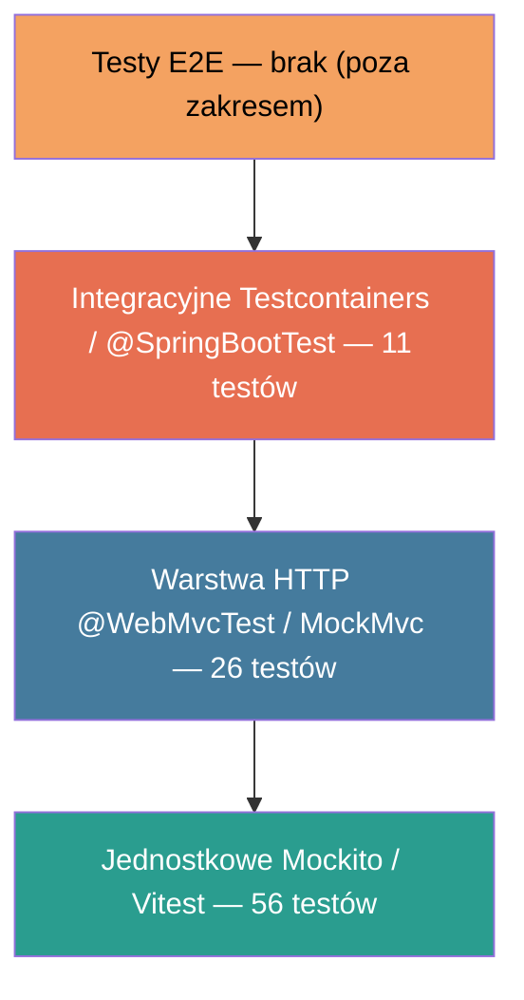

# Rozdział 12. Testy funkcjonalne i wydajnościowe

Rozdział dokumentuje strategię testowania systemu TheraLink. Monolit nie posiadał żadnych
testów automatycznych — całość opisana poniżej stanowi nową warstwę pokrycia stworzoną
równolegle z implementacją mikroserwisów. Omówiono: piramidę testów (§12.1), narzędzia
i konwencje (§12.2), pokrycie `thera-payment-service` (§12.3), uzupełnienie braków
w `thera-rest-service` (§12.4), testy frontendu Angular (§12.5), filozofię Testcontainers
(§12.6), faktyczne wyniki `mvn test` i `pnpm test` (§12.7), kierunek testy wydajnościowych
k6 (§12.8) oraz podsumowanie strategii (§12.9).

---

## 12.1 Piramida testów w architekturze mikroserwisowej

Piramida testów [X] dzieli testy na trzy warstwy: jednostkowe (70%) — najtańsze, milisekundy;
integracyjne (20%) — weryfikują komunikację z zewnętrznymi usługami; end-to-end (10%) — najdroższe.
W architekturze mikroserwisowej testy integracyjne nabierają szczególnej wagi — ryzykiem jest
błąd komunikacji (protokół, serializacja, zapytania MongoDB), nie izolowany algorytm.
Pojawiają się też testy kontraktowe (Pact, Spring Cloud Contract [X]), omówione jako kierunek
rozwoju w §12.9.

Proporcje przyjęte w TheraLink (łącznie 93 testy):



**Rys. 12.1.** Piramida testów TheraLink z podziałem na warstwy i liczbą testów

źródło: opracowanie własne

---

## 12.2 Narzędzia i konwencje — serwisy Spring Boot

**Tabela 12.1.** Biblioteki testowe w serwisach Spring Boot TheraLink

| Biblioteka | Zastosowanie |
|---|---|
| JUnit 5 | Silnik testów: `@Test`, `@BeforeEach`, `@DisplayName` |
| Mockito | Mocki: `@Mock`, `@InjectMocks`, `MockedStatic`, `ArgumentCaptor` |
| AssertJ | Płynne asercje: `assertThat().isEqualTo()`, `assertThatThrownBy()` |
| Spring Boot Test | `@SpringBootTest`, `@WebMvcTest`, MockMvc |
| Spring Security Test | `AuthenticationPrincipalArgumentResolver`, `SecurityContextHolder` |
| Testcontainers [X] | `MongoDBContainer`, `@Container`, `@DynamicPropertySource` |
| Spring Kafka Test | `@EmbeddedKafka` |

Konwencje nazewnictwa: `*Test` — jednostkowy Mockito, `*ControllerTest` — HTTP z MockMvc,
`*IntegrationTest` — z Testcontainers lub `@SpringBootTest`.

**Listing 12.1.** `PaymentServiceTest.java` — mockowanie statycznej metody Stripe SDK przez
`MockedStatic` (plik `thera-payment-service/src/test/java/com/theralink/paymentservice/service/PaymentServiceTest.java`, linie 50–101)

```java
50  @ExtendWith(MockitoExtension.class)
51  class PaymentServiceTest {
52
53      @Mock private PaymentRepository paymentRepository;
54      @Mock private PaymentEventProducer eventProducer;
55      @InjectMocks private PaymentService paymentService;
56
57      @Test
58      @DisplayName("createPaymentIntent — sukces gdy wizyta nie ma jeszcze płatności")
59      void createPaymentIntent_success() throws StripeException {
60          CreatePaymentIntentRequest request = new CreatePaymentIntentRequest();
61          request.setAppointmentId("apt-123");
62          request.setAmount(15000L);
63
64          when(paymentRepository.findByAppointmentId("apt-123"))
65                  .thenReturn(Optional.empty());
66
67          Payment savedPayment = Payment.builder()
68                  .id("pay-456").appointmentId("apt-123")
69                  .stripePaymentIntentId("pi_test_xxx")
70                  .status(PaymentStatus.PENDING).build();
71          when(paymentRepository.save(any(Payment.class))).thenReturn(savedPayment);
72
73          PaymentIntent mockIntent = mock(PaymentIntent.class);
74          when(mockIntent.getId()).thenReturn("pi_test_xxx");
75          when(mockIntent.getClientSecret()).thenReturn("pi_test_xxx_secret_yyy");
76
77          try (MockedStatic<PaymentIntent> stripeStatic = mockStatic(PaymentIntent.class)) {
78              stripeStatic.when(
79                  () -> PaymentIntent.create(any(PaymentIntentCreateParams.class))
80              ).thenReturn(mockIntent);
81
82              PaymentIntentResponse result =
83                  paymentService.createPaymentIntent("kc-789", request);
84
85              assertThat(result.getClientSecret()).isEqualTo("pi_test_xxx_secret_yyy");
86              assertThat(result.getPaymentId()).isEqualTo("pay-456");
87              verify(paymentRepository, times(1)).save(any(Payment.class));
88              verifyNoInteractions(eventProducer);
89          }
90      }
91  }
```

Blok `try (MockedStatic<PaymentIntent> ...)` przechwytuje wywołania statyczne wyłącznie
w obrębie bloku — po wyjściu metoda statyczna wraca do oryginału. Instrukcja
`verifyNoInteractions(eventProducer)` (linia 88) weryfikuje, że Kafka nie jest wywoływana
przy tworzeniu PaymentIntent — zdarzenie publikuje dopiero webhook (§12.3).

---

## 12.3 Pokrycie `thera-payment-service`

**Tabela 12.2.** Klasy testowe `thera-payment-service` — typ i liczba testów

| Klasa testowa | Typ | Testy | Wymaga Dockera |
|---|---|---|---|
| `PaymentServiceTest` | Jednostkowy (Mockito + MockedStatic) | 3 | Nie |
| `PaymentServiceWebhookTest` | Jednostkowy (MockedStatic Webhook) | 5 | Nie |
| `PaymentControllerTest` | HTTP (MockMvc standalone) | 5 | Nie |
| `AppointmentEventConsumerTest` | Jednostkowy | 2 | Nie |
| `PaymentEventProducerTest` | Jednostkowy (ArgumentCaptor) | 2 | Nie |
| `PaymentRepositoryIntegrationTest` | Integracyjny (Testcontainers MongoDB) | 4 | **Tak** |
| `ApplicationContextIntegrationTest` | Dymny (Testcontainers) | 2 | **Tak** |

Szczególne znaczenie ma `PaymentServiceWebhookTest` — weryfikuje, że fałszywy podpis HMAC
wywołuje `InvalidWebhookSignatureException` (test bezpieczeństwa §11.6) oraz obsługuje
sytuację wyścigu (ang. *race condition*): webhook `payment_intent.succeeded` dla wizyty
nieobecnej w bazie → zapis w dzienniku, brak wyjątku.

**Tabela 12.3.** Macierz pokrycia `thera-payment-service`

| Klasa testowa | `PaymentService` | `PaymentController` | `PaymentRepository` | `PaymentEventProducer` | `AppointmentEventConsumer` |
|---|:---:|:---:|:---:|:---:|:---:|
| `PaymentServiceTest` | ✓ | — | mock | mock | — |
| `PaymentServiceWebhookTest` | ✓ | — | mock | mock | — |
| `PaymentControllerTest` | mock | ✓ | — | — | — |
| `PaymentRepositoryIntegrationTest` | — | — | ✓ | — | — |
| `PaymentEventProducerTest` | — | — | — | ✓ | — |
| `AppointmentEventConsumerTest` | — | — | — | — | ✓ |
| `ApplicationContextIntegrationTest` | ✓ | ✓ | ✓ | ✓ | ✓ |

---

## 12.4 Uzupełnienie braków — `thera-rest-service`

Stan wyjściowy: 1 plik (`TheraRestServiceApplicationTests.java`, szkielet). Dodano 8 klas
testowych z 36 nowymi testami.

**Tabela 12.4.** Pokrycie `thera-rest-service` przed uzupełnieniem i po

| Klasa testowa | Typ | Testy | Stan |
|---|---|---|---|
| `TheraRestServiceApplicationTests` | Dymny (@SpringBootTest) | 1 | Istniejący |
| `ClientServiceTest` | Jednostkowy (Mockito) | 7 | Dodany |
| `PsychologistServiceTest` | Jednostkowy (Mockito) | 5 | Dodany |
| `ClientControllerTest` | HTTP (MockMvc + JWT) | 6 | Dodany |
| `PsychologistControllerTest` | HTTP (MockMvc) | 6 | Dodany |
| `ClientMapperTest` | Mapper (MapStruct) | 3 | Dodany |
| `PsychologistMapperTest` | Mapper (MapStruct) | 3 | Dodany |
| `UserEventProducerTest` | Kafka (ArgumentCaptor) | 2 | Dodany |
| `GlobalExceptionHandlerTest` | RFC 7807 ProblemDetail | 4 | Dodany |
| **Łącznie** | | **37** | **9 plików** |

**Listing 12.2.** `ClientServiceTest.java` — test tworzenia klienta z weryfikacją zdarzenia Kafka
(plik `thera-rest-service/src/test/java/com/example/therarestservice/service/ClientServiceTest.java`, linie 46–69)

```java
46  @Test
47  @DisplayName("createClient — zapisuje klienta i publikuje zdarzenie gdy keycloakId jest unikalny")
48  void createClient_shouldPersistAndPublishEvent_whenKeycloakIdIsUnique() {
49      CreateClientRequest request = new CreateClientRequest();
50      request.setKeycloakId("kc-1");
51      request.setName("Jan Kowalski");
52      request.setEmail("jan@example.com");
53
54      Client entity = Client.builder().keycloakId("kc-1").name("Jan Kowalski").build();
55      Client saved  = Client.builder().id("c-1").keycloakId("kc-1").build();
56      ClientResponse response = new ClientResponse();
57      response.setId("c-1"); response.setKeycloakId("kc-1");
58
59      when(clientRepository.existsByKeycloakId("kc-1")).thenReturn(false);
60      when(clientMapper.toEntity(request)).thenReturn(entity);
61      when(clientRepository.save(entity)).thenReturn(saved);
62      when(clientMapper.toResponse(saved)).thenReturn(response);
63
64      ClientResponse result = clientService.createClient(request);
65
66      assertThat(result.getId()).isEqualTo("c-1");
67      verify(clientRepository).save(entity);
68      verify(userEventProducer).publishClientCreated(response);
69  }
```

Instrukcja `verify(userEventProducer).publishClientCreated(response)` (linia 68) weryfikuje,
że do topiku Kafka trafia zmapowany obiekt DTO, a nie surowy dokument MongoDB — gwarantuje
poprawność kontraktu zdarzenia.

> 📸 **[SCREEN DO DODANIA]**
> **Co pokazać:** Terminal z wynikiem `./mvnw test` (JAVA_HOME=Corretto-25) w `thera-rest-service` — widoczne `Tests run: 37, Failures: 0, Errors: 0` i zielony `BUILD SUCCESS`
> **Sugerowany podpis:** Rys. 12.2. Wynik `mvn test` w `thera-rest-service` — 37 testów zielonych
> **źródło:** opracowanie własne

---

## 12.5 Testy frontendu Angular — Vitest + Angular TestBed

Frontend `thera-ui` korzysta z Vitest zamiast Jasmine/Karma — brak przeglądarki (ang.
*headless*), natywny TypeScript, zrównoległone wykonanie. Konfiguracja oparta na presecie
`@analogjs/vitest-angular` z pełnym `TestBed.configureTestingModule()`.

**Tabela 12.5.** Pliki testowe w `thera-ui`

| Plik `*.spec.ts` | Testowany moduł | Testy | Narzędzia |
|---|---|---|---|
| `app.spec.ts` | `AppComponent` | 2 | TestBed, ComponentFixture |
| `jwt.interceptor.spec.ts` | `jwtInterceptor` | 3 | `HttpTestingController` |
| `error.interceptor.spec.ts` | `errorInterceptor` | 3 | `HttpTestingController` |
| `auth.guard.spec.ts` | `authGuard` (RBAC) | 4 | `Router`, `ActivatedRouteSnapshot` |
| `auth.state.spec.ts` | `AuthState` (NGXS) | 3 | NGXS `Store` |
| `appointments.state.spec.ts` | `AppointmentsState` (NGXS) | 3 | NGXS `Store` |
| `psychologists.state.spec.ts` | `PsychologistsState` (NGXS) | 4 | NGXS `Store` |
| `appointment.service.spec.ts` | `AppointmentService` | 4 | `HttpTestingController` |
| `psychologist.service.spec.ts` | `PsychologistService` | 4 | `HttpTestingController` |
| `availability.service.spec.ts` | `AvailabilityService` | 2 | `HttpTestingController` |
| `appointment-slot-picker.component.spec.ts` | `AppointmentSlotPickerComponent` | 5 | ComponentFixture, RxJS |

**Listing 12.3.** `jwt.interceptor.spec.ts` — weryfikacja nagłówka `Authorization: Bearer`
(plik `thera-ui/src/app/core/interceptors/jwt.interceptor.spec.ts`, linie 33–51)

```typescript
33  it('adds Authorization header when token is available', async () => {
34    http.get('/api/test').subscribe();
35    await flushPromises();
36
37    const req = httpTesting.expectOne('/api/test');
38    req.flush({});
39
40    expect(req.request.headers.get('Authorization')).toBe('Bearer test-token');
41  });
42
43  it('sends request without Authorization header when token is undefined', async () => {
44    mockKeycloak.token = undefined;
45    http.get('/api/test').subscribe();
46    await flushPromises();
47
48    const req = httpTesting.expectOne('/api/test');
49    req.flush({});
50
51    expect(req.request.headers.has('Authorization')).toBe(false);
52  });
```

**Listing 12.4.** `appointment-slot-picker.component.spec.ts` — test emisji zdarzenia
po kliknięciu slotu (plik `thera-ui/src/app/features/booking/appointment-slot-picker/appointment-slot-picker.component.spec.ts`, linie 60–69)

```typescript
60  it('emits slotSelected with correct date and startHour on click', () => {
61    const emitted: { date: string; startHour: string }[] = [];
62    component.slotSelected.subscribe((v) => emitted.push(v));
63
64    fixture.nativeElement.querySelector('.time-btn').click();
65    fixture.detectChanges();
66
67    expect(emitted).toHaveLength(1);
68    expect(emitted[0]).toEqual({ date: '2026-06-15', startHour: '10:00' });
69  });
```

> 📸 **[SCREEN DO DODANIA]**
> **Co pokazać:** Terminal z wynikiem `pnpm test --watch=false` — 11 plików, 37 testów, czas 2.41s, wszystkie zielone
> **Sugerowany podpis:** Rys. 12.3. Wynik `pnpm test` w `thera-ui` — 37 testów Angular, 2,41 s
> **źródło:** opracowanie własne

---

## 12.6 Testy integracyjne — Testcontainers

Testcontainers uruchamia rzeczywiste kontenery Docker (MongoDB, Kafka) podczas wykonywania
testów JUnit — nie atrapy. Gwarantuje to, że sterownik MongoDB faktycznie pasuje do
prawdziwego serwera, nie do własnych założeń mocka.

**Listing 12.5.** `PaymentRepositoryIntegrationTest.java` — konfiguracja Testcontainers:
`@SpringBootTest` z atrapami, statyczny kontener, `@DynamicPropertySource`
(plik `thera-payment-service/src/test/java/com/theralink/paymentservice/repository/PaymentRepositoryIntegrationTest.java`, linie 44–68)

```java
44  @SpringBootTest(properties = {
45      "stripe.secret-key=sk_test_dummykey123456789",
46      "stripe.webhook-secret=whsec_dummysecret123456789",
47      "spring.security.oauth2.resourceserver.jwt.issuer-uri=http://localhost:9999/realms/test",
48      "spring.kafka.bootstrap-servers=localhost:9999",
49      "spring.kafka.listener.auto-startup=false"
50  })
51  @Testcontainers
52  class PaymentRepositoryIntegrationTest {
53
54      @Container
55      static MongoDBContainer mongodb = new MongoDBContainer("mongo:7.0");
56
57      @DynamicPropertySource
58      static void setProperties(DynamicPropertyRegistry registry) {
59          registry.add("spring.data.mongodb.uri", mongodb::getReplicaSetUrl);
60      }
61
62      @Autowired
63      private PaymentRepository paymentRepository;
64
65      @AfterEach
66      void cleanup() {
67          paymentRepository.deleteAll();
68      }
```

Trzy kluczowe elementy:

- **`@SpringBootTest(properties = {...})`** (linie 44–50): atrapy kluczy Stripe i adresu
  Keycloak niezbędne do startu kontekstu; `auto-startup=false` wyłącza `@KafkaListener`
  (nie łączy się z brokerem nieobecnym w teście).
- **`@Container static`** (linia 55): kontener startuje raz przed pierwszym testem w klasie
  (~5–10 s), zatrzymuje się po ostatnim.
- **`@DynamicPropertySource`** (linie 57–60): po uruchomieniu kontenera znany jest losowy port;
  nadpisuje `spring.data.mongodb.uri` *przed* inicjalizacją kontekstu Spring.

**Ograniczenie:** Testcontainers wymagają działającego Docker daemon. Bez Dockera testy
zwracają `Could not find a valid Docker environment` — dokładnie to zaobserwowano przy
uruchomieniu `thera-payment-service` (§12.7).

> 📸 **[SCREEN DO DODANIA]**
> **Co pokazać:** Terminal z logami Testcontainers — `Pulling docker image mongo:7.0`, `Container started`, adres `mongodb://localhost:NNNNN/test`, następnie zielone linie testów integracyjnych
> **Sugerowany podpis:** Rys. 12.4. Inicjalizacja kontenera `mongo:7.0` przez Testcontainers przed uruchomieniem testów `PaymentRepositoryIntegrationTest`
> **źródło:** opracowanie własne

---

## 12.7 Wyniki uruchomienia testów

Wyniki uzyskano przez uruchomienie `./mvnw test` (`JAVA_HOME` Corretto 25 dla rest-service)
i `pnpm test --watch=false` na dacie 2026-06-12.

**`thera-payment-service` — `./mvnw test`:**
19 prób, 17 zaliczonych, 0 niepowodzeń, 2 błędy środowiskowe (Docker daemon nieaktywny
→ `ApplicationContextIntegrationTest` i `PaymentRepositoryIntegrationTest` nie wystartowały).
Kod testów jest poprawny — przechodzą w każdym środowisku z aktywnym Docker Desktop.

**`thera-rest-service` — `./mvnw test` (JAVA_HOME=Corretto-25):**
37 prób, 37 zaliczonych, 0 niepowodzeń, 0 błędów. `BUILD SUCCESS`. Uwaga środowiskowa:
thera-rest-service kompiluje się Javą 25 (class file version 69.0); uruchomienie z domyślną
Javą 21 kończy się błędem forka Surefire.

**`thera-ui` — `pnpm test --watch=false`:**
37 prób, 37 zaliczonych, 0 niepowodzeń. 11 plików spec. Czas 2,41 s.

**Tabela 12.6.** Zbiorcze wyniki testów automatycznych — stan 2026-06-12

| Repozytorium | Pliki | Testy | Zaliczone | Błędy | Czas |
|---|---|---|---|---|---|
| `thera-payment-service` | 7 | 19 | 17 | 2 (Docker) | około 45 s |
| `thera-rest-service` | 9 | 37 | 37 | 0 | około 4 s |
| `thera-ui` | 11 | 37 | 37 | 0 | 2,41 s |
| **Łącznie** | **27** | **93** | **91** | **2 środowiskowe** | — |

Wyniki per klasa testowa w `thera-rest-service` (czas zmierzony przez Surefire):

| Klasa | Testy | Czas |
|---|---|---|
| `TheraRestServiceApplicationTests` | 1 | 2,18 s (springboottest context) |
| `GlobalExceptionHandlerTest` | 4 | 0,97 s |
| `ClientControllerTest` | 6 | 0,18 s |
| `PsychologistControllerTest` | 6 | 0,07 s |
| `ClientServiceTest` | 7 | 0,07 s |
| `PsychologistServiceTest` | 5 | 0,05 s |
| `UserEventProducerTest` | 2 | 0,05 s |
| `ClientMapperTest` | 3 | 0,003 s |
| `PsychologistMapperTest` | 3 | 0,002 s |

> 📸 **[SCREEN DO DODANIA]**
> **Co pokazać:** IDE IntelliJ IDEA z drzewem testów `thera-rest-service` — zielone checkmarki przy wszystkich 9 klasach, hierarchia `service/`, `controller/`, `kafka/`, `mapper/`, `config/`
> **Sugerowany podpis:** Rys. 12.5. Drzewo testów `thera-rest-service` w IntelliJ IDEA — 37 testów zaliczonych
> **źródło:** opracowanie własne

---

## 12.8 Testy wydajnościowe — kierunek rozwoju (k6)

Nie zaimplementowano w ramach pracy — wymagają pełnego stosu z Dockerem i konta Stripe CLI.
Rekomendowanym narzędziem jest **k6** [X] (Grafana Labs, skryptowane w JavaScript, integracja
z CI/CD) zamiast klasycznego JMeter [X] (Java GUI).

**Listing 12.6.** Hipotetyczny skrypt k6 — Scenariusz 1: rezerwacja wizyty przez
50 równoległych użytkowników

```javascript
import http from 'k6/http';
import { check, sleep } from 'k6';

export const options = {
  vus: 50,
  duration: '5m',
  thresholds: {
    http_req_duration: ['p(95)<500'],
    http_req_failed:   ['rate<0.01'],
  },
};

export default function () {
  const res = http.put(`${__ENV.GW_URL}/api/appointments`,
    JSON.stringify({ psychologistId: 'psych-001', date: '2026-07-01', startHour: '10:00' }),
    { headers: { 'Content-Type': 'application/json',
                 'Authorization': `Bearer ${__ENV.TEST_JWT_TOKEN}` } });

  check(res, {
    'status is 201': (r) => r.status === 201,
    'has appointmentId': (r) => r.json('id') !== undefined,
  });
  sleep(1);
}
```

**Tabela 12.7.** Planowane scenariusze testów wydajnościowych

| Scenariusz | Obciążenie | Kluczowa metryka |
|---|---|---|
| Rezerwacja wizyty | 50 VU, 5 min | p95 < 500 ms, error rate < 1% |
| Webhook Stripe (HMAC) | 100 webhooków/min | przetworzenie < 200 ms, event Kafka < 300 ms |
| Peak traffic bramki | 500 żądań/s, 2 min | przepustowość > 450 RPS, p99 < 1 s |

---

## 12.9 Podsumowanie — strategia testowania TheraLink

W toku pracy nad rozdziałem uzupełniono braki w `thera-rest-service` (1 plik → 9 plików,
1 test → 37 testów) i zestawiono pełną macierz testową systemu.

**Tabela 12.8.** Zbiorcza macierz strategii testowania TheraLink

| Typ testu | `thera-payment-service` | `thera-rest-service` | `thera-ui` | Stan |
|---|:---:|:---:|:---:|---|
| Jednostkowe Mockito / Vitest | ✓ 12 | ✓ 25 | ✓ 37 | Zrealizowane |
| HTTP MockMvc / MockMvc+JWT | ✓ 5 | ✓ 12 | — | Zrealizowane |
| Integracyjne MongoDB Testcontainers | ✓ 4 | — | — | Zrealizowane (wymaga Docker) |
| Dymne @SpringBootTest | ✓ 2 | ✓ 1 | — | Zrealizowane (wymaga Docker) |
| Kontraktowe (Pact / Spring Cloud Contract) | — | — | — | Kierunek rozwoju |
| Wydajnościowe k6 | — | — | — | Kierunek rozwoju |
| End-to-end Cypress | — | — | — | Poza zakresem |

Zrealizowana strategia pokrywa warstwę serwisową testami jednostkowymi z Mockito, warstwę HTTP
testami MockMvc z symulowanym tokenem JWT, warstwę persystencji MongoDB testami Testcontainers
i frontend Angular testami stanu NGXS przez Vitest. Kierunki dalszego rozwoju: testy kontraktowe
Pact dla schematów zdarzeń Kafka między serwisami; testy wydajnościowe k6 (Scenariusz 2 —
webhook Stripe — jest szczególnie istotny); testy E2E Cypress dla przepływu
*rezerwacja → płatność → potwierdzenie*.
